# Data Layer — PostgreSQL, AGE, pgvector, and Text Search

> **Product: v0.23.0** · Contract: [OpenAPI snapshot](../../edgequake_webui/openapi/openapi.snapshot.json) · Spec ops: [Ingestion cancel & fairness](../ingestion-cancel-and-fairness.md)

Where EdgeQuake stores information, how it is indexed, and how each query mode reads it. **Code is law** — physical names and SQL come from `edgequake-storage` adapters and `edgequake/migrations/`.

**Related:** [Graph Storage](graph-storage.md) · [Vector Storage](vector-storage.md) · [Query Modes](query-modes.md) · [Lineage Tracking](../architecture/lineage-tracking.md) · [Data Flow](../architecture/data-flow.md) · [Product limits](../product-limits.md) · [SPEC-073 relational RAG layout](../../specs/073-relational-rag-layout/000-index.md) · [ADR-073 multi-lens decision](../../specs/073-relational-rag-layout/007-adr-relational-rag-layout.md)

---

## Contents

1. [Mental model](#1-mental-model--three-stores--relational-sidecar)
2. [Physical naming and tenancy](#2-physical-naming-and-tenancy)
3. [PostgreSQL ER (relational)](#3-postgresql-er-schema-relational)
4. [KV store](#4-kv-store-document-text-ssot)
5. [Apache AGE](#5-apache-age-property-graph)
6. [pgvector](#6-pgvector)
7. [Text search (FTS)](#7-text-search-fts)
8. [Query mode × store matrix](#8-how-information-is-queried)
9. [Ingest write path](#9-write-path-summary-ingest)
10. [Migration and index map](#10-migration--index-map)
11. [Operator SQL cookbook](#11-operator-debugging-cookbook)

---

## 1. Mental model — three stores + relational sidecar

### 1.1 Four units of meaning (logical spine)

Conflating these units causes integrity and capacity bugs. Detail: [SPEC-073 first principles](../../specs/073-relational-rag-layout/001-first-principles.md).

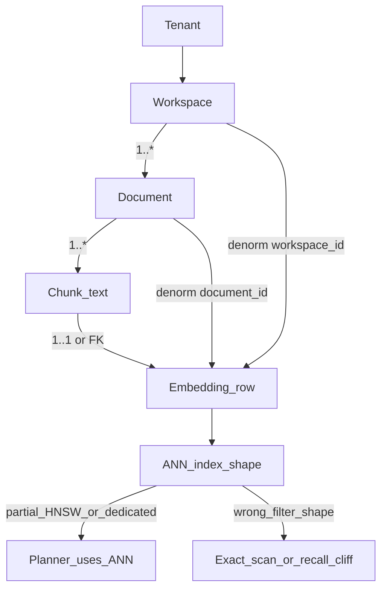

```text
Tenant
  └── Workspace          ← isolation / index-shape key
        └── Document     ← ownership, ACL, delete, status
              └── Chunk  ← retrieval + FTS unit (text)
                    └── Embedding  ← ANN unit (vector/halfvec row)
                          └── Index shape must match workspace filter
```

### 1.2 Physical stores (one Postgres, four surfaces)

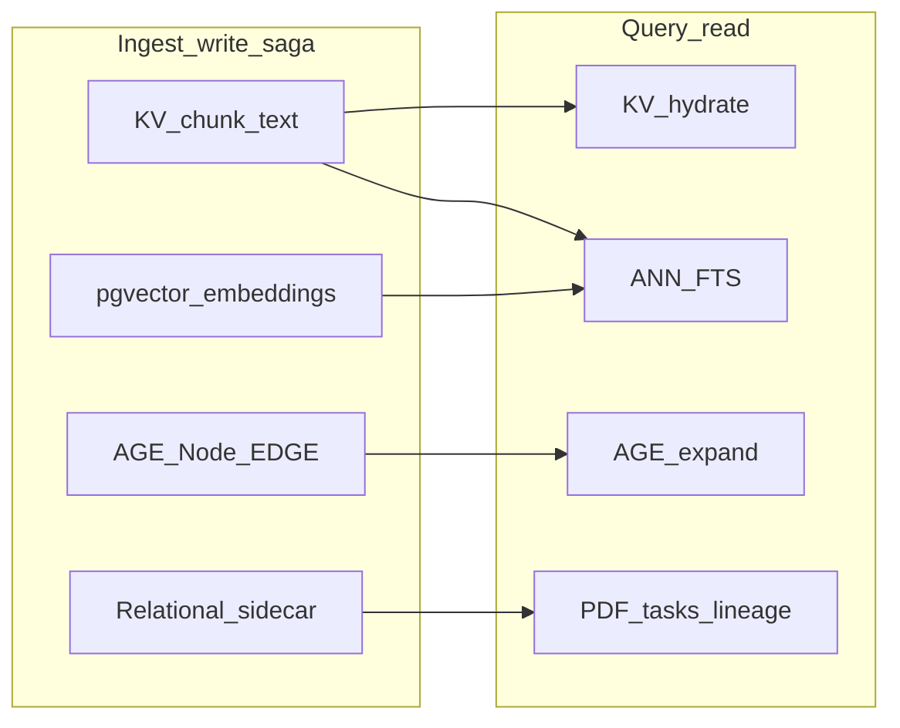

```text
+------------------------------------------------------------------+
| EdgeQuake data layer (v0.23.0) — one PostgreSQL instance         |
|                                                                  |
|  WRITE (ingest saga)              READ (query)                   |
|  -------------------              ------------                   |
|  KV  doc/chunk text SSOT  <-----  hydrate + FTS join             |
|  AGE Node / EDGE          <-----  Local/Global expand            |
|  pgvector embeddings      <-----  ANN / filter_ids               |
|  relational sidecar       <-----  lineage, PDF, tasks, CQRS      |
+------------------------------------------------------------------+
```

| Store | Role | SSOT for RAG? |
| ----- | ---- | ------------- |
| **KV** (`eq_*_kv`) | Document metadata + chunk text JSON | **Yes** — chunk text |
| **AGE** (`eq_*_graph`) | Entities (Node) + relationships (EDGE) | **Yes** — graph |
| **pgvector** (`eq_*_vectors`) | Chunk / entity / relationship embeddings | **Yes** — vectors |
| **Relational** | PDF bytes, mm-assets, lineage links, tasks, CQRS `entities` | Sidecar / ops / analytics |

### 1.3 Ideal relational spine vs EdgeQuake dual-SSOT

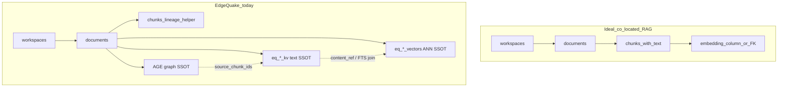

**Dual-SSOT warning:** Do not treat `public.documents` / `public.chunks` alone as the RAG corpus. Pipeline ingest writes **KV + AGE + vectors**. Relational `documents`/`chunks` support PDF linkage, lineage columns, and CQRS; `entities`/`relationships` are a **CQRS read model** (M039) optionally dual-written via `entity_sync_mode`. Mapping table: [SPEC-073 §002](../../specs/073-relational-rag-layout/002-edgequake-mapping.md). Admin/debug presence helpers: `eq_serving_chunk_presence` / `eq_serving_vector_presence` ([SPEC-081](../../specs/081-serving-view-dual-ssot/000-index.md)) — **not** the ANN query path.

**Why workspace → document → chunk → embedding matters:** Relational ownership plus denormalized `workspace_id` / `document_id` on vector rows is the control plane for isolation, delete/retract, and workspace-shaped ANN (Wave-2 partial HNSW / dedicated DiskANN). First-principles + July 2026 scale playbook: [SPEC-073](../../specs/073-relational-rag-layout/000-index.md) · [industry ladder](../../specs/073-relational-rag-layout/005-industry-scale-playbook.md) · [research → improvements](../../specs/073-relational-rag-layout/006-research-evidence-improvements.md).

EdgeQuake keeps vectors and the property graph in **one PostgreSQL instance** (low latency, one ops surface). That is **not** a single ACID transaction across KV + pgvector + AGE: ingest is a **best-effort saga** (persist → merge phases → compensate on failure). Embeddings are **not** stored as AGE node properties — they live in dedicated `eq_*_vectors` tables linked by id / `source_*` properties.

**SPEC-058 / SPEC-059 integrity rules:**

- Compensate deletes only **created** entity/rel vectors (never shared updates). Creation is detected **atomically** via `upsert_report_created` (`RETURNING (xmax = 0)` / memory write-lock) — not a preflight `get_by_ids` TOCTOU.
- Cancel / orphan-fail **retracts** indexes on every surface (HTTP/WS/PDF/pipeline facade, stuck/reprocess cleanup, boot orphan janitor when `EDGEQUAKE_ORPHAN_RETRACT_ON_RECOVER` is on — default). Retract checklist + denorm guard: [SPEC-074](../../specs/074-storage-p0-hardening/001-retract-checklist.md).
- Native AGE upsert merges `source_ids` / `source_chunk_ids` via `eq_merge_graph_properties` (not last-write-wins on the full map). Single-node upsert uses the native path when enabled.
- Dimension mismatch **fails closed** unless `EDGEQUAKE_ALLOW_VECTOR_TABLE_REBUILD=1`.
- Greenfield tip (July 2026): `EDGEQUAKE_VECTOR_STORAGE=halfvec` after recall gate (≥99% of full). Existing indexes at older `ef_construction` need operator `REINDEX` — never silent boot rebuild.
- Native graph writes default **ON** (`EDGEQUAKE_NATIVE_GRAPH_WRITES`); Cypher MERGE/DETACH loops are debug opt-out only. Compensate uses `delete_nodes_batch` (SPEC-060).

---

## 2. Physical naming and tenancy

### Namespace → table prefix

From [`PostgresConfig::table_prefix`](../../edgequake/crates/edgequake-storage/src/adapters/postgres/config.rs):

```mermaid
flowchart TB
  ns["namespace = default"]
  prefix["table_prefix = eq_default"]
  kv["public.eq_eq_default_kv"]
  vec["public.eq_eq_default_vectors"]
  graph["AGE schema eq_eq_default_graph"]
  ns --> prefix
  prefix --> kv
  prefix --> vec
  prefix --> graph
```

```text
namespace "default"
  --> table_prefix "eq_default"
  --> KV:      public.eq_eq_default_kv
  --> vectors: public.eq_eq_default_vectors
  --> graph:   eq_eq_default_graph   (AGE schema name)
```

Helpers prepend another `eq_` to the prefix:

```rust
// config.rs
format!("public.eq_{prefix}_kv")       // prefix already starts with eq_
format!("public.eq_{prefix}_vectors")
```

API boot typically uses `.with_namespace("default")`.

### Workspace vector tables

[`WorkspaceVectorConfig`](../../edgequake/crates/edgequake-storage/src/traits/workspace_vector.rs) builds a workspace namespace `default_ws_{first8-of-uuid}`, then `PgVectorStorage` qualifies it:

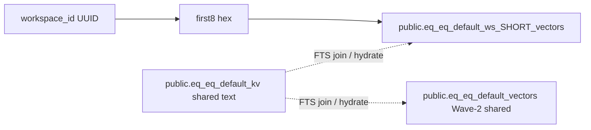

```text
workspace_id = 4e32a055-...
logical name (trait / logs):  eq_default_ws_4e32a055_vectors
physical table (create path): public.eq_eq_default_ws_4e32a055_vectors
chunk text KV (FTS join):     public.eq_eq_default_kv   (shared default KV)
```

- **Vectors:** shared table (Wave-2) **or** table-per-workspace (dimension isolation / DiskANN opt-in).
- **Graph:** one AGE graph per namespace; isolation via Node/EDGE properties `workspace_id` / `tenant_id`.
- **RLS:** `set_tenant_context` / `current_tenant_id()` (M001/M009); optional AGE RLS when `EDGEQUAKE_AGE_RLS=true` (M081).

---

## 3. PostgreSQL ER schema (relational)

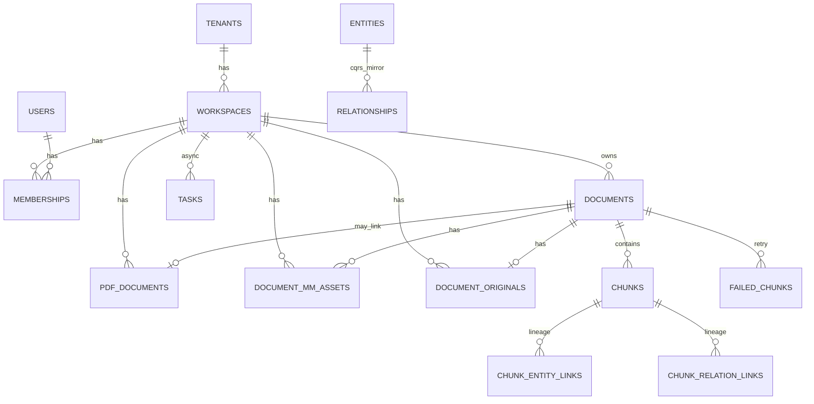

```text
+------------------------------------------------------------------+
| Relational ER (fixed migrations) — sidecar, not sole RAG corpus  |
|                                                                  |
|  tenants 1--* workspaces 1--* memberships *--1 users             |
|                                                                  |
|  workspaces 1--* documents                                       |
|       |--* pdf_documents / document_mm_assets / document_originals|
|  documents 1--* chunks                                           |
|  chunks *--* chunk_entity_links / chunk_relation_links           |
|                                                                  |
|  entities *--* relationships   (CQRS mirror of AGE; optional)    |
|  tasks / failed_chunks         (async delivery + retry)          |
+------------------------------------------------------------------+
```

### Identity and tenancy

| Table | Purpose | Writers |
| ----- | ------- | ------- |
| `tenants`, `workspaces`, `users`, `memberships` | Multi-tenant identity | auth / workspace APIs |
| RLS helpers | `set_tenant_context`, policies on core tables | M001, M009 |

### Content sidecar

| Table | Purpose | Notes |
| ----- | ------- | ----- |
| `documents` | Relational document row (status, hashes, PDF link) | Not sole RAG text SSOT |
| `chunks` | Relational chunks + M066 `char_*` / `page_*` / `embedding_id` | Links to vector id |

### Lineage (M066)

| Table | PK / keys | Indexes |
| ----- | --------- | ------- |
| `chunk_entity_links` | `(chunk_id, entity_name, workspace_id)` | entity→chunks lookups |
| `chunk_relation_links` | chunk + source/target entity | relation provenance |

API writers: `postgres_lineage_sink`, `postgres_chunk_lineage`.

### CQRS entities (M039)

| Table | Purpose |
| ----- | ------- |
| `entities` | Analytics / FTS read model; GIN on `source_chunk_ids`, generated `tsv` |
| `relationships` | Same for edges; `sync_status` tracks AGE dual-write |

`server_config.entity_sync_mode` defaults to **disabled** — AGE remains the graph SSOT until sync is enabled.

### PDF and multimodal

| Table | Migration | Role |
| ----- | --------- | ---- |
| `pdf_documents` | M022+ | BYTEA PDF + `markdown_content`; status includes **`cancelled`** (M087) |
| `document_originals` | M082 | Non-PDF originals |
| `document_mm_assets` | M084/085 | Page/chart PNGs; stable `asset_id` + workspace RLS |

Rust: `pdf_storage_impl.rs`, `mm_asset_storage_impl.rs`, `original_storage_impl.rs`.

### Async delivery

| Object | Migration | Role |
| ------ | --------- | ---- |
| `tasks` | M002+ | Job rows; **lease_owner / lease_token / lease_expires_at** (M088) |
| `edgequake.tasks` view | M031 → M089 | Must refresh after lease columns or view hides them |
| `failed_chunks` | M021 | Extraction retry queue |

Claim indexes: `idx_tasks_claimable_pending`, `idx_tasks_stale_processing_lease`. Ops: [Ingestion cancel & fairness](../ingestion-cancel-and-fairness.md).

### Other (pointer)

`conversations` / `messages` / `folders`, partitioned `audit_logs`, `server_config`, `workspace_metrics_history` — not on the RAG hot path.

---

## 4. KV store (document text SSOT)

### Table shape

Runtime DDL creates JSONB key-value storage (plus `_kv_stats` for O(1) counts):

```text
public.eq_eq_default_kv
  key   TEXT PRIMARY KEY
  value JSONB
  ...
```

Adapter: `adapters/postgres/kv.rs`.

### Key taxonomy (SSOT module)

All reads/writes must use [`kv_key_schema.rs`](../../edgequake/crates/edgequake-storage/src/kv_key_schema.rs) / `kv_keys::*`:

| Key pattern | Payload |
| ----------- | ------- |
| `{doc_id}-metadata` | DocumentMetadata JSON |
| `{doc_id}-chunk-{n}` | Chunk content JSON (text, offsets, tokens) |
| `{doc_id}-chunk-` | Prefix scan all chunks |
| `wsdoc:{workspace_id}:{document_id}` | Workspace document index |
| `staging:{doc_id}-…` | Admit saga staging (SPEC-026) |
| `compensation_quarantine:{doc}:{entry}` | Saga DLQ (SPEC-057) |
| `{hash}-cache` / `{hash}-kwcache` | LLM / keyword caches |

### Query hydrate

When vector metadata lacks content, query code calls `batch_fetch_chunk_contents` ([`chunk_content.rs`](../../edgequake/crates/edgequake-storage/src/chunk_content.rs)) against the **shared default KV** table — even when ANN runs on a workspace vector table (SPEC-024 2.5).

---

## 5. Apache AGE property graph

AGE stores a labeled property graph inside PostgreSQL ([AGE graphs overview](https://age.apache.org/age-manual/master/intro/graphs.html)): parent tables `_ag_label_vertex` / `_ag_label_edge`, plus **child** label tables for each label.

### Graph and labels

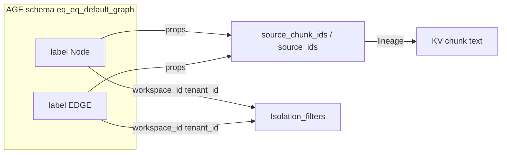

```text
graph name:  eq_eq_default_graph
labels:      "Node" (vertex), "EDGE" (edge)
created via: create_graph / create_vlabel / create_elabel
             (graph_lifecycle.rs — eager bootstrap)
```

### Property map (conceptual)

| Object | Important properties |
| ------ | -------------------- |
| **Node** | `node_id` (entity name), `entity_type`, `description`, `source_ids` / `source_chunk_ids`, `tenant_id`, `workspace_id`, `community_id` |
| **EDGE** | `source_id`, `target_id`, weight / keywords / description, same lineage + tenancy |

Communities are **not** separate AGE labels; `community_id` is written onto Node properties.

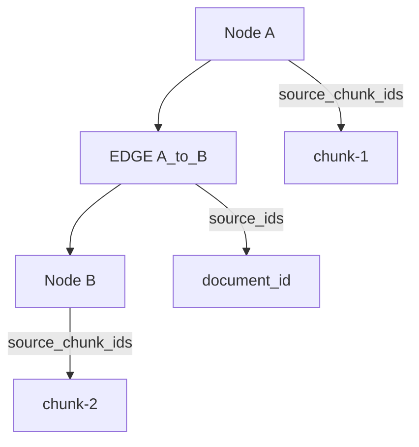

### Native SQL vs Cypher

| Path | Used for |
| ---- | -------- |
| **Native SQL** on `{graph}."Node"` / `"EDGE"` | Batch upsert, degrees, incident edges, workspace stats, lineage GIN probes |
| **Cypher** via `ag_catalog.cypher()` | Traversals, some deletes/clears, searches |

Hot query expansion prefers native batch helpers (O(log E) on child tables after M070/M086). Parent `_ag_label_*` tables are not the indexed hot path.

### Indexes (child tables)

| Index | Purpose | Source |
| ----- | ------- | ------ |
| `idx_node_prop_node_id_unique` | Native upsert ON CONFLICT | M074 / M083 |
| `idx_node_source_ids_gin` / `idx_edge_source_ids_gin` | Doc→entity lineage | M038 + bootstrap |
| `idx_edge_source_id` / `idx_edge_target_id` | BFS / incident edges / degrees | M086 |
| `idx_edge_start_id` / `idx_edge_end_id` | graphid navigation | M072 + ensure_indexes |
| `idx_node_workspace_id` / `idx_node_tenant_id` | Isolation filters | M078 reconcile |

### Lineage probes

[`source_lineage_sql.rs`](../../edgequake/crates/edgequake-storage/src/adapters/postgres/graph/helpers/source_lineage_sql.rs):

- Predicates match `source_ids` / `source_chunk_ids` JSON arrays (GIN `@>`).
- `SOURCE_CHUNK_PROBE_LIMIT = 256` caps batch probes.

Fallback tables `graph_nodes` / `graph_edges` (M013) exist if AGE is missing — production expects AGE loaded.

---

## 6. pgvector

### DDL (runtime)

From [`vector/ddl.rs`](../../edgequake/crates/edgequake-storage/src/adapters/postgres/vector/ddl.rs):

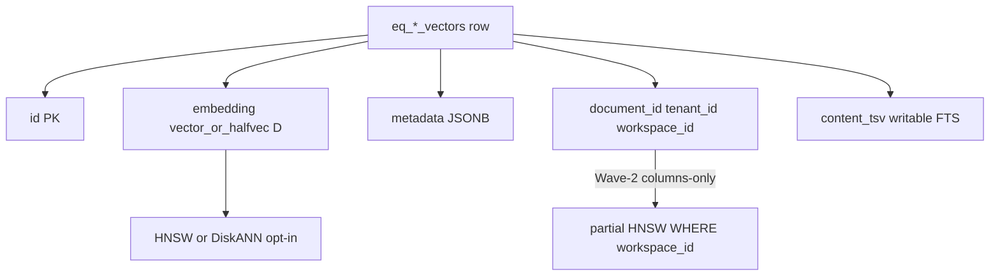

```sql
CREATE TABLE IF NOT EXISTS public.eq_eq_default_vectors (
    id TEXT PRIMARY KEY,
    embedding vector(D) NOT NULL,  -- or halfvec(D)
    metadata JSONB DEFAULT '{}',
    created_at TIMESTAMPTZ NOT NULL DEFAULT NOW()
);
-- plus document_id, tenant_id, workspace_id
-- plus writable content_tsv (FTS)
```

### Dimension / halfvec policy

[`AnnIndexPolicy`](../../edgequake/crates/edgequake-storage/src/adapters/postgres/capabilities.rs) (aligned with [pgvector HNSW limits](https://github.com/pgvector/pgvector#hnsw)):

| Dimension | Column | HNSW |
| --------- | ------ | ---- |
| ≤ 2000 | `vector` or `halfvec` per `EDGEQUAKE_VECTOR_STORAGE` | Yes |
| 2001–4000 | promote to **`halfvec`** | Yes |
| > 4000 | configured type | **No ANN** (seq scan) |

Env: `EDGEQUAKE_VECTOR_STORAGE=full|halfvec` (default `full`; greenfield recommendation `halfvec` after SPEC-059 recall gate). Marker M080 + bootstrap reconcile — no silent DROP on existing DBs.

### HNSW

- Opclass: `vector_cosine_ops` or `halfvec_cosine_ops`
- Defaults: `m = 16`, `ef_construction = 64` (SPEC-059; overridable via `EDGEQUAKE_HNSW_EF_CONSTRUCTION`)
- Index name pattern: `eq_{prefix}_vectors_embedding_idx`
- Fail-closed: ANN DDL errors are not swallowed (SPEC-046)
- Search tuning: `SET LOCAL hnsw.ef_search = …`; `hnsw.iterative_scan=relaxed_order` when pgvector ≥ 0.8.0 ([`search_tuning.rs`](../../edgequake/crates/edgequake-storage/src/adapters/postgres/vector/search_tuning.rs))
- Optional search overrides (SPEC-064 battle / ops): `EDGEQUAKE_HNSW_EF_SEARCH`, `EDGEQUAKE_HNSW_MAX_SCAN_TUPLES` (default 20000), `EDGEQUAKE_HNSW_SCAN_MEM_MULTIPLIER`
- Opt-in workspace **partial HNSW** (SPEC-064 Wave 2): `EDGEQUAKE_HNSW_PARTIAL_BY_WORKSPACE=1` + `PgVectorStorage::ensure_partial_hnsw_for_workspace` for hot workspaces (falls back to global+iterative otherwise). L1 Q1-d @100k/1536 measured green with halfvec + partial (`make ann-scale-battle`).
- **GUC knee (SPEC-064 Wave 3):** keep code defaults; battle best was `ef_search=40`, `max_scan_tuples=20000`, `scan_mem_multiplier=1`. Raising `ef_search`/`max_scan_tuples` did **not** help the dominant plan (btree filter + exact sort on ~20% rows).
- **REINDEX honesty:** bumping `ef_construction` (e.g. 32 → 64) does **not** rebuild existing indexes at boot. Operators must `REINDEX INDEX CONCURRENTLY …` (or recreate) on warm graphs. New tables get ef=64 via DDL. See `e2e_spec059_hnsw_indexdef_ef64`.
- **halfvec honesty:** greenfield recommendation only after nightly recall gate (`e2e_spec059_halfvec_perf_recall`, recall@20 ≥ 0.99). Do not flip prod `EDGEQUAKE_VECTOR_STORAGE` without measured recall; M080 converts schemas — never silent DROP.

### Query shape

```sql
SELECT id, metadata,
       (1 - (embedding <=> $1::vector))::float4 AS score
FROM public.eq_eq_default_vectors
WHERE ... MetadataFilter / id = ANY(...)
ORDER BY embedding <=> $1::vector
LIMIT $k;
```

Also: btree on `document_id`, `(tenant_id, workspace_id)`.

---

## 7. Text search (FTS)

### Chunk sparse retrieval (vectors + KV)

Chunk vectors store `content_ref` only (SPEC-024) — not inline `content`. SPEC-058 makes `content_tsv` a **writable** column populated at upsert from KV (or metadata content), with `NULLIF(empty_tsv, …)` so legacy empty rows still fall through to the KV join.

[`fts.rs`](../../edgequake/crates/edgequake-storage/src/adapters/postgres/vector/fts.rs):

```sql
SELECT v.id, v.metadata,
       ts_rank_cd(
         coalesce(NULLIF(v.content_tsv, ''::tsvector),
                  to_tsvector('english', coalesce(v.metadata->>'content',
                                                 k.value->>'content', ''))),
         websearch_to_tsquery('english', $1)
       )::float4 AS score
FROM public.eq_eq_default_ws_XXXXXXXX_vectors v
LEFT JOIN public.eq_eq_default_kv k
  ON k.key = coalesce(v.metadata->>'content_ref', v.id)
WHERE coalesce(...) @@ websearch_to_tsquery('english', $1)
ORDER BY score DESC
LIMIT $k;
```

- GIN on writable `content_tsv` (M091 / ensure_content_fts; M045 historically used a generated column).
- Workspace vector tables hold embeddings; **chunk text SSOT remains default KV**.

### Entity CQRS FTS

`entities.tsv` GENERATED from name/type/description + GIN (M039) — analytics / search over the relational CQRS mirror, not the AGE hot path.

### Historical AGE name FTS

M015 added tsvector/trgm on graph name fields; after M070 index consolidation, prefer child-table indexes and entity vector + AGE expand for RAG.

---

## 8. How information is queried

Pipeline: prepare (keywords + embeddings) → retrieve by mode → finalize (truncate / LLM). Entry: `edgequake-query` `query_pipeline.rs`.

### Mode × store matrix

| Mode | Vector | AGE | KV / FTS |
| ---- | ------ | --- | -------- |
| **Naive** | Chunk ANN (`query_filtered` / modality preference) | — | Hydrate; optional FTS fuse |
| **Local** | Entity vectors (`filter_by_type(Entity)`) → chunk re-score by ids | `get_nodes_batch`, degrees, neighborhood expand | Hydrate |
| **Global** | Relationship (+ optional `CommunityReport`) vectors | Same expand path | Hydrate |
| **Hybrid** | Parallel Local / Global / Naive (intent-gated) | Via Local/Global | Via Naive + hydrate |
| **Mix** (default) | Same three arms → weighted / RRF merge | Via Local/Global | Via Naive + hydrate |
| **Bypass** | — | — | — |

Code: `modes/{naive,local,global,hybrid,mix}.rs`, `chunk_retrieval.rs`, `chunk_hydration.rs`.

### Local / Mix bridge

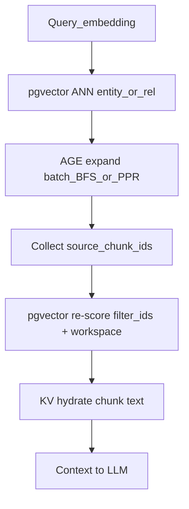

```text
+------------------------------------------------------------------+
| Local / Mix retrieval bridge                                     |
|                                                                  |
|  Query embedding                                                 |
|       v                                                          |
|  pgvector ANN (entity or relationship vectors)                   |
|       v                                                          |
|  AGE expand (batch nodes / edges / BFS or PPR)                   |
|       v                                                          |
|  Collect chunk ids from source_ids / source_chunk_ids            |
|       v                                                          |
|  pgvector re-score with filter_ids (+ workspace filter)          |
|       v                                                          |
|  KV hydrate chunk text (if metadata empty)                       |
|       v                                                          |
|  Context --> LLM (unless context_only)                           |
+------------------------------------------------------------------+
```

### Naive / Hybrid store touchpoints

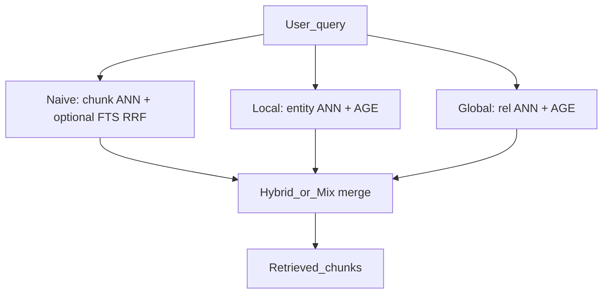

---

## 9. Write path summary (ingest)

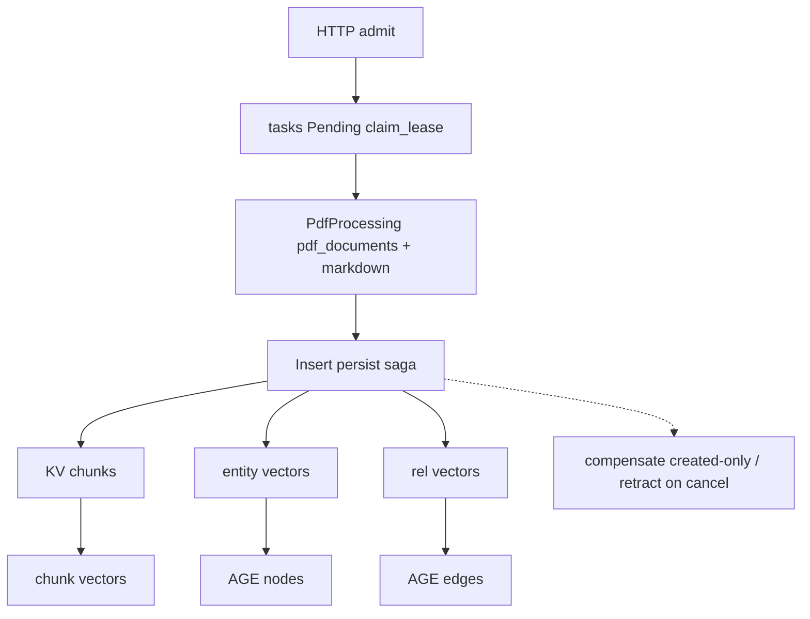

```text
+------------------------------------------------------------------+
| Ingest write path (saga, not one TX)                             |
|                                                                  |
|  HTTP admit --> tasks Pending (claim/lease)                      |
|       |                                                          |
|       +--> PdfProcessing: pdf_documents + markdown               |
|       |         v markdown barrier                               |
|       +--> Insert persist:                                       |
|              KV chunks --> chunk vectors --> merge               |
|                entity vectors --> AGE nodes                      |
|                rel vectors --> AGE edges                         |
|              on merge error: compensate (created only)           |
|              on cancel: retract_document_indexes                 |
+------------------------------------------------------------------+
```

Full sequence, cancel, and convert≠ingest: [Data Flow](../architecture/data-flow.md), [Ingestion cancel & fairness](../ingestion-cancel-and-fairness.md). Integrity hardening: [SPEC-058](../../specs/058-data-layer-hardening/000-index.md), [SPEC-059](../../specs/059-data-layer-integrity/000-index.md).

---

## 10. Migration & index map

| Migration | Concern | Runtime note |
| --------- | ------- | ------------ |
| 001 / 008 / 009 | Extensions, tenancy, RLS | Base |
| 013–015 | AGE helpers, graph indexes, early FTS | Child indexes later |
| 022 / 084–087 | PDF + mm-assets + Cancelled | pdf_storage / mm_asset |
| 028–029 / 071 | Vector columns + HNSW optimize | DDL + bootstrap |
| 038 | `source_ids` GIN on AGE | `migration_bootstrap` M038 |
| 039 | CQRS entities + `tsv` | Optional dual-write |
| 045 / 069 | `content_tsv` FTS (generated historically) | ensure_content_fts |
| 090 | `eq_merge_graph_properties` | native AGE upsert |
| 091 | writable `content_tsv` + KV backfill | upsert + FTS |
| 066 | chunk lineage tables | lineage sink |
| 070 / 074 / 083 / 086 | AGE child indexes, unique node_id, BFS | graph_lifecycle ensure_indexes |
| 080 | halfvec promotion | capabilities + apply |
| 081 | AGE RLS (optional) | `EDGEQUAKE_AGE_RLS` |
| 088 / 089 | Task leases + view refresh | Must refresh `edgequake.tasks` |

Marker migrations often pair with `migrations/support/*/apply.sql` and API bootstrap reconcile.

---

## 11. Operator debugging cookbook

Replace graph/table names with your namespace. Examples assume `namespace=default`.

### Inventory

```sql
-- KV document metadata keys
SELECT count(*) FROM public.eq_eq_default_kv
WHERE key LIKE '%-metadata';

-- Vector rows
SELECT count(*) FROM public.eq_eq_default_vectors;

-- Workspace vector tables
SELECT tablename FROM pg_tables
WHERE schemaname = 'public'
  AND tablename LIKE 'eq_eq_default_ws_%_vectors';

-- AGE graphs
SELECT name FROM ag_catalog.ag_graph ORDER BY name;

-- Approximate Node count (child table; adjust schema)
SELECT reltuples::bigint
FROM pg_class c
JOIN pg_namespace n ON n.oid = c.relnamespace
WHERE n.nspname = 'eq_eq_default_graph' AND c.relname = 'Node';
```

### Cosine ANN (smoke)

```sql
-- Requires a real query vector of matching dimension
EXPLAIN (ANALYZE, BUFFERS)
SELECT id, 1 - (embedding <=> '[0,0,...]'::vector) AS score
FROM public.eq_eq_default_vectors
ORDER BY embedding <=> '[0,0,...]'::vector
LIMIT 10;
```

### FTS

```sql
SELECT v.id,
       ts_rank_cd(v.content_tsv, websearch_to_tsquery('english', 'your query')) AS score
FROM public.eq_eq_default_vectors v
WHERE v.content_tsv @@ websearch_to_tsquery('english', 'your query')
ORDER BY score DESC
LIMIT 10;
```

### Lineage GIN probe (AGE child table)

```sql
-- Example: nodes citing a document prefix in source_ids
SELECT id, properties
FROM "eq_eq_default_graph"."Node"
WHERE properties->'source_ids' @> '["your-doc-id-chunk-0"]'::jsonb
LIMIT 20;
```

### Task leases

```sql
SELECT id, status, task_type, lease_owner, lease_expires_at, created_at
FROM edgequake.tasks
WHERE status IN ('pending', 'processing')
ORDER BY created_at
LIMIT 50;
```

If lease columns are missing from the view, apply M089 / refresh the view (see release notes for M031 class drift).

### Queue pressure (API)

```bash
curl -s http://localhost:8080/api/v1/pipeline/queue-metrics | jq
curl -s http://localhost:8080/ready
```

---

## Performance proof (SPEC-060 / SPEC-061)

Complexity catalog SSOT: [`specs/054-fix-bugs-17/005-query-complexity-catalog.md`](../../specs/054-fix-bugs-17/005-query-complexity-catalog.md).  
Stage matrix: [`specs/060-data-layer-perf-proof/002-stage-matrix.md`](../../specs/060-data-layer-perf-proof/002-stage-matrix.md).  
**Multi-version op matrix:** [`specs/061-multi-version-data-access-perf/002-op-matrix.md`](../../specs/061-multi-version-data-access-perf/002-op-matrix.md).

| Layer | How we prove it |
| ----- | --------------- |
| Asymptotic class | Catalog OK / ADMIN / FORBIDDEN + `contract_spec060_forbidden_request_path` |
| Plan shape | `EXPLAIN (ANALYZE, BUFFERS)` — Index/HNSW/GIN; Seq Scan fails on hot paths |
| Scale | Same query @ 2k and 50k; p95 within SLO |
| Stages | Prometheus ingest stage + query arm histograms (SPEC-060) |
| Majors | **PG16 / PG17 / PG18** via `make data-access-perf-matrix` (SPEC-061) |
| Stress | Concurrent ANN/FTS/expand/Mix: pg16 N=8 ≤2×; pg17/18 N=16 ≤1.5× |
| CI | Nightly `spec061-data-access-perf` matrix + `EDGEQUAKE_REQUIRE_POSTGRES_TESTS=1` |
| Artifacts | `/tmp/eq-perf-{profile}.jsonl` (`PERF_REPORT` lines) |

### Multi-version performance matrix (SPEC-061 / SPEC-062)

Pins: [`edgequake/docker/extension-pins.sh`](../../edgequake/docker/extension-pins.sh) (pgvector ≥0.8.5; AGE ≥1.6 on pg16, ≥1.7 on pg17/18).

```bash
make data-access-perf-matrix          # all majors (debug cargo)
make data-access-perf-matrix-release  # SPEC-062: cargo --release
make data-access-perf-matrix-prod     # release + EDGEQUAKE_PERF_SCALE=prod
make data-access-perf-capacity-ladder # SPEC-063: L1=100k (set EDGEQUAKE_CAPACITY_LADDER=L2|L3)
make compare-eq-perf                  # cross-major ≤2× gate on archived JSONL
EQ_PERF_PROFILES=pg18 make data-access-perf-matrix
```

| Major | Posture | Notes |
|-------|---------|--------|
| **pg16** | Legacy supported | AGE 1.6; expect slower graph writes until denormalized `eq_*` ids (SPEC-062 Wave 1) |
| **pg17** | Managed modern | AGE 1.7; stress ≤1.5× single-client; halfvec after recall gate |
| **pg18** | Recommended greenfield | Default tip; same code as 17; prefer for new installs |

**Stress honesty:** matrix stress measures **DataAccess concurrency** (storage + Mix arm orchestration with `MockProvider` / `context_only`). It is not a full production LLM round-trip soak. Use `EDGEQUAKE_PERF_SCALE=prod` (or `make data-access-perf-matrix-prod`) for 50k ANN/FTS + Mix 5k@1536; concurrent gates use pool ≥ `max(clients, 32)` except `stress_pool_saturation` (clients=16, pool=5).

### Capacity sizing (SPEC-063)

Separate **hard caps** (50 MiB upload, community **50k** nodes, HNSW dim ≤2000/4000), **physics**, and **proven / supported floors**. **SSOT (start here):** [`docs/product-limits.md`](../product-limits.md) — TL;DR: **50k Proven**, **100k Wave-2 Supported**, **150k DiskANN opt-in**, Wave-2 above 100k **Not promoted**. Capacity packs: [`specs/063-architecture-capacity-assessment/`](../../specs/063-architecture-capacity-assessment/000-index.md), [`specs/065-product-limits-ssot/`](../../specs/065-product-limits-ssot/000-index.md). Binary quantize + rerank ([SPEC-077](../../specs/077-binary-quantize-bakeoff/000-index.md)) and Filtered-DiskANN labels ([SPEC-078](../../specs/078-filtered-diskann-labels/000-index.md)) are **study tips** only — not silent defaults.

**Disk / RAM order of magnitude** at \(D=1536\) full `vector`:

\[
\text{table\_GB} \approx N_{\text{chunks}} \times 6.5 \times 10^{-6},\quad
\text{RAM\_effective\_GB} \approx 10\text{–}14 \times (N / 10^6)
\]

(`halfvec` ≈ 0.5× payload.) There is **no** enforced workspace storage-GB quota; `storage_bytes` undercounts embeddings/graph — do not size from UI “used MB” alone. Docs ≠ vectors: \(N_{\text{docs}} \approx N_{\text{chunks}} / \text{chunks\_per\_doc}\).

**Halfvec greenfield (no silent prod flip):** set `EDGEQUAKE_VECTOR_STORAGE=halfvec` only for **new** workspaces after `e2e_spec059_halfvec_perf_recall` is green. Existing `vector` columns need an explicit migration / rebuild — never flip under the hood.

**Cold ingest:** create vectors with `VectorIndexType::None`, bulk `upsert_report_created`, then `ensure_ann_index()` (heap insert avoids HNSW insert tax; `REINDEX` / rebuild honesty unchanged).

**REINDEX:** changing `EDGEQUAKE_HNSW_EF_CONSTRUCTION` only affects **new** indexes; existing HNSW needs operator `REINDEX CONCURRENTLY`.

Capability battle (`battle-matrix`) remains separate from SLO gates. Soft-skip on missing `DATABASE_URL` is a hard fail under `EDGEQUAKE_REQUIRE_POSTGRES_TESTS=1`.

Criterion memory benches under `edgequake/benches/` remain **informational only**. See [`specs/062-data-layer-perf-excellence/`](../../specs/062-data-layer-perf-excellence/).

### Scrapable stage metrics

| Metric | Labels |
| ------ | ------ |
| `edgequake_ingest_stage_duration_seconds` | `stage` = `kv_upsert`, `chunk_vector_upsert`, `entity_vector_upsert`, `age_node_upsert`, `rel_vector_upsert`, `age_edge_upsert`, `compensate` |
| `edgequake_query_arm_duration_seconds` | `arm` = `local`, `global`, `naive` |
| `edgequake_storage_op_duration_seconds` | `op` = `query_filtered`, `text_search_filtered`, `incident_edges` |

---

## Code map (quick)

| Concern | Path under `edgequake/crates/` |
| ------- | ------------------------------ |
| Naming | `edgequake-storage/.../postgres/config.rs` |
| KV keys | `edgequake-storage/src/kv_key_schema.rs` |
| KV adapter | `edgequake-storage/.../postgres/kv.rs` |
| Vectors | `edgequake-storage/.../postgres/vector/` |
| Workspace vectors | `edgequake-storage/.../postgres/workspace_vector.rs` |
| AGE | `edgequake-storage/.../postgres/graph/` |
| Lineage SQL | `.../graph/helpers/source_lineage_sql.rs` |
| Query modes | `edgequake-query/src/engine_impl/modes/` |
| Migrations | `edgequake/migrations/` |
| Perf proof tests | `edgequake-storage/tests/e2e_spec060_*`, `e2e_spec054_*`, `e2e_spec059_*` |

Optional live dump for a concrete database: `specs/044-upgrate-issue-study/edgequakeSchema.sql`.
