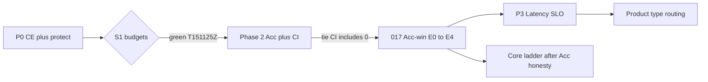

# 020 — Phased Roadmap

**Cross-ref:** [000 Index](./000-index.md) · all lenses · [017 Beat LightRAG](./017-beat-lightrag.md) · [018 E4 Acc-tie close](./018-e4-acc-tie-close.md) · **[021 Grounded plan F1–F4](./021-grounded-improvement-plan.md)** · **[028 First-principles beat roadmap](./028-first-principles-beat-roadmap.md)** (active Acc next steps) · [011 Acc Report §7](../011-publication-acc-report.md)

> **2026-07-20:** Acc-win E0–E4 and 024–027 are closed (no promote). **Next Acc work lives in [028](./028-first-principles-beat-roadmap.md)** (Horizon A query/prompt → B ingest → C latency deferred). This file remains the historical phase diagram.

---

## 1. Phase diagram

```text
  Phase 0          Phase 1                     Gate S1
  (docs)    →   P0 CE + protect        →   S1 GREEN (T151125Z)
                      │                           │
                      │                           ▼
                      │                    Phase 2 Acc + CI  ✅
                      │                    (persistent Acc tie;
                      │                     L2 near-gate / unstable)
                      │                           │
                      ▼                           ▼
               (ablation ladder)           Acc-win ladder (017)
                                           E0 L2 stabilize → E1 soft path+protect
                                           → E2 query-rank ents → E3 summarize
                                           → E4 Acc CI decision
                                                  │
                                                  ▼
                                           Phase 3 latency → 4 routing → 5 research
```



---

## 2. Phases

| Phase | Work | Primary docs | Gate |
|-------|------|--------------|------|
| **0** | This pack + index links | 000–017, 020 | Docs complete ✅ |
| **1** | Env-gated relevancy prune · PathRAG prune · CE · protect blend | [010](./010-lens-retrieval-noise.md) | **S1 green** `T151125Z` |
| **2** | Acc + bootstrap CI under S1 pins | [016](./016-lens-eval-fairness.md) | **Done** — persistent Acc **tie** (CI includes 0); L2 not stable ≥0.50 across replicates → **no headline promotion** (§2b) |
| **2b / Acc-win** | Stabilize L2 + Complex packing + Summarize coverage + CI | [017](./017-beat-lightrag.md) | E0–E4: ctx_rel stable; Complex ΔF1 ≤0.03; Summarize recall ≥0.95; Δ Acc CI excludes 0 **or** documented tie |
| **3** | Parallel Mix arms, keyword cache, tighter token budget | [013](./013-lens-latency-ops.md) | EQ p50 ≤ **1.5×** LR matched concurrency (CE cost in scope) |
| **4** | Intent routing product path (arm gate on for product only) | [014](./014-lens-generation-routing.md) | Per-type Acc ≥ always-mix; Acc headline still arms-off |
| **5** | Research: PPR / contextual embed; optional `P0_paper`; core ladder | [012](./012-lens-multihop-graph.md), [015](./015-lens-ingest-chunking.md) | Labeled profiles; core only after L2 stable + Acc honesty |

---

## 1b. Phase 1 Acc ablation ladder (2026-07-19)

| Archive | Config | EQ Acc | EQ ctx_rel | EQ recall | Notes |
|---------|--------|--------|------------|-----------|-------|
| `smoke-20260719T124903Z` | baseline (BM25, prune off) | **0.765** | 0.375 | 0.928 | Publication baseline |
| `smoke-20260719T134809Z` | RRF prune keep=10 | 0.706 | 0.438 | 0.884 | Too aggressive |
| `smoke-20260719T135230Z` | RRF prune keep=15 | 0.721 | 0.406 | 0.902 | |
| `smoke-20260719T140420Z` | cosine keep=12 | 0.722 | 0.456 | **0.950** | Best prune-only L2/recall |
| `smoke-20260719T142532Z` | cosine+CE+path0.6+orphan | 0.704 | 0.531 | 0.898 | First ctx_rel ≥0.50 |
| `smoke-20260719T142841Z` | cosine+CE+path0.4 top_k=16 | 0.696 | **0.544** | 0.911 | Max ctx_rel; Acc tax |
| `smoke-20260719T145324Z` | CE-only top_k=24 path0.4 | 0.710 | 0.506 | 0.909 | Acc recovery start |
| `smoke-20260719T145634Z` | CE path-off top_k=30 | 0.709 | 0.525 | 0.936 | Fact F1 recovered |
| `smoke-20260719T150417Z` | protect front-loaded | 0.698 | 0.506 | 0.916 | Wrong order — reject |
| **`smoke-20260719T151125Z`** | **CE path-off + `PROTECT_FIRST=12` top_k=30** | **0.760** | **0.519** | **0.928** | **S1 green** |

**Reading:** Soft CE maximized ctx_rel (0.544) but taxed Acc (~−0.07). Pure CE recovered Fact F1 but not overall Acc. **CE-order protect inclusion** clears **all three S1 budgets** vs baseline (Acc −0.004, ctx_rel 0.519, recall flat). Protect must **not** front-load Mix ranks ahead of CE order.

**Code shipped:**

| Module | Env keys | Default (headline) |
|--------|----------|--------------------|
| `relevancy_prune.rs` | `EDGEQUAKE_MIX_RELEVANCY_*` | `PRUNE=0` |
| `path_prune.rs` | `EDGEQUAKE_PATH_PRUNE_*` | fraction 0.4; orphan off |
| `bootstrap.rs` | `EDGEQUAKE_RERANKER*` + DashScope intl | `RERANKER=bm25` |
| `rerank_protect.rs` | `EDGEQUAKE_RERANK_PROTECT_FIRST` | `0` |
| Acc harness | `start_acc_backend.py` / `acc_env.py` / `fair_pins.py` | preserves shell overrides |

### S1 package pins (labeled profile — headline unpromoted)

```text
EDGEQUAKE_MIX_RELEVANCY_PRUNE=0
EDGEQUAKE_RERANKER=cross_encoder
EDGEQUAKE_RERANKER_PROVIDER=aliyun
EDGEQUAKE_RERANKER_MODEL=qwen3-rerank
EDGEQUAKE_PATH_PRUNE=0
EDGEQUAKE_RERANK_PROTECT_FIRST=12
BENCH001_EQ_RERANK_TOP_K=30
# fairness pins unchanged: MIX_ARM_GATE=false, FUSION=rrf, chunk 1200/100, mistral-small + mistral-embed
```

---

## 2b. Phase 2 Acc+CI (2026-07-19)

| Archive | Role | EQ Acc | LR Acc | Δ Acc 95% CI | EQ ctx_rel | EQ recall |
|---------|------|--------|--------|--------------|------------|-----------|
| `smoke-20260719T151125Z` | S1 discovery | 0.760 | 0.780 | [−0.106, +0.061] | **0.519** | 0.928 |
| `smoke-20260719T151836Z` | Phase 2 confirm | 0.751 | 0.771 | [−0.112, +0.069] | 0.481 | 0.911 |

**Verdict (honest):**

1. **Acc:** Persistent **statistical tie** under S1 pins — both Δ Acc CIs **include 0**. Point estimates favor LR (~−2pp). Same honesty class as baseline Acc tie (`T124903Z`).
2. **L2:** Discovery cleared ctx_rel ≥ 0.50; confirmatory **0.481** (still ~+10pp vs baseline 0.375, still below LR). **Unstable at the gate** → do not claim L2 parity for promotion.
3. **Promotion:** Acc headline stays BM25 / `PRUNE=0`. CE+protect remains a **labeled** profile.
4. **Next (Acc-win ladder):** Follow [017](./017-beat-lightrag.md) E0–E4 — L2 stabilize → soft path+protect → query-conditioned entity ranking → Summarize coverage → Acc CI decision. Do not promote headline until E4.

Paired bootstrap CI = decision rule (CI excludes 0 ⇒ reliable Δ; includes 0 ⇒ tie). See `tools/bench001/bench001/acc_stats.py`.

---

## 2c. Acc-win ladder (Phase 2b → beat LR)

Authoritative detail: **[017 Beat LightRAG](./017-beat-lightrag.md)**.

| Step | Change | Success | Status |
|------|--------|---------|--------|
| **E0** | Replicate S1 CE+protect pins | ctx_rel ≥0.50 on ≥2/3 **or** EQ ≥ LR | Skipped → E1 |
| **E1** | Soft `PATH_PRUNE=0.4` + `PROTECT_FIRST=12` | ctx_rel ≥0.50; Acc drop ≤0.02 | **Done** `T153436Z` (ctx_rel 0.519) |
| **E2** | `EDGEQUAKE_ENTITY_RANK=query_score` | Complex ΔF1 vs LR ≤ **0.03** | **Missed** `T153959Z` (ΔF1 −0.094); code labeled |
| **E3** | `RELATED_CHUNK_NUMBER` 5→8 | Summarize recall ≥ **0.95** | **Missed** `T154427Z` (0.863 flat) |
| **E3b** | `MIX_NAIVE_WEIGHT=2` | Summarize recall ≥ **0.95** | **Missed** `T155350Z` (0.882) |
| **E4** | Acc CI / honesty close | Document persistent tie | **Done** — [018](./018-e4-acc-tie-close.md); no promote |

**Acc-win closed:** persistent Acc **tie** under best labeled pins (S1 CE+protect). Soft Mix knobs exhausted.  
**Next program:** [021 F1–F4](./021-grounded-improvement-plan.md) — truncation Summarize floor → path packing → latency ops → labeled passage pack.

---

## 3. Code hooks (implementation cheat sheet)

| Phase | Touch first | Env / pin |
|-------|-------------|-----------|
| 1 ✅ | `relevancy_prune.rs`, `path_prune.rs`, `bootstrap.rs`, `rerank_protect.rs`, `query_pipeline.rs`, Acc env | See §1b table |
| 2 ✅ | Harness Acc+CI under S1 pins (`T151125Z`, `T151836Z`) | Acc tie documented; no promote |
| 2b / Acc-win ✅ | E0–E4 closed; soft knobs shipped labeled; Acc tie documented | [017](./017-beat-lightrag.md) · [018](./018-e4-acc-tie-close.md) |
| 3 / F3 | Stage timing export; arm semaphore sizing; prefill from F1/F2 | [021](./021-grounded-improvement-plan.md) · [013](./013-lens-latency-ops.md) L1/L2 shipped |
| F1 | `truncation.rs` Summarize/Exploratory chunk floor | [021](./021-grounded-improvement-plan.md) |
| F2 | `context_format` path mode + soft path | `EDGEQUAKE_CONTEXT_FORMAT=path` |
| 4 | `mix_weights.rs` intent gate (product default) | Never flip Acc server to gate-on silently |
| 5 / F4 | Passage pack + PPR tune (labeled) | `EDGEQUAKE_PASSAGE_PACK=1`; separate profile ids |

**Frozen Acc fairness pins (all phases):**

```text
EDGEQUAKE_MIX_ARM_GATE=false
EDGEQUAKE_RELATED_CHUNK_NUMBER=5
EDGEQUAKE_MIX_FUSION=rrf
EDGEQUAKE_CHUNK_SIZE=1200  (+ overlap 100)
EDGEQUAKE_ADAPTIVE_CHUNKING=0
LLM/vision/judge = mistral-small-latest
embed = mistral-embed @ 1024-d
retrieve_topk = 30
```

---

## 4. Suggested experiment order

1. ~~Baseline confirm `T124903Z`.~~ ✅  
2. ~~E1 cosine prune.~~ ✅ (partial S1)  
3. ~~E2/E4 path + CE ladder.~~ ✅  
4. ~~E4b CE+protect → S1 green `T151125Z`.~~ ✅  
5. ~~Phase 2 Acc+CI under S1 pins.~~ ✅ Acc **tie** (CI includes 0); L2 unstable → no promote.  
6. ~~Acc-win E0–E4.~~ ✅ Persistent Acc **tie** documented ([018](./018-e4-acc-tie-close.md)).  
7. **Next:** [021](./021-grounded-improvement-plan.md) F1a truncation → F2 path pack → F3 latency → F4 passage pack.  
8. Core ladder / paper rescore still blocked on Acc CI win or waived claim.

---

## 5. Definition of done (program)

- [x] Phase 1 gate green on smoke under labeled CE+protect pins (`T151125Z`)  
- [x] Phase 2 Acc claim honest — **persistent Acc tie** under S1 pins (`T151125Z` + `T151836Z`); L2 parity **not** stable → headline unpromoted  
- [x] Beat-LightRAG first-principles plan authored ([017](./017-beat-lightrag.md))  
- [x] Acc-win E1: L2 ctx_rel ≥0.50 under soft path+protect (`T153436Z`)  
- [x] Acc-win E2 measured — Complex ΔF1 gate **not** met (`T153959Z`); `EDGEQUAKE_ENTITY_RANK` shipped labeled  
- [x] Acc-win E3 measured — Summarize recall gate **not** met (`T154427Z` related_chunk=8 flat at 0.863)  
- [x] Acc-win E3b measured — Summarize recall gate **not** met (`T155350Z` naive×2 → 0.882); `EDGEQUAKE_MIX_*_WEIGHT` shipped  
- [x] Acc-win E4: **documented persistent Acc tie** under best labeled pins ([018](./018-e4-acc-tie-close.md)); no promote  
- [x] Post-E4 grounded plan authored ([021](./021-grounded-improvement-plan.md))  
- [ ] F1 Summarize truncation gate met or falsified  
- [ ] F2 Complex path-pack gate met or falsified  
- [ ] Phase 3 / F3 latency SLO met or explicitly waived with stage numbers  
- [ ] Product routing (Phase 4) documented separately from Acc  
- [ ] `000-index.md` stop rules still enforced in harness doctor checks  

---

## 6. Out of scope for this pack

- UltraDomain / MMLongBench claims  
- Changing LightRAG upstream  
- Silent Acc headline promotion (E4 forbids without CI excluding 0)  
