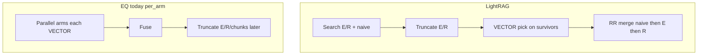

# 078 — EdgeQuake vs LightRAG (easy read) + next confound

**Status:** Assess done · R3 post-truncate pack next · **not** Acc Beat  
**Date:** 2026-07-22  
**Keep peer:** E2 occ [`T133053Z`](../e2e/artifacts/history/medical-mid-20260722T133053Z/) · Acc CI tie  
**Acc SSOT:** P0 [`T104918Z`](../e2e/artifacts/history/medical-mid-20260722T104918Z/) · `publish/latest`  
**Prior:** [077](./077-dense-arms-fact-l2.md) · [076](./076-mix-law-remaining-after-l15.md) · LR `operate.py`

---

## 1. 30-second verdict

Same medical-mid n=200, fair Mistral pins. **Two packs — do not merge claims.**

| Claim surface | EQ Acc | LR Acc | Acc Δ CI | ctx | Fact ER |
|---------------|--------|--------|----------|-----|---------|
| **Acc headline** (P0) | 0.706 | 0.774 | [−0.107, −0.033] **LR** | 0.396 | 0.790 |
| **Gap-close keep** (E2) | 0.765 | 0.760 | [−0.031, +0.040] **tie** | 0.491 | 0.917 |

- Headline: LightRAG ahead (CI excludes 0).
- Labeled LR-identity pack: **Acc peer**; ER ≈ matched; **Fact ER** and **ctx&lt;0.50** still open.
- No “EQ beats LightRAG” until mid CI excludes 0 EQ **and** ctx≥0.50 **and** ER≥LR−0.03.

---

## 2. Same idea, different engines

Both: Mix = naive + local + global → fuse → LLM.

| Layer | LightRAG | EdgeQuake |
|-------|----------|-----------|
| Code | Python `operate.py` | Rust `edgequake-query` |
| DB | Nano / Neo4j / … | Postgres + AGE + pgvector |
| Arms | Sequential | Parallel (keep) |
| Fair fuse | Round-robin | RR on gap-close; RRF on Acc headline |
| Citations | One list = prompt | Acc Mix ≠ Fact L2 (`fact_replace`) |



---

## 3. Code map (what still differs)

| # | Law | LR | EQ keep E2 | Status |
|---|-----|----|------------|--------|
| — | RR · rerank off · bfs · VECTOR+LR budget · retrieval rank · occ sort | yes | yes | matched |
| R1 | RR naive→entity→relation | `_merge_all_chunks` | `local_first` (NF hatch) | REJECT Acc |
| R2 | Dense arms when rerank off | no BM25 | BM25 default on | REJECT Acc |
| **R3** | Truncate E/R **then** VECTOR | `_build_query_context` | per-arm pick → fuse → truncate | **next** |
| R4 | Incident rank+weight rels | local edges | `RELATION_SELECT=default` | deferred |
| R5 | Occurrence sort | always | E2 on | keep Acc; Fact ER miss |
| R6 | Acc = L2 list | one list | `fact_replace` | by design |

Files: LR [`operate.py`](file:///Users/raphaelmansuy/Github/03-working/LightRAG/lightrag/operate.py) · EQ [`mix.rs`](../../../edgequake/crates/edgequake-query/src/engine_impl/modes/mix.rs) · [`chunk_retrieval.rs`](../../../edgequake/crates/edgequake-query/src/engine_impl/modes/chunk_retrieval.rs) · [`query_pipeline.rs`](../../../edgequake/crates/edgequake-query/src/engine_impl/query_entry/query_pipeline.rs)

---

## 4. Tried / rejected (do not retry)

| Pack | Mid Acc CI | Verdict |
|------|------------|---------|
| NF `RR_ORDER=naive_first` | [−0.080, −0.007] | REJECT |
| Dense `BM25_RETRIEVAL=0` | [−0.083, −0.010] | REJECT (L2↑) |
| Occ `KG_CHUNK_OCCURRENCE_SORT=1` | [−0.031, +0.040] | **keep** Acc; Fact ER miss |

Packing fishing **stopped** after E2 Fact ER miss.

---

## 5. Next — R3 post-truncate pick

**Law:** Acc/Fact membership follow **which chunks exist**. EQ can keep chunks from entities later dropped; LR never picks those.

**Pin on E2 base:** `EDGEQUAKE_KG_CHUNK_PICK_TIMING=post_truncate` (default `per_arm`).

```bash
make bench001-lr-posttrunc-fact-l2
make bench001-medical-mid-lr-posttrunc-fact-l2
```

Profile: `LR_POSTTRUNC_FACT_L2_v1`. Gates: Acc CI not worse than E2; Fact ER ≥LR−0.03 or ≥E2+0.02; ctx ≥0.50 or ≥E2+0.02; Acc `publish/latest` intact.

**Stop:** Acc CI regresses → REJECT; keep E2; do not stack R4.

### R3 results

| Stage | Acc CI | ctx | Fact ER | Verdict |
|-------|--------|-----|---------|---------|
| Smoke [`T140403Z`](../e2e/artifacts/history/smoke-20260722T140403Z/) | tie [−0.108, +0.052] | 0.500 | 0.95 | green |
| Mid [`T141105Z`](../e2e/artifacts/history/medical-mid-20260722T141105Z/) | **[−0.076, −0.001] LR** | 0.484 | **0.930** (≥LR−0.03) | **REJECT Acc** |

Post-truncate lifts Fact ER toward LR but Acc CI regresses vs E2 keep → **keep E2**. Acc `publish/latest` untouched (P0). Do not stack R4 in this pass.

| Pack | Acc CI | ctx | Fact ER | Role |
|------|--------|-----|---------|------|
| **E2 occ** | **[−0.031, +0.040]** | 0.491 | 0.917 | **keep** |
| R3 posttrunc | [−0.076, −0.001] LR | 0.484 | 0.930 | REJECT Acc |
