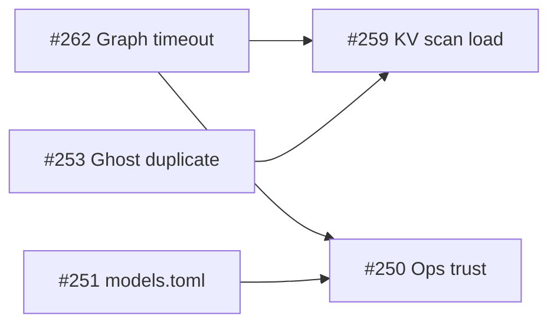

# SPEC-040 — 5 WHY Analysis (Issues #250–#253, #259, #262)

**Lens:** Root cause (5 WHY)  
**Evidence:** Live source on `main` (2026-07-02)

---

## Issue #262 — Graph stream / stats 15s timeout

### Symptom

`GET /api/v1/workspaces/{id}/stats` and graph stream materialization hit a hard 15s Tokio timeout. Logs show `Nested Loop Left Join` over ~27k vertices × ~23k edges.

### 5 WHY chain

| # | Why | Evidence |
| - | --- | -------- |
| 1 | Why does the query exceed 15s? | `run_timed_graph_query` enforces `graph_query_timeout_secs` (default 15) — `graph_materialization.rs:41-74` |
| 2 | Why is the SQL plan slow? | `pg_get_popular_nodes_with_degree` joins `edge_counts` to `filtered_nodes` via `start_id::text`; bad plans pick Nested Loop — `query_ops.rs:504-531` |
| 3 | Why does PostgreSQL pick Nested Loop? | Planner estimates `rows=1` for `workspace_id` filter on `agtype_to_json(properties)->>'workspace_id'` — no extended stats on expression (#262 reporter EXPLAIN) |
| 4 | Why aren't indexes used on the filter? | Migration 014/038 created indexes on `_ag_label_vertex` **parent** tables; AGE stores rows in `"Node"` / `"EDGE"` **child** tables — parent indexes stay empty (8 KB) |
| 5 | Why wasn't this caught in CI? | Dev graphs are small (<1k nodes); nested loop is “fast enough”; production graphs + missing child ANALYZE only fail at scale |

**Root cause:** AGE table inheritance + expression-index placement on wrong rel + missing planner statistics → catastrophic join order on workspace-scoped graph reads.

---

## Issue #259 — `messages_conversation_id_fkey` + multi-workspace slowness

### Symptom

After creating multiple workspaces and uploading documents, queries fail with:

`Failed to save response: … insert or update on table "messages" violates foreign key constraint "messages_conversation_id_fkey"`

App becomes slow.

### 5 WHY chain

| # | Why | Evidence |
| - | --- | -------- |
| 1 | Why does message insert fail FK check? | `PostgresConversationStorage::create_message` INSERTs with `conversation_id` that has no parent row — `conversation.rs:509-527` |
| 2 | Why is conversation missing at assistant-message time? | Streaming path saves user message **before** LLM work, assistant message **after** — `streaming.rs:157-169`, `535-547`; conversation may be deleted in between |
| 3 | Why would conversation be deleted mid-stream? | User bulk-deletes history, admin workspace reset, or DB maintenance while long RAG query runs (compounded by #262 slowness) |
| 4 | Why does multi-workspace usage increase frequency? | Workspace switch does **not** always clear `activeConversationId` before next submit — `use-query-conversation-lifecycle.ts:110-123` only clears when loaded conversation has `messages.length > 0` |
| 5 | Why does slowness correlate? | Each workspace switch triggers cold stats/graph reads (#262), KV metadata scans, and concurrent materialization slots — `stats.rs:195-251`, `graph_materialization.rs:22-29` |

**Root cause:** Conversation ID lifecycle is not workspace-scoped at submit time; long-running streams assume conversation immutability; performance degradation (#262) widens the deletion race window.

---

## Issue #253 — Duplicate upload Replace does nothing

### Symptom

Documents list appears empty; upload shows “Duplicate document detected” for `*.md`; user clicks Replace → dialog reappears / nothing happens.

### 5 WHY chain

| # | Why | Evidence |
| - | --- | -------- |
| 1 | Why does UI show duplicate? | Upload response includes `duplicate_of` → `use-file-upload.ts:354-361` queues `DuplicateUploadDialog` |
| 2 | Why is backend returning duplicate when list is empty? | Workspace content-hash key `{workspace}-hash-{sha256}` still maps to old `document_id` — `document_reingest.rs:23-28`, `ContentHasher::workspace_hash_key` |
| 3 | Why is hash key present without visible document? | Metadata deleted (failed ingest, partial delete, workspace migration) but hash key not removed — delete path must include hash cleanup (`single.rs:368-376`) |
| 4 | Why does Replace fail to clear it? | `resolvePendingDuplicates` for markdown: `deleteDocument` may 404; re-upload hits `StillProcessing` if metadata status is `pending`/`processing`/`deleting` — `document_reingest.rs:94-100` |
| 5 | Why wasn't PDF-style orphan recycle applied? | `recycle_orphan_workspace_pdf` + visibility check exists for PDFs only — `pdf_workspace_dedup.rs`, `upload.rs:410-421`; no KV-hash orphan equivalent for text/markdown |

**Root cause:** Duplicate detection uses a **third store** (hash KV) that can outlive list-visible metadata; Replace path lacks orphan-hash recycle and force-reindex parity with PDFs.

---

## Issue #251 — `models.toml` not overridable at runtime

### Symptom

Mounting custom `models.toml` + `EDGEQUAKE_MODELS_CONFIG` has no effect; `/api/v1/models/llm` serves embedded catalog only.

### 5 WHY chain

| # | Why | Evidence |
| - | --- | -------- |
| 1 | Why doesn't mounted file appear in API? | `load_bundled_models_config()` returns embedded parse result — `bundled_models.rs:16-20` |
| 2 | Why isn't `ModelsConfig::load()` called? | Chained as `.or_else(|_| ModelsConfig::load())` **after** `from_toml(BUNDLED)` which always succeeds |
| 3 | Why was it written this way? | Comment says “fallback to env/file” but implementation treats embed as primary SSOT |
| 4 | Why do docs contradict code? | `models.toml` header documents priority 1–4 — `edgequake/models.toml:6-10`; code inverts order |
| 5 | Why no operator signal? | No `tracing::info!` on which catalog source loaded — silent misconfiguration |

**Root cause:** Inverted precedence in `load_bundled_models_config()` — dead runtime path despite documented contract.

---

## Issue #250 — UI version ≠ API version

### Symptom

Footer shows `v0.12.3`; header/API health shows `v0.12.11`.

### 5 WHY chain

| # | Why | Evidence |
| - | --- | -------- |
| 1 | Why do two versions appear? | Sidebar uses `APP_VERSION_NUMBER` from `package.json` — `app-version.ts:15-21`, `sidebar.tsx:225` |
| 2 | Why doesn't UI match API? | API uses `env!("CARGO_PKG_VERSION")` — `health.rs:150`; frontend/backend ship as separate artifacts |
| 3 | Why wasn't UI rebuilt on deploy? | ECS/Fargate may roll API task without matching frontend image tag (#250 reporter) |
| 4 | Why is footer still “wrong” after labeling fix? | i18n now says “UI vX” vs “API vY” — `en.json:34,103` — reduces confusion but not single version |
| 5 | Why no build-time coupling? | `NEXT_PUBLIC_APP_VERSION` optional; no CI gate comparing UI package to API semver |

**Root cause:** **Dual release artifacts** without enforced version lockfile; UI semver is independent of API semver.

---

## Cross-issue coupling

| From | To | Mechanism |
| ---- | -- | --------- |
| #262 | #259 | Long streams increase window for conversation deletion before assistant `create_message` |
| #262 | #250 | Stats timeout → dashboard “0 entities” → operators suspect wrong version deployed |
| #253 | #259 | Ghost hash keys cause repeated failed uploads → extra worker load |
| #251 | #250 | Cannot add local Ollama model without rebuild → operators doubt deployment correctness |
