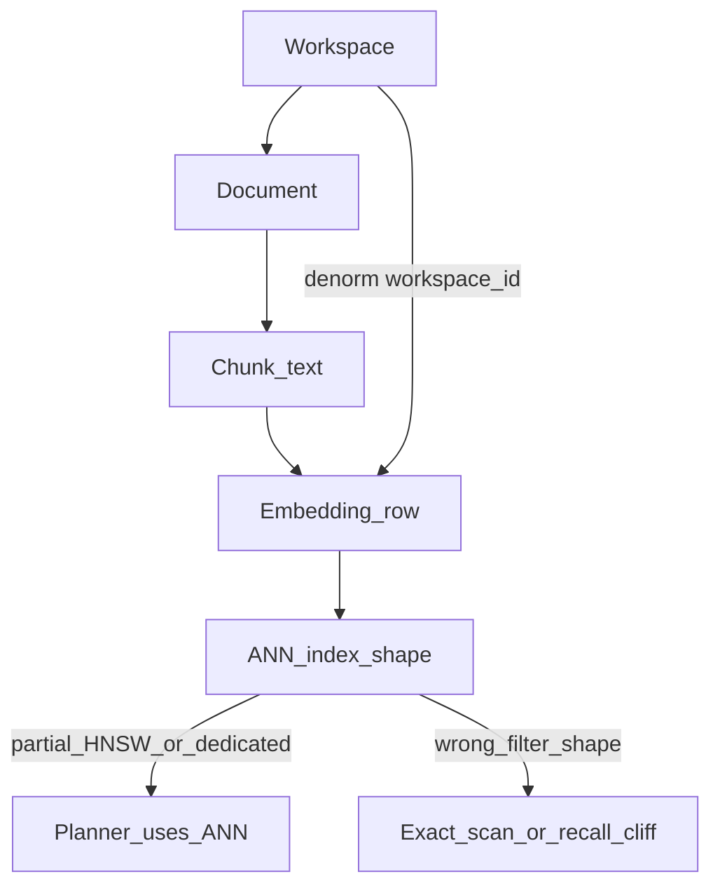

# SPEC-073 — First principles

## Law (same as SPEC-063)

Capacity and reliability claims require: **(1)** a hard cap in code, **or (2)** a physics formula with stated assumptions, **or (3)** a measured gate under published SLOs. Layout opinions without one of these are aspirational.

## Four units of meaning

Conflating these units is the root of both integrity bugs and capacity cliffs:

| Unit | Role | What scales / fails |
|------|------|---------------------|
| **Workspace** | Isolation / tenancy boundary | Filter selectivity; **index shape** (partial HNSW, partition, dedicated table) |
| **Document** | Ownership, ACL, status, delete | Cascade / retract surface; `max_documents` |
| **Chunk** | Retrieval + FTS unit | \(N\) ≈ corpus size for latency/RAM |
| **Embedding** | ANN unit (co-located or linked) | Bytes × HNSW/DiskANN residency |

**Ideal relational spine (industry 2026):**

```text
workspaces 1──* documents 1──* chunks
                  │                │
                  │                └── embedding vector(D)   [or FK → vectors]
                  └── workspace_id / tenant_id denormalized onto chunks
```

- Document = business unit (permissions, deletion, metadata, content hash).
- Chunk = retrieval unit (`chunk_index`, text, token counts).
- `tenant_id` / `workspace_id` on **both** documents and chunks is intentional redundancy: hot-path filters, RLS, partial indexes, and partition keys must not require a join ([jacar.es — RAG + pgvector production](https://jacar.es/en/rag-with-postgres-and-pgvector-in-production-from-poc-to-slo/)).

## Physics (reuse SPEC-063)

At \(D = 1536\) and `vector` (float32):

\[
\text{table\_GB} \approx N \times 6.5 \times 10^{-6}
\quad\Rightarrow\quad
1\text{M chunks} \approx 6\text{–}7\text{ GB table}
\]

HNSW residency (order of magnitude):

\[
\text{RAM\_effective\_GB} \approx 10\text{–}14 \times (N / 10^6)
\quad\text{at } D=1536 \text{ full vector}
\]

`halfvec` ≈ 0.5× payload → roughly doubles \(N\) for the same RAM budget.

**Documents ≠ vectors:**

\[
N_{\text{docs}} \approx N_{\text{chunks}} / \text{chunks\_per\_doc}
\]

Example: 50k chunk vectors @ ~100 chunks/doc ⇒ **~500 documents**, not 50k docs.

## Filter–index law (reliability = correct plan)

Filtered ANN cost (SPEC-064):

\[
\text{cost} \approx \text{embedding\_bytes} \times \text{filtered\_heap\_rows} \times (1 + \text{I/O\_miss\_penalty})
\]

HNSW graphs are **global** unless the index predicate matches the query filter:

| Query shape | Typical planner outcome | Risk |
|-------------|-------------------------|------|
| `ORDER BY embedding <=> q LIMIT k` (no filter) | HNSW | OK if index resident |
| `WHERE workspace_id = $ws` + global HNSW | Post-filter / underfill, or btree→exact on slice | **Recall cliff** or **latency cliff** |
| Same filter + **partial HNSW** `WHERE workspace_id = $ws` | ANN over workspace subgraph | Wave-2 path |
| Same filter + **dedicated table** / partition | ANN over table = workspace | Dimension isolation; DiskANN opt-in |
| Filter only via `metadata->>'workspace_id'` | Partial index **not implied** | Cold exact path |

Industry levers for the filter trap (pgvector 0.8+, July 2026) — apply in order:

1. **Partial HNSW** or **partition / dedicated table** on `workspace_id` (index shape ≡ filter)
2. **`hnsw.iterative_scan`** (`relaxed_order` for most RAG; `strict_order` when rank must be exact)
3. Raise **`ef_search`** (latency cost)
4. DiskANN **labels** (`smallint[]`) or tuned **post-filter** search list (pgvectorscale)

See the full ordered ladder: [`005-industry-scale-playbook.md`](005-industry-scale-playbook.md).

**Implication:** workspace linkage is not decorative metadata. It is the **predicate that must match the ANN index shape**.

## Why one Postgres + relational linkage

| Property | Effect |
|----------|--------|
| Ordinary `WHERE` + joins | Tenant/workspace/document filters without a second payload-filter product |
| FK / CASCADE / RLS | Delete and isolation are DB-enforced, not only app convention |
| One backup / PITR surface | Embeddings share ops with the product DB (industry comfort ~1–10M HNSW/node with quantization; not an EdgeQuake floor) |
| Hybrid FTS + ANN | Same engine; RRF/lexical recovery without a second cluster |

When **not** enough: HNSW out of RAM → DiskANN; then sub-20 ms p99 at extreme QPS / multi-region / tens of M+ → external ANN — only after full gates.

## Diagram


