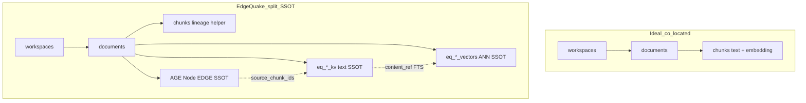
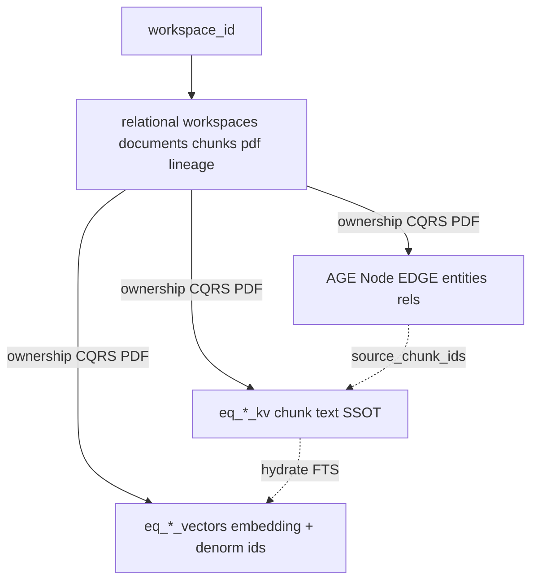

# SPEC-073 — EdgeQuake mapping

EdgeQuake implements the **four units** of [`001-first-principles.md`](001-first-principles.md), but **splits physical storage** across a relational sidecar and three RAG SSOTs. This is intentional; it is also the reliability tax.

**How this maps to the July 2026 industry scale ladder:** [`005-industry-scale-playbook.md`](005-industry-scale-playbook.md) §3 and §8.

## Ideal vs today



| Ideal | EdgeQuake today | Implication |
|-------|-----------------|-------------|
| `workspaces 1—* documents 1—* chunks` | Migrations [`001_init_database.sql`](../../edgequake/migrations/001_init_database.sql), lineage [`066_chunk_lineage_tables.sql`](../../edgequake/migrations/066_chunk_lineage_tables.sql), PDF [`022_add_pdf_documents_table.sql`](../../edgequake/migrations/022_add_pdf_documents_table.sql) | Lifecycle, status, PDF, lineage OK |
| Chunk text + embedding co-located | **Split:** KV text (`eq_*_kv`) + embeddings (`eq_*_vectors`) | Hot ANN avoids wide text TOAST; FTS joins KV |
| Denorm `workspace_id` / `document_id` on embedding rows | Materialized columns + upsert dual-write ([`028_add_vector_materialized_columns.sql`](../../edgequake/migrations/028_add_vector_materialized_columns.sql), vector `storage_impl`) | Required for Wave-2 partial-HNSW implication |
| Partial HNSW / partition per hot workspace | `EDGEQUAKE_HNSW_PARTIAL_BY_WORKSPACE=1` in [`vector/ddl.rs`](../../edgequake/crates/edgequake-storage/src/adapters/postgres/vector/ddl.rs) | Default supported 100k path ([`docs/product-limits.md`](../../docs/product-limits.md)) |
| Dedicated per-workspace table | `PgWorkspaceVectorRegistry` → `eq_*_ws_{short8}_vectors` | Dimension isolation; DiskANN opt-in @150k (SPEC-072) |
| Single ACID ingest + CASCADE delete | **Saga** across KV + AGE + vectors; retract on cancel/fail (SPEC-058/059) | Compensate must be complete or dual-SSOT drifts |

**Dual-SSOT warning (canonical):** do not treat `public.documents` / `public.chunks` alone as the RAG corpus — see [`docs/deep-dives/data-layer.md`](../../docs/deep-dives/data-layer.md) §1 diagrams.

## Physical layout



```text
                    +-------------------------------------+
  workspace_id ---> | relational: workspaces / documents  |
                    |            / chunks / pdf / lineage |
                    +------------------+------------------+
                                       | ownership / CQRS / PDF
          +----------------------------+----------------------------+
          v                            v                            v
   eq_*_kv (text)              eq_*_vectors (ANN)             AGE graph
   chunk JSON SSOT             embedding + denorm             entities/rels
                               workspace_id, document_id
```

### Relational spine (sidecar)

| Table | Role |
|-------|------|
| `workspaces` | Tenancy root (`workspace_id`, `tenant_id`, settings) |
| `documents` | Business unit: status, content_hash, workspace link, chunk_count |
| `chunks` | Lineage / CQRS helper rows (`document_id`, `workspace_id`, `chunk_index`); legacy `embedding` column is **not** the RAG ANN SSOT |
| `pdf_documents` | BYTEA payload linked to `document_id` / `workspace_id` |
| `chunk_entity_links` / `chunk_relation_links` | Graph lineage |

### RAG SSOTs (runtime DDL)

| Store | Physical (namespace `default`) | Hot columns |
|-------|--------------------------------|-------------|
| KV | `public.eq_eq_default_kv` | `key`, JSONB `value` (chunk text) |
| Vectors (shared) | `public.eq_eq_default_vectors` | `id`, `embedding`, `metadata`, **`document_id`**, **`tenant_id`**, **`workspace_id`**, `content_tsv` |
| Vectors (dedicated WS) | `public.eq_eq_default_ws_{first8}_vectors` | Same shape; one table per workspace |
| AGE | schema `eq_eq_default_graph` | Node/EDGE props include workspace |

DDL / partial HNSW: [`edgequake/crates/edgequake-storage/src/adapters/postgres/vector/ddl.rs`](../../edgequake/crates/edgequake-storage/src/adapters/postgres/vector/ddl.rs).

Naming: [`config.rs`](../../edgequake/crates/edgequake-storage/src/adapters/postgres/config.rs) (`qualified_vectors_table_name`, workspace registry).

## Query shape (no join to relational chunks for ANN)

ANN reads the vectors table with `MetadataFilter` column predicates, then optionally LEFT JOINs KV for text ([`vector/fts.rs`](../../edgequake/crates/edgequake-storage/src/adapters/postgres/vector/fts.rs)):

```sql
SELECT id, metadata, 1 - (embedding <=> $1) AS score
FROM public.eq_eq_default_vectors
WHERE workspace_id = $n          -- Wave-2 columns-only (implies partial HNSW)
  AND document_id = ANY(...)     -- optional document scope
ORDER BY embedding <=> $1
LIMIT $k;
```

Filter policy: [`metadata_filter_sql.rs`](../../edgequake/crates/edgequake-storage/src/adapters/postgres/vector/metadata_filter_sql.rs), [`hnsw_runtime_policy.rs`](../../edgequake/crates/edgequake-storage/src/adapters/postgres/vector/hnsw_runtime_policy.rs).

| Mode | Isolation mechanism |
|------|---------------------|
| Wave-2 shared | Column `workspace_id` + partial HNSW `WHERE workspace_id = …` |
| Dedicated `*_ws_*` | Table = workspace; skip partial HNSW |
| Opt-in DiskANN | Dedicated table + `query_search_list_size≥400` (SPEC-072) |
| Legacy | JSONB `OR` metadata fallback — **breaks** partial-index implication |

## What “document linked to workspace” means for indexes

1. **Workspace is the index-shape key.** Document filters (`document_id = ANY`) are secondary selectivity; they do not replace partial HNSW / dedicated tables.
2. **Upsert must denormalize** `workspace_id` / `document_id` / `tenant_id` onto vector rows. Metadata-only dual-write without columns → planner cannot use Wave-2 partial indexes.
3. **Delete-by-document** must hit vectors (and KV/AGE) by denorm `document_id`, not only delete the relational row — saga retract (SPEC-058/059).
4. **Dedicated tables** isolate dimension / DiskANN recipes; SPEC-069 showed dedicated **HNSW** alone does **not** unlock mid-scale concurrent floors.

## Proven shapes (do not restate as new floors)

From [`docs/product-limits.md`](../../docs/product-limits.md):

| Shape | Floor | Notes |
|-------|-------|-------|
| Default / laptop | ~50k vectors | Prod stress matrix |
| Wave-2 shared+partial | **100k** filtered ANN | Product default supported |
| Dedicated HNSW | Concurrent wall | Not a mid-scale unlock (SPEC-069) |
| Opt-in DiskANN | **150k** | `q_list≥400`; not silent default (SPEC-072) |
