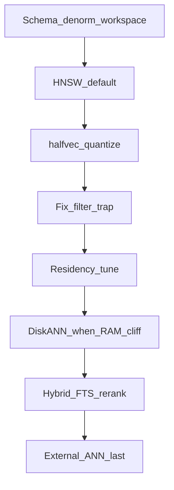

# SPEC-073 — Industry scale playbook (July 2026)

Plain-language guide: how the industry scales **document + chunk + pgvector** RAG in Postgres, grounded in first principles, then mapped to EdgeQuake.

**Sources (July 2026 band):** [jacar.es RAG+pgvector](https://jacar.es/en/rag-with-postgres-and-pgvector-in-production-from-poc-to-slo/), [ClickHouse / scale-in-Postgres](https://clickhouse.com/resources/engineering/scale-vector-search-postgres), [pgvector 0.8 iterative scan (Aurora)](https://aws.amazon.com/blogs/database/supercharging-vector-search-performance-and-relevance-with-pgvector-0-8-0-on-amazon-aurora-postgresql/), [dbi Services pgvector DBA guide (Mar 2026)](https://www.dbi-services.com/blog/pgvector-a-guide-for-dba-part-2-indexes-update-march-2026/), [pgvectorscale / StreamingDiskANN](https://github.com/timescale/pgvectorscale/), [DanubeData managed Postgres RAG 2026](https://danubedata.ro/blog/pgvector-rag-managed-postgres-2026).

**Honesty rule:** Industry *comfort bands* (e.g. ~10M HNSW/node) are **not** EdgeQuake product floors. EdgeQuake claims only measured gates ([`docs/product-limits.md`](../../docs/product-limits.md)).

---

## 1. The problem in one paragraph

RAG search is almost never “find nearest vectors in the world.” It is “find nearest vectors **in this workspace** (and often this document set).”  
If the ANN index is global and the workspace filter is applied afterward, you get either **wrong/empty answers** (recall cliff) or **slow exact scans** (latency cliff).  
If the HNSW graph no longer fits in RAM, every query pays disk I/O and p95 collapses.  
Scaling is therefore: **shrink the bytes**, **match the index to the filter**, **keep the hot graph resident** (or move to disk-oriented ANN), and **measure recall + latency + concurrency together**.

---

## 2. Three first principles (non-negotiable)

### P1 — Separate units of meaning

| Unit | Question it answers |
|------|---------------------|
| Workspace | *Whose* corpus? |
| Document | *What* may I delete / ACL? |
| Chunk | *What text* do I retrieve? |
| Embedding | *How* do I ANN-search? |

Industry schema: separate `documents` and `chunks`; put `tenant_id` / `workspace_id` on **both** (denormalized). Join on the hot path is optional; **filter columns on the embedding row are mandatory**.

### P2 — Cost follows bytes × filtered rows × cache miss

\[
\text{cost} \approx \text{embedding\_bytes} \times \text{rows\_touched} \times (1 + \text{I/O\_miss})
\]

Levers that actually move the needle:

1. Fewer bytes per row (`halfvec`, binary/SBQ, Matryoshka trim)
2. Fewer rows in the ANN subgraph (partial index, partition, dedicated table)
3. Fewer cache misses (residency / DiskANN streaming)

### P3 — Claims need evidence

Hard cap **or** physics formula **or** measured SLO gate (SPEC-063).  
Demo latency without filtered recall is not a scale win.

---

## 3. Industry scale ladder (apply in order)

Do **not** jump to an external vector DB before exhausting the steps that fit your filter shape.



| Step | What industry does (2026) | Why (first principle) | EdgeQuake today |
|------|---------------------------|------------------------|-----------------|
| **0. Schema** | `documents` 1—* `chunks`; denorm `workspace_id`/`tenant_id`; optional embedding model version on row | P1 — filter/RLS/partition without join | Relational sidecar + denorm columns on `eq_*_vectors` |
| **1. Default ANN** | **HNSW** (not IVFFlat) for RAG; match opclass to `<=>` / `<->` / `<#>` | Low-latency ANN while graph fits RAM | Shared / partial HNSW (Wave-2) |
| **2. Quantize** | Prefer **`halfvec`** first (~2× density, small recall loss); then binary/SBQ; then Matryoshka dim trim | P2 — cut bytes | Wave-2 greenfield `EDGEQUAKE_VECTOR_STORAGE=halfvec` |
| **3. Fix filter trap** | In order of selectivity: **partial HNSW** / **list partition by workspace** → **`hnsw.iterative_scan`** (`relaxed_order` typical) → raise `ef_search` → DiskANN **labels** (`smallint[]`) if using pgvectorscale | P1+P2 — index shape ≡ filter | Wave-2 **partial HNSW** (proven); iterative_scan = future bake-off; DiskANN labels **out of scope** (dedicated table instead) |
| **4. Residency** | Size `shared_buffers` / host RAM so HNSW stays hot; build with `maintenance_work_mem` + parallel workers; `CREATE INDEX CONCURRENTLY` | P2 — I/O miss dominates cold cliffs | SPEC-067/071 residency + warmup |
| **5. Disk-oriented ANN** | **pgvectorscale StreamingDiskANN** when HNSW outgrows RAM; tune `query_search_list_size`; SBQ for compression | P2 — compact nav structure, heap rescore | Opt-in `pg18-vectorscale`; dedicated DiskANN @150k with **q_list≥400** (SPEC-072) |
| **6. Quality layer** | Hybrid FTS + ANN (RRF); two-stage ANN → cross-encoder / exact rescore | Embedding alone loses codes/names | FTS join to KV; rerank product-dependent |
| **7. Leave Postgres** | Sub-20 ms p99 at extreme QPS, multi-region ANN, tens of M–billions with GPU, heavy re-embed churn | Ops / physics beyond one node | Not EdgeQuake default path |

**Industry comfort bands (aspirational for EdgeQuake):** pgvector HNSW ~**1–10M**/node with quantization; DiskANN/pgvectorscale cited toward **tens of M** with SBQ. EdgeQuake **measured**: Wave-2 **100k**; opt-in DiskANN **150k**.

---

## 4. Schema best practice (clear recipe)

```sql
-- Industry spine (illustrative)
CREATE TABLE documents (
  id            uuid PRIMARY KEY,
  workspace_id  uuid NOT NULL,
  tenant_id     uuid NOT NULL,
  -- status, hash, title, …
);

CREATE TABLE chunks (
  id            uuid PRIMARY KEY,
  document_id   uuid NOT NULL REFERENCES documents(id) ON DELETE CASCADE,
  workspace_id  uuid NOT NULL,   -- denorm: hot filter / RLS / partition
  tenant_id     uuid NOT NULL,
  chunk_index   int  NOT NULL,
  content       text NOT NULL,
  embedding     halfvec(1536) NOT NULL,  -- or FK to vectors table
  embedding_model text NOT NULL
);

CREATE INDEX ON chunks (workspace_id);
CREATE INDEX ON chunks (document_id);

-- Hot-tenant ANN (filter trap fix)
CREATE INDEX chunks_hnsw_ws_acme
  ON chunks USING hnsw (embedding halfvec_cosine_ops)
  WHERE workspace_id = '…';
```

**Why denorm `workspace_id` on chunks/vectors?**  
Saves a join on every query, enables RLS, enables **partial HNSW** / partition prune, and keeps delete-by-workspace O(relevant rows).

**EdgeQuake twist:** text lives in **KV**, embeddings in **`eq_*_vectors`**, ownership in **relational** tables. Same control plane — split physical planes for TOAST/ANN. See [`002-edgequake-mapping.md`](002-edgequake-mapping.md).

---

## 5. Filter strategies ranked (July 2026)

When `WHERE workspace_id = $1 ORDER BY embedding <=> $q`:

| Rank | Strategy | Best when | Caveat |
|------|----------|-----------|--------|
| A | **Partial HNSW** `WHERE workspace_id = …` | Few hot workspaces; filter is equality | Many workspaces ⇒ many indexes (warmup ops) |
| B | **Partition / dedicated table** by workspace | Strong isolation; DiskANN per WS | Catalog / ops overhead; dedicated HNSW ≠ free concurrent (SPEC-069) |
| C | **`hnsw.iterative_scan = relaxed_order`** | Shared global HNSW + moderate selectivity | Extra scan work; bound with `max_scan_tuples` |
| D | Raise **`ef_search`** | Mild underfill | Latency ↑; does not fix cold exact path |
| E | DiskANN **label** filter (`smallint[]` + `&&`) | Stable small label set | Needs workspace→smallint map; not EdgeQuake product path yet |
| F | DiskANN + **post-filter** `WHERE` | Arbitrary SQL filters | Streaming but can need higher search list (SPEC-072) |

**EdgeQuake choice:** A (Wave-2) for default 100k; B+DiskANN (dedicated, no labels) for opt-in 150k. C is the next experiment if EXPLAIN shows underfill on shared HNSW.

---

## 6. Operations best practices (industry)

| Practice | Why |
|----------|-----|
| Measure **recall@k with the production filter** | Filter trap is invisible in unfiltered demos |
| Tune **`ef_search` / DiskANN list size** at query time | Build params ≠ query recall |
| **REINDEX CONCURRENTLY** after heavy delete/re-embed | HNSW graph bloat / drift |
| Autovacuum tuned on chunk/vector tables | Churn from re-ingest |
| PgBouncer (transaction mode) | Short concurrent ANN queries |
| Idempotent ingest + content hash | Safe re-runs |
| Store **embedding model + version** on row | Day-2 re-embed without big-bang |
| Warm hot indexes before promising p95 | Cold cliff ≠ “ANN is slow” |

---

## 7. One-screen decision tree

```text
Need multi-tenant RAG in Postgres?
  │
  ├─ Denorm workspace_id on embedding rows? ── no ──► FIX SCHEMA FIRST
  │
  ├─ HNSW fits in RAM for hot workspaces?
  │     yes → halfvec + partial HNSW (or partition) + residency
  │     no  → DiskANN (pgvectorscale) + tune search list; keep halfvec path if still HNSW
  │
  ├─ Filtered recall < SLO?
  │     → iterative_scan OR stronger workspace-shaped index OR higher list/ef
  │
  └─ Still failing full gate (latency ∧ recall ∧ concurrency)?
        → partitions / more hosts / external ANN (last)
```

---

## 8. What this means for EdgeQuake (summary)

| Industry step | EdgeQuake action |
|---------------|------------------|
| Schema + denorm | **Keep** — non-negotiable |
| HNSW + halfvec + partial | **Default product path** (Wave-2 @100k) |
| Iterative scan | **Defer** until measured need (SPEC-074 candidate) |
| DiskANN | **Opt-in** dedicated @150k, `q_list≥400` — not silent default |
| External vector DB | **Out of scope** unless measured gates demand |
| Unified `document_chunks` | **No silent merge**; bake-off only |

Floors stay evidence-led. This playbook explains *how to scale*; it does **not** raise `highest_green_N` by itself.

**Next:** concrete research-backed improvements (precision / performance / reliability) → [`006-research-evidence-improvements.md`](006-research-evidence-improvements.md).
