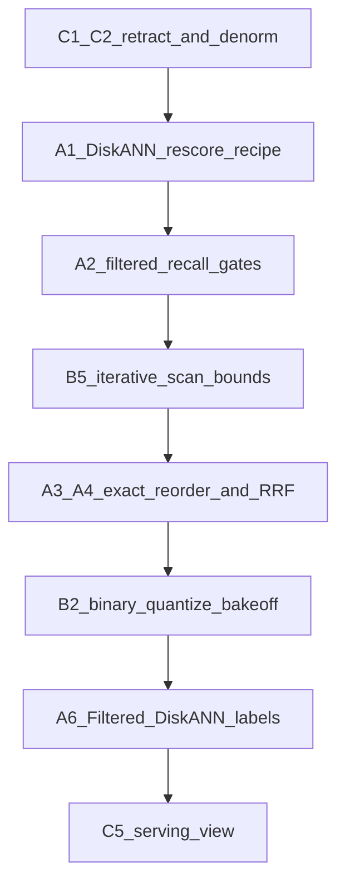

# SPEC-073 — Research evidence → storage improvements (July 2026)

Brainstorm grounded in **official docs + peer-reviewed ANNS research**, then applied with first principles to EdgeQuake’s relational + pgvector layout.  
This does **not** raise product floors. Ideas need measured full-gate before SSOT changes.

---

## 1. Evidence base (what to trust)

| Source | Kind | Why it matters |
|--------|------|----------------|
| [pgvector 0.8.0 release (PostgreSQL.org)](https://www.postgresql.org/about/news/pgvector-080-released-2952/) | Official | Iterative index scans; better cost estimation when filters present |
| [pgvector README — filtering / iterative scans / halfvec / binary quantize](https://github.com/pgvector/pgvector/blob/v0.8.2/README.md) | Official | Overfiltering math; `relaxed_order` vs `strict_order`; scale recipe |
| [Aurora blog — pgvector 0.8](https://aws.amazon.com/blogs/database/supercharging-vector-search-performance-and-relevance-with-pgvector-0-8-0-on-amazon-aurora-postgresql/) | Vendor + official feature | 10% selectivity → ~4 usable hits at `ef_search=40` without iterative scan |
| [DiskANN — NeurIPS 2019 (Subramanya et al.)](https://www.microsoft.com/en-us/research/publication/diskann-fast-accurate-billion-point-nearest-neighbor-search-on-a-single-node/) | Research | SSD-resident graph + compressed in-RAM; high recall without full HNSW residency |
| [Filtered-DiskANN — WWW 2023 (Gollapudi et al. / Microsoft)](https://doi.org/10.1145/3543507.3583552) | Research | Graph edges respect **labels**; order-of-magnitude better filtered QPS@90% recall vs post-filter |
| [pgvectorscale README 0.9.x](https://github.com/timescale/pgvectorscale/) | Official extension | `query_search_list_size`, **`query_rescore`**, SBQ, label filter (`smallint[]` + `&&`) |
| EdgeQuake SPECs 063–082 | Measured | Wave-2 @100k; DiskANN opt-in @150k needs `q_list≥400`; @250k needs list≥800 + HQ build (SPEC-082) |

---

## 2. First principles (performance · reliability · precision)

Define three independent objectives — do not trade them silently:

| Objective | Meaning | Fails when |
|-----------|---------|------------|
| **Performance** | p95 latency + concurrent clients under load | Index cold / wrong plan / too-large candidate set |
| **Reliability** | Correct isolation, delete/retract, no ghost rows, stable plans | Dual-SSOT drift; JSONB-only filters; missing CASCADE/retract |
| **Precision** | Returned neighbors are the true nearest **under the filter** (recall@k + ranking quality) | Post-filter underfill; weak DiskANN list/rescore; no hybrid for lexical IDs |

**Law (same as SPEC-063):** improve only with hard cap, physics, or measured gate.

**Cost law:**

\[
\text{cost} \approx \text{bytes} \times \text{candidates\_touched} \times (1 + \text{I/O\_miss})
\]

**Precision law (official pgvector):** with post-filter and `ef_search = E`, expected matching hits ≈ \(E \times selectivity\). At 10% selectivity and \(E=40\) → ~4 rows — not your `LIMIT 20`. Fixes: larger search budget, iterative scan, **or** index that already encodes the filter (partial HNSW / Filtered-DiskANN / dedicated table).

**Reliability law:** relational ownership (`workspace → document → chunk`) must be mirrored by denorm columns on the ANN row, or the index and the ACL diverge.

---

## 3. What EdgeQuake already got right (do not unlearn)

| Practice | Evidence alignment |
|----------|--------------------|
| Denorm `workspace_id` / `document_id` on vectors | Industry schema + Filtered-ANN precondition |
| Wave-2 partial HNSW + halfvec | pgvector scale advice + filter-trap fix |
| `SET LOCAL hnsw.iterative_scan = relaxed_order` on filtered queries | Official 0.8 + Aurora; already in [`search_tuning.rs`](../../edgequake/crates/edgequake-storage/src/adapters/postgres/vector/search_tuning.rs) |
| Dedicated DiskANN + raised `query_search_list_size` | DiskANN research + SPEC-072 (q≥400) |
| Saga retract across KV/AGE/vectors | Dual-SSOT honesty (SPEC-058/059) |
| One Postgres | Ops unity (PITR) — still industry default below tens of M |

---

## 4. Brainstorm: improvements by objective

Priorities: **P0** = high evidence, low product risk · **P1** = high leverage, needs bake-off · **P2** = research-aligned, larger product change.

### A — Precision (recall / ranking quality)

| ID | Idea | Evidence | First-principle why | EdgeQuake gap / next |
|----|------|----------|---------------------|----------------------|
| **A1** P0 | Pair DiskANN **`query_rescore`** with `query_search_list_size` | pgvectorscale: “suggest adjusting `query_rescore` to fine-tune accuracy”; defaults list=100, rescore=50 | List expands candidates; rescore restores full-precision distances — SPEC-072 raised list but recipe should set **rescore ≈ list/2** (ops tip already hints this) | **Done in SPEC-074:** `diskann_optin_recipe_statements()` + SSOT + `make diskann-rescore-smoke` |
| **A2** P0 | Always measure **filtered** recall@k | pgvector FAQ + Aurora underfill example | Unfiltered recall hides workspace filter trap | **Done in SPEC-075:** `make filtered-recall-gate` + SSOT; never promote from unfiltered-only |
| **A3** P1 | Two-stage **ANN → exact distance reorder** on candidate set | pgvector binary-quantize pattern; industry rerank | Approximations in index; exact score on small heap = precision without full scan | **Done in SPEC-076:** opt-in `EDGEQUAKE_ANN_EXACT_REORDER` + MATERIALIZED CTE (default OFF) |
| **A4** P1 | Hybrid **FTS + ANN (RRF)** for codes / names | Industry RAG 2026 | Embeddings miss exact tokens; relational FTS is free in Postgres | **Done in SPEC-076:** `EDGEQUAKE_SPARSE_FUSION=rrf` tip + lexical bake-off; `content_tsv` upsert honesty; default weighted unchanged |
| **A5** P1 | Matryoshka / `num_dimensions` trim on DiskANN build | pgvectorscale `num_dimensions`; HF Matryoshka | Fewer indexed dims → smaller graph, then full-dim rescore | Experiment only if embedding model supports prefix dims |
| **A6** P2 | **Filtered-DiskANN labels** (`smallint[]` workspace/tenant) | WWW’23 Filtered-DiskANN: graph edges use labels; ≫ post-filter | Native filter in graph ≠ post-filter underfill | **Done (smoke) [SPEC-078](../078-filtered-diskann-labels/000-index.md):** `WorkspaceLabelMap` + `make filtered-diskann-labels-bakeoff`; Wave-2 stays default — promote only after mid-scale/full gate |

### B — Performance (latency / concurrency / RAM)

| ID | Idea | Evidence | First-principle why | EdgeQuake gap / next |
|----|------|----------|---------------------|----------------------|
| **B1** P0 | Keep **halfvec** as greenfield default tip | pgvector scale section | Bytes dominate residency | Already Wave-2; never silent flip existing |
| **B2** P1 | Official **binary quantize + rerank** path for huge shared tables | pgvector README expression index + reorder | Hamming prefilter keeps index in RAM; exact reorder restores precision | **Done (smoke) [SPEC-077](../077-binary-quantize-bakeoff/000-index.md):** helpers + `make binary-quantize-bakeoff`; Wave-2 stays default — promote only after mid-scale/full gate |
| **B3** P0 | Prefer **btree/flat exact** when workspace slice is tiny | pgvector 0.8 cost estimation intentionally skips ANN for small sets | 100% recall, often faster | **Done [SPEC-080](../080-tiny-slice-exact/000-index.md):** skip Wave-2 planner bias when rows ≤ `EDGEQUAKE_ANN_EXACT_MAX_ROWS` (default 2000) |
| **B4** P1 | Partition or dedicated table by workspace at high N | Industry multi-tenant; DiskANN density paper | Prune before ANN; smaller graphs | Dedicated already exists; declarative PARTITION BY later |
| **B5** P0 | Bound iterative scan worst case | `hnsw.max_scan_tuples` / `scan_mem_multiplier` | Precision without unbounded latency | **Done in SPEC-075:** env knobs + contract (filtered on / unfiltered off); tip in product-limits |
| **B6** P1 | Build-time DiskANN quality (`num_neighbors`, `search_list_size`, `max_alpha`) | pgvectorscale build params; SPEC-072 rebuild arm unused | Better graph → lower query list for same recall | Only if q_list≥400 still fails at higher N |

### C — Reliability (integrity / isolation / ops)

| ID | Idea | Evidence | First-principle why | EdgeQuake gap / next |
|----|------|----------|---------------------|----------------------|
| **C1** P0 | Retract completeness across relational + KV + vectors + AGE | SPEC-058/059; dual-SSOT tax in 003 | Document delete must clear ANN ghosts | Checklist in 004 — automate e2e “delete doc → zero vectors” |
| **C2** P0 | Columns-only filters on Wave-2 | Partial index implication | JSONB OR breaks plan reliability | Already policy; guard tests on upsert |
| **C3** P1 | Store **`embedding_model` + dim + content_hash`** on vector/chunk row | Industry Day-2 re-embed | Prevent mixed-model nearest-neighbor nonsense (precision + reliability) | Metadata often has model; make column + fail closed on mismatch |
| **C4** P1 | RLS on relational + require workspace on every ANN query | Industry multi-tenant | Fail closed if app omits filter | Vectors: keep explicit filter; consider DB role policies for sidecar |
| **C5** P2 | Narrow dual-SSOT (serving view that JOINs ownership) | ACID aspiration | Single query sees “allowed + embedded” truth | **Done (assessment) [SPEC-081](../081-serving-view-dual-ssot/000-index.md):** `eq_serving_chunk_presence` / `eq_serving_vector_presence` — admin/debug only; not ANN SSOT |
| **C6** P0 | REINDEX / vacuum discipline after mass delete | pgvector ops guidance | Graph bloat → latency/recall drift | Ops runbook link from product-limits |

---

## 5. Recommended improvement sequence (first principles)

Do not skip steps — each step addresses a different term of the cost/precision laws.

| Phase | Focus | Exit criterion |
|-------|-------|----------------|
| **0** | Reliability hardening (C1–C2) | Delete/retract e2e green; Wave-2 EXPLAIN always Index Scan |
| **1** | Precision knobs already in stack (A1–A2, B5) | **Done (SPEC-074/075):** DiskANN list+rescore recipe; `make filtered-recall-gate` + iterative_scan bounds |
| **2** | Precision layers (A3–A4) | **Done (SPEC-076):** `make precision-layers-gate`; exact reorder opt-in; sparse RRF tip measured |
| **3** | Scale bake-offs (B2, B6, A6) | **B2 + A6 smoke done (077/078)**; mid-scale archive [SPEC-079](../079-midscale-quantize-labels/000-index.md) — no silent default |
| **4** | Schema convergence (C5, optional unify) | **C5 assessment done (SPEC-081)**; broader unify only if retract surfaces decrease without recall loss |

---

## 6. Concrete “next experiments” (SPEC-076+ candidates)

1. **DiskANN rescore Pareto @ higher N** — **Done (SPEC-082):** primary full-gate @250k green with list=800 / rescore=400 + HQ build; SSOT opt-in floor → 250k.  
2. **Iterative_scan vs partial @100k** — SPEC-075 smoke archives compare arms; re-run at 100k before changing Wave-2 default.  
3. **Binary quantize + rerank** — **Done (smoke) SPEC-077**; optional mid-scale re-run before any promote.  
4. **Workspace label map for Filtered-DiskANN (A6)** — **Done (smoke) SPEC-078**; optional mid-scale re-run before any promote.  
5. **Embedding model column fail-closed** — mixed-model corpus must not silently ANN-mix.  
6. **Phase 4 / C5 serving view** — after scale bake-offs; only if retract surfaces decrease without recall loss.

---

## 7. Anti-patterns (research + measurement agree)

| Anti-pattern | Why it fails |
|--------------|--------------|
| Raise N from unfiltered latency demos | Precision law violated |
| DiskANN at default list=100 @150k | SPEC-072: recall ~0.65 |
| Silent halfvec / DiskANN / label migration | Reliability / silent flip ban |
| Dedicated HNSW as “scale unlock” | SPEC-069 concurrent wall |
| Treat `public.chunks.embedding` as RAG SSOT | Dual-SSOT drift |
| Iterative_scan on unfiltered “more like this” | Extra cost for no filter benefit (pgvector guidance) |

---

## 8. One-paragraph synthesis

Official pgvector 0.8 made **filtered precision** a first-class concern (iterative scans + better planner costs). Microsoft DiskANN / Filtered-DiskANN show that **performance at scale** comes from (a) not keeping the full graph in RAM and (b) putting **filters into the graph**, not after it. pgvectorscale operationalizes that with list size, **rescore**, SBQ, and optional labels. EdgeQuake’s relational workspace→document→chunk spine plus denorm vector columns is the right control plane; the highest-ROI improvements now are **rescore in the DiskANN recipe**, **filtered-recall discipline**, **retract automation**, then research bake-offs (binary+rerank, Filtered-DiskANN labels) — never silent schema flips.
