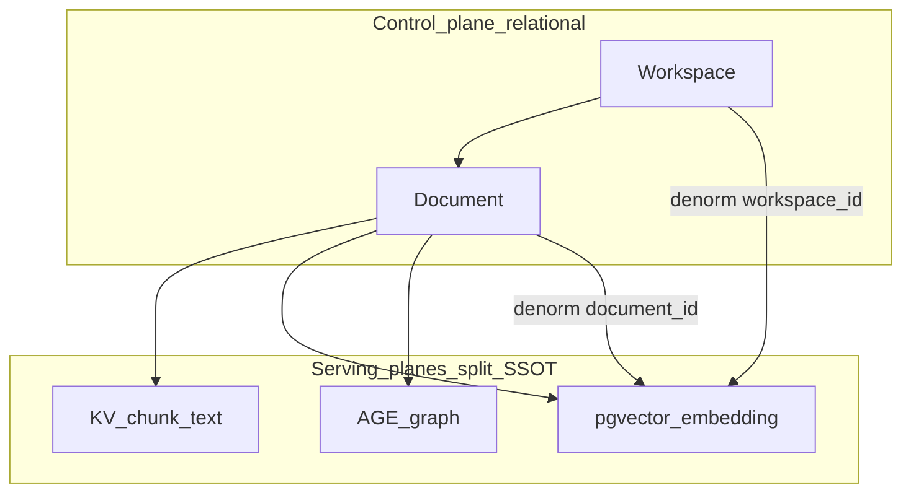

# ADR-073 — Relational RAG layout (workspace → document → chunk → embedding)

| Field | Value |
|-------|-------|
| **ID** | ADR-073 |
| **Pack** | [`specs/073-relational-rag-layout/`](000-index.md) |
| **Status** | **Accepted** (records existing product architecture; not a new migration) |
| **Date** | 2026-07-18 |
| **Deciders** | EdgeQuake storage / capacity track (SPEC-063–076) |
| **Supersedes** | — |
| **Related ADRs** | [ADR-0004 trait storage](../../edgequake/docs/adr/0004-trait-based-storage.md) · [ADR-0006 graph-centric](../../edgequake/docs/adr/0006-graph-centric-knowledge.md) |

---

## 1. Context

EdgeQuake stores RAG state in **one PostgreSQL instance** but across **multiple physical surfaces** (relational sidecar, KV, pgvector, AGE). Industry tutorials often show a single `document_chunks(text, embedding)` table. Operators and contributors need a **decided architecture** that answers:

1. What are the units of meaning (workspace / document / chunk / embedding)?
2. Why is storage split, and what reliability tax does that impose?
3. How does workspace linkage make filtered ANN reliable and scalable?
4. What must never be silent-flipped, and what is deferred to bake-off?

This ADR formalizes the locked answers of SPEC-073 using **multiple lenses**. Detail and evidence live in pack docs [`001`](001-first-principles.md)–[`006`](006-research-evidence-improvements.md) and [`docs/deep-dives/data-layer.md`](../../docs/deep-dives/data-layer.md).

---

## 2. Decision (summary)

**We accept and keep** the following architecture:

1. **Four units of meaning** stay distinct: Workspace (isolation / index shape) → Document (ownership / delete) → Chunk (retrieval / FTS text) → Embedding (ANN row).
2. **Split serving SSOTs** (deliberate):
   - **KV** = chunk text SSOT (`eq_*_kv`)
   - **pgvector** = ANN SSOT (`eq_*_vectors` + denorm `workspace_id` / `tenant_id` / `document_id`)
   - **AGE** = graph SSOT (Node / EDGE)
   - **Relational** = ownership / PDF / lineage / tasks / optional CQRS mirror — **not** the sole RAG corpus
3. **Index plane = workspace filter**: Wave-2 columns-only + partial HNSW (or dedicated `*_ws_*` / opt-in DiskANN) so planner ANN shape matches `WHERE workspace_id = …`.
4. **Integrity plane = saga retract** across KV + vectors + AGE (+ relational), not a single ACID `CASCADE` over the RAG corpus.
5. **No silent unify** of KV+vectors into one `document_chunks` table; **no floor raise** from this ADR alone.



---

## 3. Lenses

### 3.1 First-principles lens

| Law | Decision implication |
|-----|----------------------|
| Capacity claims need hard cap, physics, or measured gate ([`001`](001-first-principles.md)) | Layout opinions alone do not raise `highest_green_N` |
| Hits ≈ `ef_search × selectivity` under post-filter ANN | Workspace must shape the **index**, not only appear in JSONB metadata |
| Documents ≠ vectors | Limits and FAQ use chunk-vector counts; convert with chunks/doc |
| Filter–index implication | Columns-only filters when Wave-2 on; JSONB `OR` breaks partial HNSW |

**Verdict:** Keep denorm columns + workspace-shaped ANN; reject metadata-only isolation as the product path.

### 3.2 Data-model lens

| Ideal industry spine | EdgeQuake mapping | Keep? |
|----------------------|-------------------|-------|
| `workspaces 1—* documents 1—* chunks` | Relational ownership + PDF + lineage | **Yes** |
| Text + embedding co-located | **Split** KV text / vector embedding | **Yes** (until bake-off) |
| Denorm `workspace_id` on embeddings | Materialized columns on upsert | **Yes** (Wave-2 requirement) |
| Single ACID ingest + CASCADE | Saga + retract (SPEC-058/059/074) | **Yes** (tax accepted) |

**Dual-SSOT warning:** `public.documents` / `public.chunks` alone are **not** the RAG ANN corpus.

**Verdict:** Document the split; do not silently collapse it in this ADR.

### 3.3 Reliability / integrity lens

| Risk | Mitigation decided |
|------|--------------------|
| Ghost embeddings after delete/cancel | Retract completeness checklist ([`004`](004-recommendations.md)); e2e in SPEC-074 |
| Shared entity vector deleted on compensate | Only retract **created** rows (`upsert_report_created`) |
| Wrong EXPLAIN (Seq+Sort / cold cliff) | Wave-2 partial + columns-only + residency/warmup |
| Mixed embedding models | Fail-closed dim mismatch; future: model column (C3, deferred) |

**Verdict:** Reliability work prioritizes **retract + denorm guards** over new ANN floors.

### 3.4 Scalability / performance lens

Industry order (July 2026) ∩ measured EdgeQuake floors ([`005`](005-industry-scale-playbook.md), [`docs/product-limits.md`](../../docs/product-limits.md)):

```text
denorm schema → HNSW → halfvec → partial HNSW / iterative_scan
  → residency/warmup → DiskANN (tuned) → hybrid/rerank → external ANN last
```

| Shape | Status | Notes |
|-------|--------|-------|
| ≤50k default | **Proven** | Prod stress matrix |
| Wave-2 shared+partial @100k | **Supported** | Product default path |
| Dedicated HNSW | Not mid-scale unlock | SPEC-069 concurrent wall |
| Opt-in DiskANN @150k | **Supported opt-in** | `q_list≥400` + `query_rescore≈list/2` (SPEC-072/074) |
| Wave-2 ≥250k | **Not promoted** | Mid-scale wall (SPEC-068) |

**Verdict:** Scale by shaping ANN to workspace and cutting bytes; do not skip to external ANN or silent DiskANN.

### 3.5 Precision / retrieval-quality lens

| Mechanism | Decision |
|-----------|----------|
| Promote metric | **Filtered** recall@20 under workspace filter (SPEC-075) |
| `hnsw.iterative_scan` | On for filtered (`relaxed_order`); **off** for unfiltered (SPEC-075) |
| DiskANN accuracy | Pair `query_search_list_size` with `query_rescore` (SPEC-074) |
| Exact reorder / sparse RRF | Opt-in tips (SPEC-076); defaults unchanged |

**Verdict:** Precision knobs are additive and opt-in; they do not redefine the layout ADR.

### 3.6 Product / claim-honesty lens

| Allowed claim | Forbidden claim |
|---------------|-----------------|
| Supported 100k Wave-2 with recipe | 100k from unfiltered latency demos |
| Opt-in 150k DiskANN with list+rescore | Silent halfvec / DiskANN / vectorscale flip |
| Mix/hybrid as a feature | Mix seed scale as ANN floor |
| Industry ~10M/node as context | Industry bands as EdgeQuake floors |

**Verdict:** [`docs/product-limits.md`](../../docs/product-limits.md) remains claim SSOT; this ADR does not change floors.

### 3.7 Operator / ops lens

| Concern | Decision |
|---------|----------|
| One backup/PITR surface | Keep embeddings in the product Postgres |
| Greenfield 100k | `make wave2-greenfield-env` + warmup; no silent flip of existing DBs |
| `/ready` | Catalog ANN presence when Wave-2 on — not a plan-shape guarantee |
| After mass delete | REINDEX / vacuum discipline (ops); not automatic silent rebuild |

**Verdict:** Prefer turnkey recipes and EXPLAIN honesty over magical boot rebuilds.

### 3.8 Graph / GraphRAG lens

AGE remains the **entity/relationship SSOT**. Local/Global/Mix expand via AGE, then re-score chunk vectors and hydrate KV. CQRS `entities`/`relationships` are optional analytics mirrors — not ANN SSOT.

**Verdict:** Relational layout ADR does **not** replace graph-centric retrieval ([ADR-0006](../../edgequake/docs/adr/0006-graph-centric-knowledge.md)); it defines how documents/chunks/embeddings attach to workspaces beside the graph.

### 3.9 Alternatives considered

| Alternative | Why rejected (for now) |
|-------------|------------------------|
| **A. Unified `document_chunks(text, embedding)` as sole SSOT** | May simplify retract, but risks TOAST/residency, large migration, and unproven full-gate vs Wave-2. Allowed only as **opt-in bake-off** ([`004`](004-recommendations.md) Future option). |
| **B. External vector DB as default** | Second consistency protocol; premature before DiskANN / binary-quantize gates fail. |
| **C. Metadata-only workspace filters (no denorm columns)** | Breaks partial-HNSW implication → cold cliff / recall underfill. |
| **D. Dedicated HNSW tables as the 100k concurrent path** | SPEC-069: concurrent wall; keep for dimension isolation / DiskANN only. |
| **E. Silent boot flip to halfvec / DiskANN** | Forbidden; greenfield/opt-in only. |

---

## 4. Consequences

### Positive

- Clear vocabulary for docs, gates, and operator runbooks.
- Wave-2 and DiskANN recipes stay evidence-led and non-silent.
- Retract and denorm become first-class reliability surfaces.
- Contributors know not to “fix” dual-SSOT by collapsing tables without a bake-off.

### Negative / costs

- Ingest is a **saga**, not one transaction — retract bugs create ghosts.
- Operators must understand four planes (control / text / ANN / graph).
- FTS joins KV; empty `content_tsv` degrades sparse quality until upsert honesty holds.
- Schema unify remains a future research cost if dual-SSOT tax grows too high.

### Neutral (explicit non-goals of this ADR)

- Raising Wave-2 or DiskANN floors
- Implementing binary quantize, Filtered-DiskANN labels, or Matryoshka (SPEC-077+)
- Changing Mix/Hybrid default fusion modes

---

## 5. Compliance checklist (for PRs touching storage layout)

- [ ] Does not treat `public.chunks.embedding` as RAG ANN SSOT
- [ ] Vector upserts populate denorm `workspace_id` / `tenant_id` / `document_id` when available
- [ ] Wave-2 path keeps columns-only filters (no JSONB `OR` that breaks implication)
- [ ] Delete/cancel/orphan paths retract KV + vectors + AGE as policy requires
- [ ] No silent flip of `halfvec`, partial HNSW, vectorscale, or DiskANN
- [ ] Claim numbers match [`docs/product-limits.md`](../../docs/product-limits.md) or are marked unproven
- [ ] Filtered recall (not unfiltered-only) used when changing ANN precision knobs

---

## 6. Follow-on work (out of scope for this ADR)

Tracked in [`006`](006-research-evidence-improvements.md); already executed through SPEC-074–076 for P0/P1 precision knobs:

| ID | Topic | Status |
|----|-------|--------|
| C1/C2, A1 | Retract e2e + DiskANN rescore recipe | Done (SPEC-074) |
| A2, B5 | Filtered recall gate + iterative_scan bounds | Done (SPEC-075) |
| A3, A4 | Exact reorder opt-in + sparse RRF tip | Done (SPEC-076) |
| B2, A6, C5 | Binary quantize; Filtered-DiskANN labels; serving view / unify bake-off | Future SPEC-077+ |

---

## 7. References

| Doc | Role |
|-----|------|
| [`000-index.md`](000-index.md) | Pack status and locked TL;DR |
| [`001-first-principles.md`](001-first-principles.md) | Four units, physics, filter–index law |
| [`002-edgequake-mapping.md`](002-edgequake-mapping.md) | Ideal ↔ physical mapping + diagrams |
| [`003-reliability-scalability.md`](003-reliability-scalability.md) | Mechanisms and cliffs |
| [`004-recommendations.md`](004-recommendations.md) | Do / do not + retract checklist |
| [`005-industry-scale-playbook.md`](005-industry-scale-playbook.md) | July 2026 ordered ladder |
| [`006-research-evidence-improvements.md`](006-research-evidence-improvements.md) | P0–P2 improvement sequence |
| [`docs/deep-dives/data-layer.md`](../../docs/deep-dives/data-layer.md) | Operator-facing data model + Mermaid |
| [`docs/product-limits.md`](../../docs/product-limits.md) | Claim SSOT |

---

## 8. One-paragraph decision statement

> **EdgeQuake’s relational RAG layout is a four-unit model with a deliberate split SSOT:** workspace-linked documents own lifecycle; chunk text lives in KV; embeddings live in pgvector with denormalized workspace/document columns so ANN indexes can match filters (Wave-2 / dedicated / opt-in DiskANN); the knowledge graph lives in AGE. Integrity is saga retract across planes, not a single CASCADE over the RAG corpus. We reject silent schema unify and floor raises from assessment alone; precision and scale changes require measured gates and remain opt-in where they flip storage shape.
