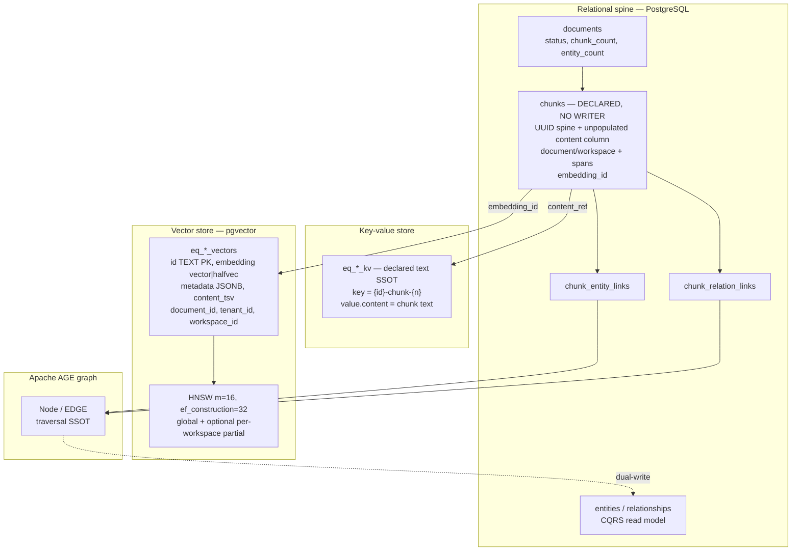
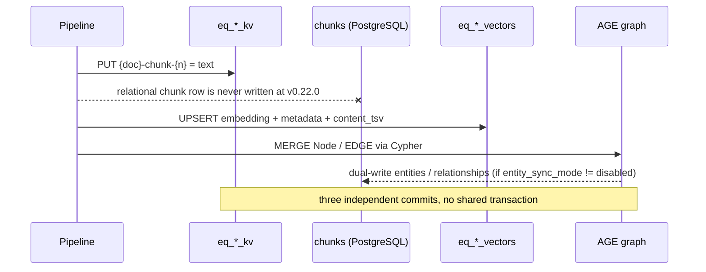
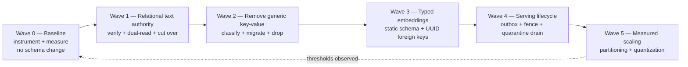
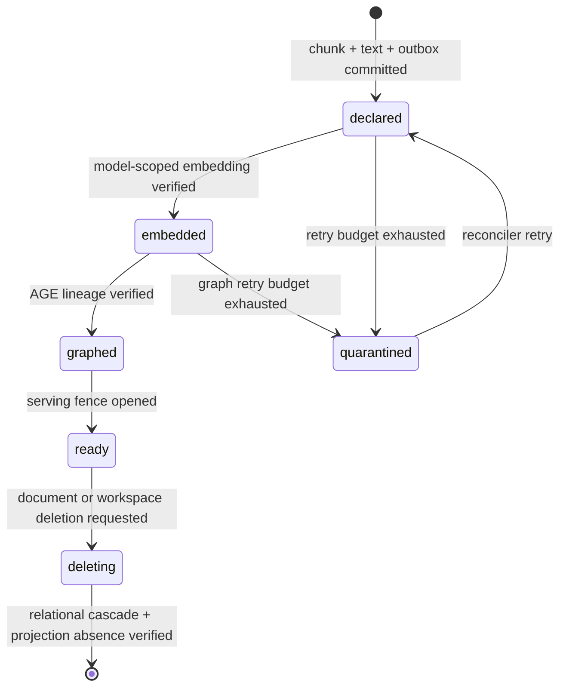
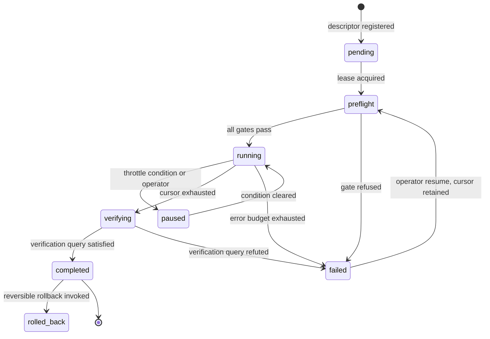

# Document & Chunk Storage — Expert Study vs July 2026 Best Practice (v0.22.0)

<aside>
📌

**Fact-check anchor:** the latest published GitHub release is `v0.22.0`, published 2026-07-26, and its annotated tag resolves to commit `36c45b769aa6285e104186e3561e6418dfdf14bb`. The default branch currently points to `62e6adb3920197c47c25f9f74a351b0b926c1bbf`, four commits later, and those commits touch only documentation, tests, UI streaming, and rustdoc style. `VERSION` remains `0.22.0` and the numbered migration chain ends at `105_pdf_blob_cutover.sql`.

**Correction carried into this revision:** reading `capabilities.rs` at the release tag shows that `VectorStorageMode::from_env()` returns `Half` when `EDGEQUAKE_VECTOR_STORAGE` is unset, and the unit test `vector_storage_mode_defaults_to_halfvec` locks that behavior. `halfvec` is therefore already the shipped default; the earlier "full precision by default" finding was wrong and has been retracted below.

**Second correction, this revision:** reading the write path rather than the schema shows that nothing inserts rows into the relational `chunks` table. `chunk_storage.rs` writes chunk text only to the key-value store, and a repository-wide search for `INSERT INTO chunks` returns no results. The earlier claim that chunk text is duplicated between `chunks.content` and `eq_*_kv` was wrong. The relational spine is declared and unpopulated, so making it authoritative is a construction with a backfill rather than a deduplication with a checksum.

</aside>

## Establishing the fact-check boundary

This revision separates three evidence classes so implementation facts do not get mixed with design recommendations.

| Evidence class | Anchor | Use in this study |
| --- | --- | --- |
| Released product | [`v0.22.0`](https://github.com/raphaelmansuy/edgequake/releases/tag/v0.22.0), commit [`36c45b7`](https://github.com/raphaelmansuy/edgequake/commit/36c45b769aa6285e104186e3561e6418dfdf14bb) | Authoritative release behavior |
| Current default branch | Commit [`62e6adb`](https://github.com/raphaelmansuy/edgequake/commit/62e6adb3920197c47c25f9f74a351b0b926c1bbf) | Detecting post-release semantic drift |
| July 2026 recommendation | PostgreSQL 18 and pgvector 0.8.x practices, with AGE version evaluated per image | Target state, always presented as a recommendation or benchmark gate |

*Table 1.0 – Evidence hierarchy used for the fact-checked analysis*

The following files were read directly at the release tag: `capabilities.rs`, `vector/ddl.rs`, `hnsw_runtime_policy.rs`, `search_tuning.rs`, `ann_exact_reorder_policy.rs`, `row_count_stats.rs`, `compensation.rs`, `chunk_storage.rs`, `workspace_ops.rs`, `kv.rs`, migrations `001`, `002`, `039`, `041`, `066`, `091`, `093`, `102`, the container initialization script, the storage-study first-principles analysis, and the migration source-of-truth notes. The earlier revision of this page read adapters, data-definition language, and migrations without reading a single write site, which is how a declared column became a claimed replica. Every statement below about which store holds which fact now cites the code that writes it. Each was compared against the same file on the default branch. The only post-tag change touching `vector/ddl.rs` is a rustdoc and style correction that does not alter DDL behavior, so release semantics and branch semantics agree for every claim on this page.

## Starting with WHY

EdgeQuake declares one logical object — a chunk of a document — across four physical representations, and populates three of them. The key-value store `eq_*_kv` holds the authoritative chunk text under the key `{id}-chunk-{n}`; the vector table `eq_*_vectors` holds the embedding, search text, and denormalized routing columns; the Apache Graph Extension (AGE) graph holds the entities and relationships extracted from that same chunk. The relational `chunks` table declares the spine, the lineage columns, and a mandatory `content` column, and receives no writes at all. The current implementation therefore combines storage fan-out across three written stores with a fourth relational schema that is created by three separate files, exposed through a view, read by statistics code, and never populated.

> **Source of Truth Map (SPEC-021, 2026-06-25):** Document lifecycle → `documents` table; Chunk text → `eq_*_kv` store, key `{id}-chunk-{n}`; Chunk embeddings → `eq_*_vectors` with `metadata.type = "chunk"`; Entity traversal → AGE `Node`, with the `entities` table as a CQRS read model.
> 

Reading the write path at the release tag sharpens that map in one decisive way. `chunk_storage.rs` is the entire chunk persistence surface, and it contains exactly two builders: `build_chunk_kv_records`, which writes chunk text to the key-value store keyed by `chunk.id`, and `build_chunk_vector_metadata`, which writes a `content_ref` and is contract-tested to omit inline content. A repository-wide search for `INSERT INTO chunks`, `INTO chunks`, and `UPDATE chunks` returns nothing. The project's own storage study reaches the same conclusion independently: its source-of-truth table records `chunk_content` as owned by `eq_*_kv` with `chunks.content` marked unused, and it states that the relational `entities`, `relationships`, and `chunks` tables "are never read in the query path". Migration `039` corroborates the pattern for the sibling column, dropping `chunks.embedding` on the recorded grounds that no insert or update to it exists anywhere in the active pipeline.

`chunks.content TEXT NOT NULL` is therefore a constraint on an empty table rather than a competing replica. A declared column proves what may exist. Only a writer proves what does exist.

That honesty is a strength, and it is also the reason a study is needed now. Three uncoordinated write targets means three failure modes for one write, several disagreeing answers to "how many chunks does this document have", and three places where a workspace deletion can leave residue. The unwritten fourth schema is worse than inert, because live code reads it: `workspace_ops.rs` computes workspace statistics with `(SELECT COUNT(*) FROM chunks WHERE workspace_id = $1)` and uses that identical subquery for both `chunk_count` and `embedding_count`, so both figures report zero and two distinct facts share one expression. The migration history already shows the cost being paid in arrears: migration `039` dropped a vestigial `embedding vector(1536)` column that was never written, migration `091` had to convert a `GENERATED` full-text column into a writable one because the chunk text lives in the key-value store and never reached the generated expression, and migration `093` added a read-only presence function whose own comment warns that it is "not RAG ANN SSOT".

The WHY of this study therefore has three layers, which the rest of the page unpacks in order.

1. **Correctness.** A chunk that exists in the relational spine but has no vector row is invisible to retrieval, and nothing in the schema currently forbids that state.
2. **Cost.** A global Hierarchical Navigable Small World (HNSW) graph, per-workspace partial indexes, and per-workspace table sprawl each carry a multiplier that compounds as tenants grow, even though the element type is already halved by the `halfvec` default.
3. **Operability.** Index builds, statistics, and deletions all reach across store boundaries, so a single slow path can stall ingestion for every tenant on the instance.

With the motivation established, the next step is to reason from first principles about why these symptoms appear at all.

## Reasoning from first principles

Rather than cataloguing symptoms, it is more useful to ask what a retrieval system minimally requires and then check which of those requirements the released code actually guarantees. Four axioms are sufficient.

1. **A retrievable chunk is a tuple, not a row.** It is retrievable only if its text, its embedding, its routing attributes, and its graph links all exist and agree.
2. **A tuple spanning several stores needs one identity.** Without a single key that every store agrees on, integrity can only ever be inferred.
3. **A tuple spanning several stores needs one commit boundary or one visibility fence.** If neither exists, partial states are observable by readers.
4. **A count is a projection of a state machine.** Where no state machine exists, every counter is an independent opinion.

Applying axiom two to the release exposes the deepest structural issue, because EdgeQuake actually operates two different chunk identities at the same time.

| Store | Chunk identity | Type | Evidence |
| --- | --- | --- | --- |
| Relational spine | `chunks.id` | `uuid` | Migration `001` |
| Key-value text store | `{doc_id}-chunk-{n}` | `text` | Source-of-truth map in `NOTES.md` |
| Vector store | `eq_*_vectors.id` | `text` | `ddl.rs` create statement |
| Entity lineage | `entities.source_chunk_ids` | `text[]` of KV keys | Migration `039` |
| Chunk lineage links | `chunk_entity_links.chunk_id` | `text` | Migration `066` |

*Table 1.1 – Two competing chunk identities across the released stores*

The relational world declares a generated `uuid` key, while the key-value store, the vector store, and the entity lineage arrays use a derived string of the form `{doc_id}-chunk-{n}`. Only the derived identity is minted today, since no writer inserts relational chunk rows. The divergence is latent rather than active, and it becomes active the moment the relational spine is populated, which is why the identity contract must be settled before the backfill and not after it. Migration `066` then introduces `chunks.embedding_id TEXT` as a bridge between the two, and migration `093` has to join on either that bridge or a document-plus-workspace fallback. That single divergence is the generator of most findings on this page: it is why no foreign key can exist, why joins need casts, why presence must be probed instead of asserted, and why deletion has to be reconciled rather than cascaded.

Applying axioms three and four then explains the remainder. There is no shared commit boundary, so `compensation.rs` performs after-the-fact rollback with a durable quarantine record. There is no visibility fence, so a partially written chunk is queryable. There is no state machine, so `documents.chunk_count`, the statement-level `eq_*_stats` counters, and a live `COUNT(*)` each answer a slightly different question.

The practical conclusion is that additional indexes or a smaller element type cannot repair this class of problem, because the missing element is a contract rather than a performance tactic.

## Mapping the current storage topology

The diagram that follows reconstructs the physical layout from the migrations and from `ddl.rs`, showing which store owns which fact.



*Figure 1.1 – Physical storage topology for documents and chunks at commit `62e6adb`*

Only three of those boxes receive writes. The `chunks`, `entities`, and `relationships` relations are schema without population, and the `chunks` relation is additionally defined by three separate files — migration `001`, migration `002`, and the container initialization script — and surfaced through an `edgequake.chunks` view with an explicit column list. Any column change therefore requires coordinating three definitions and dropping the view first, exactly as migration `039` had to do.

The vector table contract is worth reading literally, because it is created by application code rather than by a numbered migration, which means it is the one schema in the system that no migration file fully documents. The relevant statement in `ddl.rs` creates only four columns and then patches six more on afterwards.

```sql
CREATE TABLE IF NOT EXISTS eq_<prefix>_vectors (
    id         TEXT PRIMARY KEY,
    embedding  halfvec(<dim>) NOT NULL,  -- halfvec is the default; vector only when EDGEQUAKE_VECTOR_STORAGE=full
    metadata   JSONB DEFAULT '{}',
    created_at TIMESTAMPTZ NOT NULL DEFAULT NOW()
);
ALTER TABLE ... ADD COLUMN IF NOT EXISTS document_id TEXT;
ALTER TABLE ... ADD COLUMN IF NOT EXISTS tenant_id TEXT;
ALTER TABLE ... ADD COLUMN IF NOT EXISTS workspace_id TEXT;
ALTER TABLE ... ADD COLUMN IF NOT EXISTS embedding_model TEXT;
ALTER TABLE ... ADD COLUMN IF NOT EXISTS embedding_dim INT;
ALTER TABLE ... ADD COLUMN IF NOT EXISTS embedding_norm TEXT;
```

Several properties of that definition drive the findings later on. The primary key is `TEXT` rather than `UUID`, the tenant columns are `TEXT` while `chunks.workspace_id` is `uuid`, the link from `chunks.embedding_id` to `eq_*_vectors.id` carries no foreign key because the target relation is created outside the migration system, and `embedding` is declared `NOT NULL` so a chunk without an embedding simply has no row at all. The six trailing `ALTER TABLE` statements are executed with their results discarded, which means a relation can silently remain one schema generation behind.

## Tracing a chunk through the write path

Understanding where consistency can break requires following a single chunk from ingestion to the moment it becomes retrievable.



*Figure 1.2 – Ingestion write path, showing three uncoordinated commit boundaries and one unwritten relation*

The three committed arrows in that sequence represent separate storage effects, so a crash can yield a partially ingested chunk. `compensation.rs` supplies idempotent, best-effort rollback for key-value, vector, and graph artifacts and writes durable `compensation_quarantine:{document_id}:{uuid}` records when cleanup fails. Migration `102` serves a different purpose: `edgequake_reconcile_state` records support-migration hashes applied at bootstrap and does not track document consistency. The remaining gap is therefore an explicit per-chunk readiness invariant plus an operational drainer for the existing compensation quarantine.

## Grading the design against July 2026 best practice

The table below scores each dimension against what a PostgreSQL 18, pgvector 0.8.x, AGE 1.7 deployment should look like in mid-2026.

| Dimension | Current implementation (evidence) | July 2026 best practice | Grade |
| --- | --- | --- | --- |
| Vector element type | `VectorStorageMode::from_env()` returns `Half` when `EDGEQUAKE_VECTOR_STORAGE` is unset, so `halfvec` plus `halfvec_cosine_ops` is the shipped default; `AnnIndexPolicy::resolve` additionally promotes dimensions in (2000, 4000] and skips ANN above 4000 | Half precision by default with an explicit dimension ceiling policy | Green |
| Distance metric | Cosine only; `capabilities.rs` documents and tests that no L2 or inner-product opclass is created or queried | Metric chosen deliberately and enforced, rather than silently configurable | Green |
| Extension version safety | `PGVECTOR_MIN_CVE_SAFE = "0.8.2"` with a documented parallel-HNSW-build advisory, prerelease-aware comparison, and AGE 1.7 gating for row-level security and the bulk loader | Capability probing tied to security floors instead of assumed versions | Green |
| ANN index parameters | HNSW `m = 16`, `ef_construction = 32` globally (migration `071`) | `m = 16` is right; `ef_construction = 32` is aggressive — tune per table, pair with runtime `hnsw.ef_search` | Amber |
| Filtered ANN | `search_tuning.rs` defaults to `hnsw.iterative_scan = relaxed_order`, sets `max_scan_tuples = 20000`, computes `ef_search = clamp(4 × K, 40, 1000)`, and forces exact reordering through a materialized candidate CTE | Adaptive iterative scans with bounded work and exact final ordering | Green |
| Quantization | No binary or scalar quantization path exists in released `ddl.rs` | Quantization is scale-dependent; adopt only after measured HNSW memory pressure and a recall/rerank benchmark | Conditional |
| Index build safety | `CREATE INDEX CONCURRENTLY` for non-empty tables, INVALID-index detection, bounded `lock_timeout` and `maintenance_work_mem` | Exactly this | Green |
| Multi-tenancy | Row-level security forced closed (migration `096`), per-workspace tables plus denormalized columns | Row-level security plus partitioning by tenant hash; table-per-tenant only above a documented threshold | Amber |
| Chunk text authority | Key-value store, referenced by `content_ref`, with a writable `content_tsv` backfilled from the store (migration `091`); the relational `chunks.content NOT NULL` column has no writer, the table is unpopulated, and workspace statistics still count it | One authoritative row per chunk, reachable by foreign key, with a generated tsvector over that same value | Red |
| Hybrid search | GIN over `content_tsv` alongside HNSW | Reciprocal rank fusion over both, executed in one round trip | Amber |
| Graph layer | AGE as traversal authority, relational tables as CQRS read model, native write helpers and reconciled indexes (`067`, `075`, `083`, `086`) | Exactly this, provided drift is measured | Green |
| Referential integrity | No foreign key from `chunks.embedding_id` to any vector table | Enforce presence by contract, since a cross-table foreign key is impossible with dynamic table names | Red |
| Lifecycle | `documents.chunk_count` and `entity_count` maintained by the writer | Derived counters materialized on a schedule, never trusted as truth by the read path | Amber |

*Table 1.2 – Design grading across thirteen storage dimensions*

Six greens, two reds, four ambers, and one conditional finding show that version 0.22.0 is considerably stronger on the vector-engine axis than the earlier revision of this page claimed. Half precision, cosine-only enforcement, capability probing against a stated pgvector security floor, safe index construction, adaptive filtered scans, and the AGE layering are all at or above mid-2026 practice. The two reds are cross-store referential integrity and an unpopulated relational chunk spine that live statistics code nevertheless reads. These are the axiom-two and axiom-four failures identified above, and neither is a tuning problem.

## Eliminating runtime-created storage tables

The strongest design is simpler than a shared replacement key-value table: remove the generic chunk key-value path and make the relational schema authoritative. At the release tag, the production storage crate ships PostgreSQL and memory adapters only. The abstraction is therefore not preserving portability across independent production databases. It currently hides ordinary relational facts behind derived string keys.

The first-principles test begins with the information being stored rather than with the existing adapter interface. Every durable fact needs one authoritative row, one stable identifier, one transaction boundary, and one schema owner. PostgreSQL already supplies typed constraints, atomic transactions, write-ahead logging, point-in-time recovery, row-level security, generated columns, and The Oversized-Attribute Storage Technique (TOAST). A second logical storage model inside the same PostgreSQL database is justified only when it provides a measured capability that typed relations cannot provide.

The current key families map directly to static relations, as the following table shows.

| Current key family | Fact represented | Relational authority | Required access path |
| --- | --- | --- | --- |
| `{doc_id}-chunk-{n}` | Chunk text | `chunks(id, document_id, workspace_id, chunk_index, content)` | Unique `(document_id, chunk_index)` and primary key on `id` |
| `{doc_id}-metadata` | Document lifecycle and counts | `documents` | Workspace, status, and creation-time indexes |
| `wsdoc:{workspace}:{doc}` | Workspace-to-document membership | `documents.workspace_id` | B-tree index on `(workspace_id, id)` |
| `staging:hash:{workspace}:...` | Ingestion idempotency | `ingestion_dedup` | Unique `(workspace_id, content_hash, pipeline_version)` |
| `compensation_quarantine:...` | Failed compensation work | `compensation_quarantine` | Status and `next_attempt_at` indexes |

*Table 1.3 – Replacing key families with typed relational facts*

This mapping removes the reason for `eq_*_kv` to exist. It is a construction rather than a consolidation. `chunks.content TEXT NOT NULL` exists in the schema and holds no rows, so the migration starts with a relational writer and a full payload backfill from the key-value store, and verification follows population rather than substituting for it. Sizing that backfill honestly is part of the design: it touches every chunk ever ingested, it moves a relation from empty to full in one operation, and it invalidates every planner statistic and relation-size measurement taken beforehand. PostgreSQL stores large text values out of line through [TOAST](https://www.postgresql.org/docs/18/storage-toast.html), which keeps ordinary spine scans narrow while preserving transactional access to the text. With text beside its lineage, `content_tsv` can return to a stored generated column. Full-text search then becomes an index over the same authoritative value, and migration `091` no longer needs a writable tsvector populated through a cross-table lookup.

The change holds the ingestion write set at three independently committed stores during migration, then reduces it to two once chunk keys stop being written. The chunk row and text commit together, deletion cascades through ordinary foreign keys, workspace isolation is enforced on `chunks.workspace_id`, and chunk counts become relational projections rather than suffix scans over derived keys. These properties follow directly from PostgreSQL 18 [row security policies](https://www.postgresql.org/docs/18/ddl-rowsecurity.html) and transaction semantics.

Runtime-created vector tables fail the same schema-ownership test. pgvector 0.8.5 supports vectors with different dimensions in one unconstrained column and documents expression plus partial indexes for each model and dimension. A migration-owned `chunk_embeddings` table can therefore use `(model_id, chunk_id)` as its key, a foreign key to `chunks(id)`, and one partial HNSW index per supported model. If tenant filtering degrades recall at scale, [pgvector recommends list partitioning or separate tables](https://github.com/pgvector/pgvector#multitenancy); PostgreSQL 18 declarative partitioning supplies the required routing and partition pruning. Partition creation remains migration-managed or control-plane-managed with a schema-generation record. Request-serving code never issues data-definition language.

The target decision matrix follows from these capabilities.

| Decision | July 2026 target | Reason |
| --- | --- | --- |
| Chunk text | `chunks.content` only | One identity, one transaction, generated full-text search, cascade deletion |
| Generic key-value table | Remove | Every current key family represents a typed relational fact |
| Vector relations | Static `chunk_embeddings`, partitioned only after measurement | Foreign keys and migration ownership outweigh runtime naming flexibility |
| Embedding dimensions | Unconstrained `halfvec` storage with model-scoped expression indexes, or a small migration-declared dimension set | Both patterns are supported by pgvector; benchmark index size, recall, and operational cost before choosing |
| Tenant isolation | Typed `workspace_id`, forced row-level security, partitioning when recall or operations require it | Isolation belongs in SQL on the relation that stores the fact |
| Schema changes | Numbered, resumable migrations only | One inspectable schema generation with no silent partial upgrades |
| Provider portability | Domain-shaped ports with a conformance suite and one adapter per provider | Portability lives at the interface boundary; a generic key-value storage model leaks keys and scans into the application and blocks provider-native features |

*Table 1.4 – Target storage decisions for PostgreSQL 18 and pgvector 0.8.5*

The conclusion is categorical for the default deployment: remove runtime-created key-value and vector tables. Keep physical separation only as an explicit enterprise deployment profile for contractual backup, restore, or residency boundaries. That profile uses migration-managed schemas with the same typed tables rather than application-generated relation names.

Removing the generic key-value storage model does not remove the ability to change provider later. These are two different layers, and conflating them is what produced the current design. The section Preserving provider portability specifies the boundary that keeps the option open, and the revised plan makes that boundary a precondition of every wave rather than an afterthought.

## Naming the structural risks

Reading the release tag directly retires one earlier finding and sharpens the rest. Half precision, filtered ANN, and extension-version safety are stronger than previously described, while identity divergence, duplicated chunk text, dynamic-relation lifecycle, and the dormant read model are the findings that survive scrutiny. The items below are ordered by severity, and each names the axiom it violates.

1. **S-01, orphaned retrieval unit (critical).** A relational chunk may have `embedding_id IS NULL`, and a non-null identifier may resolve to no vector row. Removing the key-value text copy reduces this from a three-way presence problem to a foreign-key and readiness problem between `chunks` and `chunk_embeddings`.
2. **S-02, unpopulated relational text authority (high).** `chunks.content` is `NOT NULL` in the schema, yet no code path inserts a chunk row, so `eq_*_kv.value.content` is the only populated copy. The target makes `chunks.content` authoritative by adding a writer, backfilling every existing chunk from the key-value store, verifying coverage and then equality, switching readers, stopping chunk-key writes, and deleting the redundant keys. Coverage is the gate that matters first, because a checksum comparison against an empty relation passes trivially and proves nothing.
3. **S-03, incompatible identifier types (high).** The spine uses UUID for chunk, document, tenant, and workspace identifiers. Vector and lineage tables use `TEXT`, requiring casts and preventing ordinary foreign keys.
4. **S-04, dynamic schema fleet (high).** Released application code creates `eq_*_vectors` tables and then applies six best-effort `ALTER TABLE` statements whose errors are ignored. The target removes runtime vector DDL and migrates rows into a migration-owned `chunk_embeddings` relation keyed by model and chunk UUID.
5. **S-05, compensation quarantine without guaranteed drain (high).** `compensation.rs` is idempotent and writes a durable dead-letter record when cleanup fails, which is excellent. The remaining gap is a continuously running, bounded retry worker with age and backlog service-level objectives.
6. **S-06, retracted.** The earlier full-precision finding was incorrect. `VectorStorageMode::from_env()` defaults to `Half`, so released deployments already store `halfvec` unless an operator opts out. The residual issue is narrower: `HnswRuntimePolicy::default()` still hardcodes `Full`, which makes the struct default disagree with the environment-derived default and can mislead tests or future callers that construct the policy directly.
7. **S-07, hot-workspace index churn (medium).** The default enables partial HNSW at only 1,000 rows. Promoting a workspace registers it, drops the global index, and rebuilds the global HNSW with an exclusion predicate, so tenant arrivals can trigger disproportionate write amplification.
8. **S-08, cached-count drift (medium).** Document counters, vector and key-value statement-level counters, and direct counts answer related questions with different consistency semantics. The statement-level transition-table triggers fixed row-lock contention, yet cross-store meaning remains divergent.
9. **S-09, dormant CQRS read model (medium).** Migration `039` registers `entity_sync_mode` with the value `disabled`, so the `entities` and `relationships` read models stay empty until an operator enables dual-write and runs the migration `040` backfill. Any analytics or listing path that reads those tables therefore depends on deployment configuration rather than on ingestion having succeeded.
10. **S-10, runtime-created key-value relations (high).** `kv.rs` creates `public.eq_{prefix}_kv`, its stats sidecar, and two pattern indexes at runtime, with index errors discarded. Migration `068` must discover relations through `tablename LIKE 'eq_%_kv'`, and no schema-generation marker proves convergence. The target removes the generic relation after moving each key family into a typed table.
11. **S-11, statistics computed from an empty relation (high).** `workspace_ops.rs` derives both `chunk_count` and `embedding_count` from `(SELECT COUNT(*) FROM chunks WHERE workspace_id = $1)`. Since nothing writes `chunks`, every workspace reports zero for both, and two distinct facts share one expression. This is a live reporting defect that exists independently of the migration, it is the clearest instance of the axiom-four failure, and it must be fixed or explicitly deprecated before Wave 1 changes the underlying row count.
12. **S-12, eight-character workspace relation identifiers (medium).** Runtime relation names derive from an eight-hexadecimal-character workspace prefix, which carries 32 bits of entropy. Collision probability approaches one percent near nine thousand workspaces and one half near seventy-seven thousand, in a system whose central claim is workspace isolation. Removing runtime-created relations retires this risk completely, which is an additional argument for typed relations over per-workspace tables.
13. **S-13, three competing definitions of one relation (medium).** `chunks` is created by migration `001`, by migration `002`, and by the container initialization script, and is exposed through an `edgequake.chunks` view with an enumerated column list. Schema drift between the three is undetected, and any column change requires dropping and recreating the view. Consolidating to one migration-owned definition is a precondition for Wave 1.

These risks map onto a revised plan that preserves the code paths already proven to be strong.

## Proposing the improvement plan

The plan is ordered by dependency and reversibility rather than by expected value. Each wave states an entry gate, a mechanism, an exit gate, and a rollback path, so a wave that fails its evidence returns to its previous state instead of proceeding under an exception. The released search-tuning, exact-reorder, compensation, and statement-trigger work is preserved throughout.

Six sequencing invariants fix the order and explain why no wave can be promoted ahead of another.

1. **Measurement precedes migration.** Every later gate is a comparison against a baseline, so the baseline must exist before the first schema change.
2. **Text authority precedes key-value removal.** The generic store cannot be deleted while it is still the declared source of truth for chunk text.
3. **Key-value removal precedes embedding consolidation.** Migrating vectors first would carry `content_ref` semantics and derived string identity into the new relation.
4. **Enforceable identity precedes the serving fence.** A readiness state is only meaningful once foreign keys guarantee that the referenced rows exist.
5. **Physical layout changes come last.** Partitioning and quantization are the least reversible steps, and their thresholds are observable only after the write path stabilizes.
6. **Interface boundaries precede storage change.** Each wave moves rows behind a domain port that already exists and already passes its conformance suite. The storage model can then change without the application noticing, and a later provider swap stays a matter of writing one adapter.



*Figure 1.3 – Migration sequence with an explicit baseline and a measurement feedback loop*

**Wave 0 establishes the baseline.** It changes no schema. It captures ingestion throughput, transaction duration, write-ahead-log bytes per chunk, approximate-search latency with recall, full-text latency, graph expansion cost, queue claim cost by backlog depth, index bytes per live vector, cache hit behavior, and vacuum progress. It also inventories every `eq_%_kv` and `eq_%_vectors` relation with its column types, index definitions, and row counts. The wave exits when every metric in the release scorecard has a recorded value with hardware, dataset shape, concurrency, and cache state attached. Rollback is not applicable, which is precisely why this wave carries no risk and must not be skipped.

**Wave 1 establishes relational text authority, and it is a build rather than a verification.** Entry requires the Wave 0 inventory, a recorded row count for `chunks`, and a single consolidated definition of that relation. The wave proceeds in three ordered steps. First, ingestion gains a relational chunk writer that inserts `id`, `document_id`, `workspace_id`, `chunk_index`, and `content` inside the same bounded transaction that already writes deduplication state, with a unique constraint on `(document_id, chunk_index)` making the write idempotent under retry. Second, a resumable backfill job reads every `-chunk-` key and populates the missing rows. Third, a verification job compares key and row and publishes coverage, checksum mismatch, missing-key, and missing-row counts as four separate metrics, because the four failures have different causes.

The backfill is the largest single write this plan introduces, so it carries explicit performance rules rather than inheriting ingestion's by default. It runs from the maintenance pool with a bounded `statement_timeout`, in batches of 250 to 1,000 rows ordered by document so that each transaction stays inside the same duration budget as normal ingestion, and it throttles against retrieval p95 and replica lag rather than running at maximum rate. Text arrives as out-of-line TOASTed values, so the spine stays narrow and existing index scans do not widen. The stored generated `tsvector` column and its Generalized Inverted Index are created after the bulk load whenever the relation exceeds roughly one million rows, and maintained continuously below that threshold, since continuous maintenance during a full-table load pays index cost on every batch. Write-ahead-log bytes per chunk, dead-tuple growth, autovacuum progress, and relation plus TOAST size are tracked for the duration, and `ANALYZE` runs on `chunks` and on every relation that joins to it once the load completes.

Readers then move to `chunks.content` behind a runtime flag with a logged key-value fallback. The wave exits when relational coverage of live key-value chunk keys reaches one hundred percent, checksum mismatches hold at zero for one complete ingestion cycle, the fallback counter records no reads for a full release soak, and ingestion transaction p95 with the added relational write remains inside its Wave 0 budget. Rollback is a flag flip, since writers still emit chunk keys throughout.

**Wave 2 removes the generic key-value store.** Entry requires a Wave 1 exit with writers no longer emitting chunk keys. Each remaining key prefix is classified and moved into `documents`, `ingestion_dedup`, `compensation_quarantine`, or another explicitly named relation, one family per change so a failure isolates to one fact type. Reads keep a compatibility path for one release. The wave exits when no reader touches `eq_*_kv` and its row count reaches zero, after which the relations, stats sidecars, trigger functions, pattern indexes, and runtime initialization code are dropped. Rollback before the drop is a flag flip; after the drop it is a restore, so the drop is the wave's single irreversible step and ships alone.

**Wave 3 converges vector storage.** Entry requires Wave 2 completion so that no migrated row depends on derived string identity. Rows move into `chunk_embeddings` keyed by `(model_id, chunk_id)`, with `chunk_id` a UUID foreign key to `chunks(id)` and routing columns in their relational types. Model-scoped Hierarchical Navigable Small World indexes are built concurrently, and each source relation is retired only after recall and latency are validated against exact search on the same data. A schema-generation ledger records progress per relation so the migration is resumable after interruption. This wave also introduces expand-and-contract for embedding generations, replacing the current behavior where a dimension change can discard existing vectors. Rollback is a read redirect to the source relation, which remains present until its own retirement gate passes.

**Wave 4 hardens the serving lifecycle.** Entry requires foreign keys to be enforced, because the fence is otherwise advisory. The chunk row, its text, ingestion state, and an outbox event commit in one bounded transaction. Workers apply embedding and graph mutations idempotently and then open the serving fence. The compensation quarantine becomes a typed dead-letter table with bounded retry and explicit objectives for backlog age and terminal failures, and workspace deletion reports completion only after relational cascade and projection absence are both verified. The wave exits when no query-visible chunk lacks text, embedding, or readiness, and when deletion leaves zero residue at one million chunks. Rollback disables the fence and returns to unfenced visibility without data loss.

**Wave 5 scales from measurements.** Entry requires a stable write path and a reproduced threshold breach. List or hash partitioning is introduced only when filtered recall, vacuum behavior, relation size, or operational isolation crosses a recorded limit. Binary quantization is gated by memory residency and a recall benchmark, reusing the existing materialized exact-reorder path for reranking. Each change is validated against the Wave 0 baseline on the same dataset. Rollback is a detach or an index drop, both of which are recoverable, while a completed partition split is not, so partition strategy is decided once and documented.

The gates below make each transition auditable.

| Wave | Entry gate | Exit gate | Rollback | Reversibility |
| --- | --- | --- | --- | --- |
| 0 | None | Full scorecard recorded with environment metadata | Not applicable | Free |
| 1 | Relation inventory complete, `chunks` row count recorded, single consolidated relation definition, domain ports defined with a green conformance suite | Backfill coverage at one hundred percent, zero checksum mismatches for one ingestion cycle, zero fallback reads for one release, and ingestion p95 inside the Wave 0 budget | Flag flip to key-value reads | Free |
| 2 | No writer emits chunk keys | Zero readers and zero rows in `eq_*_kv` | Flag flip before the drop; restore after | Free until the drop |
| 3 | Generic key-value store removed | Recall and latency parity per migrated relation, foreign keys enforced | Read redirect to the retained source relation | Free until retirement |
| 4 | Foreign keys enforced | Zero unready visible chunks and zero deletion residue at one million chunks | Disable the fence | Free |
| 5 | Reproduced threshold breach | Improvement against the Wave 0 baseline with no recall regression | Detach partition or drop index | Partial |

*Table 1.5 – Entry gates, exit gates, and rollback per wave*

Four execution rules keep the sequence safe under normal delivery pressure. Every behavioral change ships behind a runtime flag with dual reads and a logged fallback counter. No destructive step ships in the same release as the cutover that made it safe, so each drop follows at least one full soak. At most one irreversible operation ships per release, counting table drops, type conversions, and partition attachments. An exit gate that fails twice returns the wave to its previous state rather than proceeding with a documented exception. A fifth rule protects the interface: no wave may introduce a storage-specific type into an application module, and the conformance suite runs against every registered adapter in continuous integration before any wave is allowed to exit.

Limited parallelism is available where the invariants allow it. Wave 0 instrumentation continues permanently rather than ending. Wave 2 may process independent key families concurrently, since they touch different facts. Wave 3 may run its inventory and index preparation during Wave 2, provided it writes nothing until Wave 2 exits. Wave 5 investigations may run in a staging environment at any time, because they produce evidence rather than production change.

The sequence therefore removes the second logical storage model first, restores enforceable identity second, fences visibility third, and defers irreversible physical optimization until measurements justify it. Waves 1, 2, and 3 each contain long-running data movement, so they are executed by the machinery described in Specifying automatic migration mode rather than by hand-run scripts.

## Designing the target serving contract

The target state keeps text and lineage inside one relational commit, then fences the two asynchronous projections that remain.



*Figure 1.4 – Proposed serving state after removing the key-value text write*

The following schema illustrates the contract. It is implementation-oriented pseudocode and still requires migration review.

```sql
CREATE TABLE chunk_embeddings (
    model_id       uuid NOT NULL REFERENCES embedding_models(id),
    chunk_id       uuid NOT NULL REFERENCES chunks(id) ON DELETE CASCADE,
    workspace_id   uuid NOT NULL,
    embedding      halfvec NOT NULL,
    dimensions     integer NOT NULL,
    created_at     timestamptz NOT NULL DEFAULT now(),
    PRIMARY KEY (model_id, chunk_id),
    CHECK (vector_dims(embedding) = dimensions)
);

CREATE TABLE chunk_serving_state (
    chunk_id       uuid PRIMARY KEY REFERENCES chunks(id) ON DELETE CASCADE,
    state          text NOT NULL,
    attempt_count  integer NOT NULL DEFAULT 0,
    last_error     jsonb,
    updated_at     timestamptz NOT NULL DEFAULT now(),
    CHECK (state IN ('declared','embedded','graphed','ready','quarantined','deleting'))
);
```

*Listing 1.1 – Proposed typed embedding and serving-state contract*

Each supported model receives a partial expression HNSW index that casts `embedding` to its declared dimension. The query includes `model_id`, allowing the planner to select the matching index. This follows pgvector's documented mixed-dimension pattern while retaining one migration-owned relation. `documents.chunk_count` then has two explicit meanings: total chunks derive from `chunks`, and serving-ready chunks derive from `chunk_serving_state WHERE state = 'ready'`.

## Engineering for predictable PostgreSQL performance

The storage simplification changes the performance problem. Once chunk text and metadata use typed relations, the dominant costs become embedding-index writes, Hierarchical Navigable Small World (HNSW) residency, vacuum progress, graph projection throughput, and interference between asynchronous ingestion and synchronous retrieval. Key-value point reads cease to be a capacity variable.

Five principles govern the target.

1. **Work that grows with total data volume stays off request paths.** Counts, relation discovery, index creation, reconciliation, and full-backlog fairness calculations run asynchronously or from bounded summaries.
2. **Large immutable values stay away from frequently updated rows.** Chunk text and embeddings are immutable by generation. Task leases, progress, retry counters, and errors use narrow typed columns.
3. **One vector belongs to one active approximate index.** Global and tenant-specific HNSW indexes never index the same embedding generation concurrently.
4. **Atomic visibility does not require an unbounded transaction.** Bounded transactions write chunks and outbox events; the serving state provides the user-visible fence.
5. **Every latency claim includes recall, scale, concurrency, and cache state.** Approximate nearest-neighbor latency without recall is incomplete evidence.

These principles convert performance from a collection of tuning flags into an enforceable workload contract.

### Separating immutable payloads from mutable state

PostgreSQL's Heap-Only Tuple optimization and vacuum work best when frequently updated rows are narrow and their changing columns are absent from indexes. The target separates data by mutation pattern, as the following table shows.

| Data | Mutation pattern | Target storage | Performance reason |
| --- | --- | --- | --- |
| Chunk text | Immutable after ingestion | `chunks.content`, with optional one-to-one `chunk_contents` when measurements justify vertical partitioning | Transactional authority with TOAST handling large values |
| Embedding | Immutable per model generation | `chunk_embeddings` | Model-scoped indexes and expand-and-contract re-embedding |
| Document lifecycle | Low-frequency updates | `documents` | Small indexed state row |
| Task lease and progress | High-frequency updates | Narrow typed columns | Heap-Only Tuple updates, less write-ahead log, and less TOAST churn |
| Task request payload | Immutable | Separate JSONB column or child table | Progress updates avoid rewriting the payload |
| Compensation history | Append-heavy | `compensation_quarantine` | Independent retention and retry indexes |

*Table 1.6 – Separating data by mutation pattern*

The default keeps content inside `chunks`, because PostgreSQL stores large text values out of line through The Oversized-Attribute Storage Technique (TOAST). A one-to-one `chunk_contents` table remains a benchmark-driven option when metadata-only scans, row updates, or buffer-cache pollution show a measurable penalty. Both layouts preserve relational authority and foreign keys.

One caution applies specifically to this migration. The `chunks` relation currently holds no rows, so every planner statistic, buffer-cache assumption, and relation-size figure measured today describes a table without data. After the Wave 1 backfill, `ANALYZE` runs on `chunks` and on every relation that joins to it, autovacuum thresholds are re-examined for a relation that grew from empty in one operation, shared-buffer and page-cache headroom are recomputed against the new resident set including TOAST, and the Wave 0 scorecard is re-measured. No Wave 3 comparison counts as evidence until that re-measurement exists.

### Controlling embedding-index cost

The primary capacity ratio is active HNSW bytes divided by effective database cache. Effective cache includes PostgreSQL shared buffers and the operating-system page cache. Once the active graph stops fitting, random reads increase and tail latency becomes unstable.

For 1,536-dimensional `halfvec`, the raw vector is approximately 3 kilobytes before tuple and graph-link overhead. Ten million vectors therefore require approximately 30 gigabytes for vector payload alone. Index links, dead tuples, relation metadata, and duplicated indexes increase that footprint.

One table with partial expression indexes is appropriate for a small number of active models. List partitioning by `model_id` becomes a candidate when many generations coexist or partial-index predicate overhead becomes measurable. Workspace partitioning is introduced only when filtered recall or operational isolation fails its gate.

Each insert must affect one active HNSW graph. When a workspace moves to a dedicated partition, the migration removes its rows from the shared graph before the dedicated index becomes authoritative. This prevents the double write amplification created by simultaneous global and workspace-specific indexes.

### Bounding ingestion transactions

A transaction spanning an entire large document pins the oldest transaction identifier, delays vacuum cleanup, accumulates write-ahead log, increases retry cost, and can hold a connection for minutes. The target commits bounded batches and relies on idempotency plus the serving fence.

Start with 250 to 1,000 chunks per transaction. Each batch writes chunk rows, text, deduplication state, and an outbox event. Tune the batch size against transaction p95, write-ahead-log bytes per chunk, lock waits, and vacuum delay. The normal ingestion transaction should remain below two seconds under the declared hardware profile.

Full-text search uses a stored generated `tsvector` over authoritative text. Steady-state ingestion maintains its Generalized Inverted Index continuously. Large imports may load into an unindexed staging partition, build the index after loading, and attach the partition after validation. This bulk path is allowed only when delayed visibility is explicit.

### Isolating workload admission

A single connection pool allows bulk ingestion to starve retrieval. Separate pools against the same PostgreSQL instance provide admission control even though they still share CPU, storage, cache, and write-ahead-log bandwidth.

| Pool | Initial budget | Policy |
| --- | --- | --- |
| Retrieval | 12–20 connections | Short statement timeout, read-biased, latency protected |
| Ingestion | 4–8 connections | Bounded transactions and concurrency |
| Task claiming | 2–4 connections | Very short transactions using `SKIP LOCKED` |
| Graph projection | 4–8 connections | Explicit timeout, depth, frontier, and node caps |
| Maintenance | 1–2 connections | Migration and concurrent index work only |

*Table 1.7 – Initial connection budgets by workload class*

These values are starting points. CPU cores, storage latency, Apache Graph Extension behavior, and external inference concurrency determine the final budgets. Every pool sets `statement_timeout`, `lock_timeout`, `idle_in_transaction_session_timeout`, `search_path`, `application_name`, and an appropriate `work_mem`. High `maintenance_work_mem` remains confined to maintenance sessions.

Ingestion admission responds to retrieval health. When retrieval p95 breaches its service level objective, the controller reduces concurrent embedding upserts and pauses optional index work. One HNSW build per database is the safe default until measurements prove additional concurrency.

### Keeping task claims bounded

Task claiming must remain bounded in pending backlog size and independent of total task history. Fairness is computed from a bounded candidate window rather than by grouping every claimable row on every poll. Separate partial indexes serve pending tasks and expired leases, while two sargable `FOR UPDATE SKIP LOCKED` arms replace a cross-status `OR` predicate.

Terminal tasks use monthly partitions or an archive retention policy. Listing uses keyset pagination on `(created_at, track_id)`. Claims fetch no immutable payload. Queue metrics use recent windows, explicit timeouts, and cached or estimated totals.

The queue performance ladder contains 100, 10,000, 100,000, and 1,000,000 pending rows. Claim p95 and buffers touched must remain bounded across the ladder.

### Bounding graph expansion

Graph traversal is controlled by depth, frontier size, visited nodes, returned edges, and statement duration. Depth alone is insufficient because a depth-two traversal through high-degree nodes can exceed a sparse depth-five traversal.

Native AGE label-table queries use bound arrays such as `= ANY($1::text[])` so plan text remains stable. Expression indexes match every cast used by the query. Planner statistics are refreshed after backfills and large ingestion waves. Boot performs read-only schema verification; reconciliation and data backfills run from a migration job with bounded batches.

### Measuring the complete system

The release scorecard follows the physical limits of the system.

| Area | Required evidence |
| --- | --- |
| Approximate nearest-neighbor search | p50, p95, p99, recall@10, recall@20, index bytes, and cache state |
| Filtered approximate search | The same metrics at 0.01%, 0.1%, 1%, 10%, and 100% selectivity |
| Ingestion | Chunks per second, transaction p95, write-ahead-log bytes per chunk, and lock waits |
| Full-text search | p95, GIN pending-list behavior, and buffers touched |
| Graph expansion | p95 by depth, frontier size, visited nodes, and edge count |
| Task queue | Claim p95 and buffers touched by backlog depth |
| Vacuum | Oldest transaction age, dead tuples, vacuum duration, and blocked cleanup |
| Connection pools | Acquire wait, active count, timeout count, and utilization by workload |
| Deletion | Duration and residual artifacts at 1,000, 100,000, and 1,000,000 chunks |
| Re-embedding | Duration, inference cost, coverage, and peak dual-generation storage |
| Chunk backfill | Rows per second, transaction p95, write-ahead-log bytes, relation and TOAST growth, autovacuum progress, replica lag, and retrieval p95 during the run |

*Table 1.8 – Release-level performance evidence*

Every representative query records `EXPLAIN (ANALYZE, BUFFERS, VERBOSE, SETTINGS)`. Approximate search is compared with exact search by disabling index scans in a transaction. Results also record PostgreSQL version, pgvector version, hardware, dataset shape, concurrency, warm or cold cache state, and index definition. This prevents a faster low-recall configuration from appearing as a performance improvement.

## Correcting the first-pass conclusions

The deeper reading produced several material corrections that should be kept visible.

- **Half precision is already the default.** `VectorStorageMode::from_env()` returns `Half` for an unset environment variable, and a unit test pins that behavior. The remaining work is converting legacy relations, not changing the default.
- **The distance metric is deliberately constrained.** Cosine is the only supported metric, and the code states plainly that configuring another metric has no runtime effect.
- **Extension risk is actively managed.** The code carries a pgvector security floor of 0.8.2 with a recommendation to pin 0.8.5 or later, gates AGE row-level security and the bulk loader on AGE 1.7, and selects UUIDv7 identifiers when PostgreSQL 18 provides them.
- **Filtered ANN is already a strength.** Runtime code enables iterative scans, bounds scan tuples, scales `ef_search` with K, and forces exact ordering after relaxed scans.
- **Row-count contention has already been addressed.** `row_count_stats.rs` uses `FOR EACH STATEMENT` triggers and transition tables, so the earlier row-level lock concern applies to stale schemas awaiting self-heal rather than to current code.
- **Chunk text is not duplicated, because the relational copy was never written.** Migration `001` creates `chunks.content TEXT NOT NULL`, but `chunk_storage.rs` writes text only to the key-value store, no `INSERT INTO chunks` exists anywhere in the repository, and the storage study records `chunks.content` as unused. The target still makes `chunks.content` authoritative, and reaching it requires a writer plus a full backfill rather than a checksum comparison between two live copies.
- **A storage study must read writers, not only schema.** The first pass read adapters, data-definition language, and migrations, then inferred data flow from constraints. That inference is invalid: `NOT NULL` proves a constraint and never a population. This revision treats a claim about where a fact lives as unsupported until a write site is cited.
- **`edgequake_reconcile_state` is a bootstrap ledger.** Migration `102` tracks support-migration hashes; it is not a document/workspace deletion state machine and should not be used as one.
- **Exact reranking already exists.** `ann_exact_reorder_policy.rs` uses a materialized candidate Common Table Expression and `ORDER BY distance + 0`, so future quantization can reuse that path.

These corrections narrow the improvement work to the seams that the code has not already solved.

The population claim is cheap to falsify, and the following queries settle it before any wave begins. If `chunks` returns rows and lifetime inserts, this revision is wrong and the write site must be added to the evidence list above.

```sql
-- Population of the relational spine
SELECT count(*) AS chunk_rows FROM chunks;
SELECT count(*) AS non_empty FROM chunks WHERE content IS NOT NULL AND content <> '';
SELECT max(created_at) AS newest_chunk_row FROM chunks;

-- Lifetime write activity, independent of current contents
SELECT relname, n_live_tup, n_tup_ins, n_tup_upd, last_autoanalyze
FROM pg_stat_user_tables
WHERE relname IN ('chunks','documents','entities','relationships')
ORDER BY relname;

-- Scale of the backfill implied by the key-value store
SELECT count(*) AS kv_chunk_keys
FROM eq_eq_default_kv
WHERE key LIKE '%-chunk-%';

-- Reporting defect: both statistics resolve to the same empty count
SELECT (SELECT count(*) FROM chunks WHERE workspace_id = $1) AS reported_chunks,
       (SELECT count(*) FROM chunks WHERE workspace_id = $1) AS reported_embeddings;
```

*Listing 1.2 – Queries that falsify or confirm the relational population claim*

## Measuring success

Each wave needs an acceptance number rather than a narrative, and the table below fixes those numbers.

| Wave | Metric | Target |
| --- | --- | --- |
| 0 | Scorecard coverage before any schema change | Every metric recorded with hardware, dataset, concurrency, and cache state |
| 1 | Query-visible chunks lacking relational text, embedding, or readiness | Zero; visibility is fail-closed |
| 1 | Backfill coverage of live key-value chunk keys in `chunks` | One hundred percent, measured before any checksum gate is trusted |
| 1 | Content checksum disagreement between `chunks.content` and KV after full coverage | Zero unexplained differences for one complete ingestion cycle |
| 1 | Ingestion transaction p95 and retrieval p95 during and after the backfill | No regression against the Wave 0 baseline; backfill throttles before retrieval breaches its objective |
| 1 | Application modules importing storage-specific types such as SQL strings, relation names, `halfvec`, or Cypher | Zero, enforced by a dependency lint in continuous integration |
| 1 | Conformance suite result for every registered adapter | Green before any wave exits, including the in-memory adapter |
| 2 | Vector tables outside the current schema generation | Zero after the resumable convergence job |
| 2 | Legacy relations still using a full-precision `vector` column | Zero, with recall@10 verified against the pre-conversion baseline |
| 2 | Rows or readers remaining in `eq_*_kv` | Zero before dropping every dynamic key-value relation and sidecar |
| 3 | Compensation quarantine oldest age | Under 15 minutes during normal operation |
| 3 | Residual artifacts after workspace deletion | Zero across relational, KV, vector, and AGE stores |
| 4 | p95 filtered ANN latency at the measured scale threshold | Under 150 ms while preserving the recall gate |
| 4 | Normal ingestion transaction p95 | Under 2 seconds with no vacuum-blocking long transaction |
| 4 | Retrieval pool acquisition p95 during sustained ingestion | Under 10 ms with zero starvation events |
| 5 | HNSW index membership per embedding generation | Exactly one active approximate index |
| 5 | Task claim p95 from 100 to 1,000,000 pending rows | Bounded by the declared service level objective without linear backlog growth |
| 5 | Recall@10 and recall@20 across filtered scale ladders | No regression beyond the declared gate at the latency target |

*Table 1.9 – Acceptance criteria per wave*

Holding these numbers turns the improvement plan from a design opinion into a verifiable engineering contract.

## Specifying automatic migration mode

The waves describe what changes. This section specifies the machine that applies those changes without an operator watching a terminal. Three properties are required at once, and they constrain each other: the migration must be efficient enough to finish within an operational window, safe enough to run against live production traffic, and observable enough that its progress is a number rather than a guess.

The release already contains three of the necessary parts. Schema migrations are tracked in `public._sqlx_migrations`. Support reconciliation is recorded in `edgequake_reconcile_state` with a `support_version` key, an `apply_sha384` digest matching the `checksums.lock` format, a duration, and an outcome, upserted through `ON CONFLICT (support_version) DO UPDATE`. Bootstrap already gates work on measured scale through `EDGEQUAKE_MIGRATION_LARGE_GRAPH_THRESHOLD`, whose default of 500,000 is published to the session as a configuration setting. What is missing is a ledger for work that cannot complete in one statement, and a progress model for work that cannot complete at boot.

### Separating schema change from data movement

The single most important design decision is that these two classes never share an execution context.

| Class | Examples | Duration | Execution context | Boot behavior |
| --- | --- | --- | --- | --- |
| Schema change | Create relation, add nullable column, add constraint as `NOT VALID`, create empty index | Milliseconds to seconds | One transaction, maintenance connection, bounded `lock_timeout` | Blocking; the instance refuses to serve until applied |
| Data movement | Chunk backfill, key-family migration, vector consolidation, generated-column population, constraint validation, concurrent index build | Minutes to days | Resumable job, batched commits, maintenance pool, throttled | Never blocking; boot verifies readiness and starts or resumes the job |
| Verification | Coverage counts, checksum sampling, recall comparison, residue checks | Seconds to minutes | Read-only, runs as a job phase and independently on demand | Read-only probe at boot, recorded rather than enforced |

*Table 1.10 – Migration classes and their execution contexts*

Boot therefore performs read-only schema verification and job resumption. It never applies a backfill, never builds an index, and never runs data-definition language derived from a request. An instance that finds pending data movement starts serving immediately, reports the pending job, and lets the job engine proceed at its own admission budget.

### Describing each migration as data

An automatic mode cannot be built from imperative scripts, because a script has no cursor, no estimate, and no resume point. Each long-running migration is declared as a step descriptor with a stable identifier, a schema generation, a digest over its statements, a keyset cursor definition, an idempotent batch statement, a verification query, a work estimate source, a reversibility class, and an admission profile. The engine is generic; the descriptors are the migration.

Two relations hold the state. The job ledger records intent and position. The batch ledger records completed work, and it is the only source of rate and estimated completion, which keeps both derived from a bounded recent window rather than a lifetime average.

```sql
CREATE TABLE edgequake_migration_job (
    job_id            uuid PRIMARY KEY DEFAULT uuidv7(),
    step_id           text NOT NULL,
    step_sha384       text NOT NULL,
    schema_generation integer NOT NULL,
    state             text NOT NULL,
    reversibility     text NOT NULL,
    cursor_position   jsonb,
    estimated_total   bigint,
    processed_count   bigint NOT NULL DEFAULT 0,
    failed_count      bigint NOT NULL DEFAULT 0,
    batch_size        integer NOT NULL,
    lease_owner       text,
    lease_expires_at  timestamptz,
    heartbeat_at      timestamptz,
    throttle_reason   text,
    started_at        timestamptz,
    completed_at      timestamptz,
    last_error        jsonb,
    UNIQUE (step_id, schema_generation),
    CHECK (state IN ('pending','preflight','running','paused','verifying','completed','failed','rolled_back')),
    CHECK (reversibility IN ('reversible','reversible_until_drop','irreversible'))
);

CREATE TABLE edgequake_migration_batch (
    job_id        uuid NOT NULL REFERENCES edgequake_migration_job(job_id) ON DELETE CASCADE,
    batch_seq     bigint NOT NULL,
    cursor_from   jsonb NOT NULL,
    cursor_to     jsonb NOT NULL,
    row_count     integer NOT NULL,
    duration_ms   integer NOT NULL,
    wal_bytes     bigint,
    committed_at  timestamptz NOT NULL DEFAULT now(),
    PRIMARY KEY (job_id, batch_seq)
);

CREATE INDEX ON edgequake_migration_batch (job_id, committed_at DESC);
```

*Listing 1.3 – Job and batch ledgers for automatic migration mode*

The `step_sha384` column reuses the digest helper that already backs `edgequake_reconcile_state`, so a descriptor whose statements change produces a different digest and cannot silently resume a job created by the previous definition. The `UNIQUE (step_id, schema_generation)` constraint makes job creation idempotent under concurrent boot.

### Executing efficiently

Efficiency here means constant cost per row and no cost proportional to total table size inside the batch loop.

Batches advance by keyset cursor on an indexed, ordered key such as `(document_id, chunk_index)`. Offset pagination is prohibited, because its cost grows with position and turns a linear migration into a quadratic one. Each batch commits independently, writes with `INSERT ... ON CONFLICT DO NOTHING` or an equivalent idempotent form, and records its cursor range in the batch ledger inside the same transaction that performed the work. Losing an instance therefore loses at most one batch of progress and produces no duplicate effect on resume.

Batch size adapts rather than being configured once. The controller targets a transaction duration between 500 milliseconds and 2 seconds, increases the batch size additively while the measured duration stays under target, halves it immediately when the duration, lock wait, or error rate breaches its limit, and stays inside a hard range of 50 to 5,000 rows. This keeps the migration fast on idle hardware and quiet under load without an operator retuning it.

The work estimate comes from `pg_class.reltuples` and periodic sampling. A `COUNT(*)` per batch would make progress reporting more expensive than the migration, so the exact count is computed once at preflight for relations below a declared size and estimated above it, with the estimate refreshed on a fixed interval and the estimate quality reported alongside the percentage.

Index strategy follows relation size. Below roughly one million rows the target indexes exist during the load and are maintained continuously. Above it the load runs against an unindexed or minimally indexed relation, and indexes are created afterwards with `CREATE INDEX CONCURRENTLY`, one build at a time per database, reusing the existing invalid-index detection and bounded `maintenance_work_mem` and `lock_timeout` handling. Constraints are added `NOT VALID` during the schema phase and validated as a job phase, so the exclusive lock window stays short. `ANALYZE` runs on the migrated relation and its join partners before the job reports completion, because every downstream latency comparison depends on refreshed statistics.

All job work uses the maintenance pool described in Isolating workload admission. No migration statement ever executes on a retrieval or request-serving connection.

### Staying safe

Safety is expressed as gates that must pass before work starts and conditions that pause work once it has.

| Gate | Check | Action on failure |
| --- | --- | --- |
| Schema generation | Applied schema generation equals the generation the descriptor targets | Refuse to start; report a version mismatch |
| Descriptor integrity | `step_sha384` matches the recorded digest for any existing job | Refuse to resume; require a new job identifier |
| Extension floor | pgvector at or above 0.8.2 with 0.8.5 preferred, AGE 1.7 for row-level security and bulk loading | Refuse to start any step that depends on the capability |
| Capacity headroom | Free storage exceeds estimated relation, TOAST, index, and write-ahead-log growth with margin | Refuse to start; report the shortfall in bytes |
| Recovery point | A restore point or verified backup exists and its identifier is recorded on the job | Refuse to start any step above the reversible class |
| Exclusivity | No other instance holds a live lease for the same step | Yield; the losing instance reports the job as running elsewhere |
| Reversibility | Descriptor is classified reversible or reversible until drop | Refuse automatic execution; require explicit operator confirmation |
| Retrieval health | Retrieval p95 within its service level objective | Pause with `throttle_reason = 'retrieval_latency'` and resume on recovery |
| Replica lag | Lag below the configured ceiling | Pause with `throttle_reason = 'replica_lag'` |
| Vacuum health | Oldest transaction age and dead-tuple growth inside limits | Pause with `throttle_reason = 'vacuum_pressure'` |
| Error budget | Consecutive batch failures below the declared limit | Fail the job, retain the cursor, and record the error payload |

*Table 1.11 – Preflight gates and runtime pause conditions*

Four rules hold across every gate. The engine is fail-closed, so an unrecognized state, a missing gate result, or an unreadable ledger stops the job rather than continuing optimistically. Exclusivity is enforced by a lease with a heartbeat and a fencing token, claimed through `FOR UPDATE SKIP LOCKED`, so a paused instance that wakes after its lease expired cannot write. Irreversible operations are excluded from automatic mode entirely: table drops, type conversions, partition attachments, and destructive cutovers are surfaced as a ready-to-run action requiring operator confirmation, which preserves the execution rule that at most one irreversible operation ships per release. Pausing is always safe and always resumable, because the cursor lives in the ledger rather than in process memory.

### Reporting progression

Progress is only useful if it is monotonic, resumable, and honest about its own uncertainty.



*Figure 1.5 – Job state machine for automatic migration mode*

Every job reports a fixed set of fields: state, processed rows, estimated total, estimate quality, completion percentage, rows per second as an exponentially weighted average over the recent batch window, estimated remaining time, current cursor position, elapsed time, throttle state with its reason, consecutive failure count, and the last error payload. Percentage is derived from the ledger rather than from memory, so a restarted instance reports the same number it reported before the restart. When the estimate is sampled rather than exact, the report says so, because a confident wrong percentage is worse than an acknowledged range.

Three surfaces expose the same values. An administrative endpoint lists jobs and returns one job in detail. A read-only SQL view joins the job and batch ledgers for operators already connected to the database. Structured logs emit one low-cardinality line per batch, and metrics expose completion percentage as a gauge, processed rows as a counter, batch duration as a histogram, and throttle state as a labelled gauge. Alerting is defined on stalls and throttles rather than on duration, since a slow migration that is politely yielding to retrieval traffic is the system working correctly.

Operator control is limited to four verbs, all of which are safe at any point: pause, resume, adjust the admission budget, and cancel. Cancel stops after the current batch and leaves the cursor in place, so it pauses permanently rather than reverting.

### Configuring and accepting the mode

Behavior is selected by `EDGEQUAKE_MIGRATION_MODE` with three values: `off` performs no job work, `verify` runs read-only verification and reports pending jobs without changing data, and `automatic` executes reversible steps under the gates above. The admission budget is configured through the target transaction duration, the batch size range, the retrieval latency ceiling, the replica lag ceiling, and the concurrent index build limit, each with a default published to the session in the same way the large-graph threshold already is.

| Property | Acceptance criterion |
| --- | --- |
| Boot independence | Instance readiness time is unchanged whether zero or many data migrations are pending |
| Bounded transactions | Batch transaction p95 under 2 seconds and p99 under 5 seconds across the full run |
| Crash resumption | Ungraceful termination loses at most one batch and produces zero duplicated or skipped rows on resume |
| Exclusivity | Ten instances starting simultaneously yield exactly one running job per step |
| Traffic protection | Retrieval p95 degrades by no more than 10 percent during migration, and the job pauses before the objective is breached |
| Progress honesty | Completion percentage is monotonic non-decreasing, and remaining-time error is under 20 percent through the final decile |
| Verification coverage | Every completed job carries a recorded verification result; a job cannot reach completion without one |
| Irreversibility control | Zero irreversible operations execute without recorded operator confirmation |
| Replica safety | Replica lag stays under its ceiling for the entire run, verified on the largest ladder rung |
| Scale | The chunk backfill completes at 1,000,000 and 10,000,000 rows with all criteria above holding |

*Table 1.12 – Acceptance criteria for automatic migration mode*

With this engine in place, the waves stop being a manual runbook. The Wave 1 chunk backfill, the Wave 2 key-family moves, the Wave 3 vector consolidation, and the Wave 5 partition migrations each become a descriptor, and the difference between a plan and a deployment becomes a registered step with a visible percentage.

## Preserving provider portability

The requirement to change provider later is legitimate, and it survives this design. It survives because portability is a property of the interface boundary and never a property of the storage model. The current architecture confuses the two, and that confusion is the reason the abstraction is expensive without being portable.

### Why a generic key-value model is the weakest portability contract

A generic store that accepts a string key and an opaque payload appears provider-neutral. In practice it is the hardest interface to port, for four reasons that the released code demonstrates.

Semantics migrate into the key. `{doc_id}-chunk-{n}`, `wsdoc:{workspace}:{doc}`, and `staging:hash:{workspace}:...` encode relationships that the interface cannot see. Any replacement provider must reproduce the exact key grammar, the prefix and suffix scan behavior, and the ordering those scans imply. That is a larger contract than a typed repository, and none of it is checkable by a compiler.

Guarantees differ silently between engines. Scan ordering, read-after-write visibility, atomicity across keys, and expiry semantics vary by provider. An interface that never states which guarantees it requires will pass its tests against one engine and corrupt data against another.

Provider strengths become unreachable. Because the application can only say "put bytes at key", it cannot ask PostgreSQL for a foreign key, a vector index for a filtered nearest-neighbor query, or a graph engine for a traversal. Every provider is reduced to its least interesting capability, which is exactly the outcome observed here: two adapters, both backed by the same process, and the abstraction paying rent for portability it never delivered.

The boundary sits in the wrong place. A key-value port is a storage-shaped interface. A storage-shaped interface changes whenever storage changes, which is the opposite of what an abstraction is for.

### Placing the boundary at the domain

The replacement is a small set of ports named after facts the system owns rather than after mechanisms it uses. Each port is batch-first, so no port can force a round trip per row. Each port declares required and optional capabilities, extending the probing pattern already implemented in `capabilities.rs` and the extension-version helpers. Each port is defined by its conformance suite rather than by its documentation.

| Port | Responsibility | Required capabilities | Realistic alternate providers | Portability risk |
| --- | --- | --- | --- | --- |
| `DocumentRepository` | Document lifecycle, workspace membership, counts | Transactional upsert, keyset listing | Any relational engine | Low |
| `ChunkRepository` | Chunk spine, text, spans, ordering | Transactional batch insert, cascade delete, keyset scan | Any relational engine | Low |
| `FullTextIndex` | Lexical retrieval over chunk text | Batch index, ranked query, workspace filter | PostgreSQL GIN, OpenSearch, Tantivy | Medium; ranking semantics differ and must be gated by a relevance test |
| `EmbeddingIndex` | Vector upsert, filtered nearest-neighbor search, exact rerank | Batch upsert, metadata filter, cosine distance, recall reporting | pgvector, Qdrant, LanceDB, Turbopuffer | Medium; filter expressiveness and recall behavior vary |
| `GraphProjection` | Entity and relationship upsert, bounded expansion | Idempotent merge, bounded traversal with depth and frontier caps | Apache AGE, Neo4j, recursive relational queries | High; traversal languages and cost models differ most |
| `BlobStore` | Original files and large binary payloads | Streaming put and get, content addressing | PostgreSQL large objects, S3-compatible object storage | Low |
| `MigrationLedger` | Job and batch state for automatic migration mode | Atomic claim with lease, monotonic counters | Any relational engine | Low |

*Table 1.13 – Domain ports and their realistic alternate providers*

The realistic portability question is therefore narrower and more useful than "can we replace the database". Nobody replaces the relational spine of a system like this, and pretending otherwise cost the current design its foreign keys. What genuinely changes is the vector engine, the lexical engine, the graph engine, and the blob store, and those are precisely the ports where an alternate provider is plausible.

```rust
// Domain-shaped, batch-first, storage-agnostic. No SQL, no relation names,
// no halfvec, no Cypher, no key strings cross this boundary.
trait ChunkRepository {
    async fn insert_batch(&self, tx: &mut UnitOfWork, chunks: &[Chunk]) -> Result<InsertReport>;
    async fn load_texts(&self, ids: &[ChunkId]) -> Result<Vec<ChunkText>>;
    async fn scan_from(&self, cursor: Option<ChunkCursor>, limit: u32) -> Result<Page<Chunk>>;
    async fn delete_for_document(&self, tx: &mut UnitOfWork, id: DocumentId) -> Result<u64>;
}

trait EmbeddingIndex {
    fn capabilities(&self) -> EmbeddingCapabilities; // filters, metrics, rerank, recall reporting
    async fn upsert_batch(&self, model: ModelId, rows: &[EmbeddingRow]) -> Result<UpsertReport>;
    async fn search(&self, req: &VectorQuery) -> Result<Vec<ScoredChunk>>;
    async fn delete_for_workspace(&self, ws: WorkspaceId) -> Result<u64>;
}
```

*Listing 1.4 – Sketch of two domain ports, with mechanism kept inside the adapter*

### Fixing what may cross the boundary

An abstraction is only as portable as the leaks it forbids. The table below is the enforceable version of that rule, checked by a dependency lint in continuous integration rather than by review.

| Concern | Stays inside the adapter | Crosses the boundary |
| --- | --- | --- |
| Query language | SQL, Cypher, engine-specific filter syntax | Typed request objects with explicit bounds |
| Physical schema | Relation names, column names, partitions, views | Domain entities and identifiers |
| Vector mechanics | `halfvec`, HNSW parameters, `ef_search`, opclasses, iterative scan settings | Model identifier, dimensions, metric, requested recall, result scores |
| Keys | Any derived string encoding | Typed `ChunkId`, `DocumentId`, `WorkspaceId`, `ModelId` |
| Transactions | Isolation levels, savepoints, lock timeouts | A `UnitOfWork` handle and a declared atomicity capability |
| Errors | Driver error codes | A closed set of domain errors with retryability stated |
| Tuning | Batch sizes, pool budgets, index build policy | Nothing; tuning is adapter configuration |

*Table 1.14 – What each adapter hides and what the application is allowed to see*

One asymmetry deserves an explicit decision rather than a silent assumption. The PostgreSQL adapter can commit a chunk, its text, its ingestion state, and its outbox event in one transaction. A split-provider deployment cannot. The `UnitOfWork` handle therefore carries an atomicity capability, and the serving fence described in Designing the target serving contract is what keeps a non-atomic deployment correct. Portability is preserved by degrading visibility rather than by degrading integrity.

### Proving portability instead of asserting it

A port is defined by its conformance suite. The suite runs against every registered adapter in continuous integration, including the in-memory adapter, and it covers idempotency under retry, correct behavior after partial failure, cursor stability under concurrent writes, deletion completeness, filter semantics, ordering guarantees, and recall reporting where the port declares it. An adapter that passes is supported. An adapter that does not is not shipped, regardless of how complete it looks.

The suite also carries a cost budget, because an abstraction that forces extra round trips is a performance regression wearing an architecture costume. No port operation may require a round trip per row, and every port exposes a batch form of every hot operation.

The revised plan reflects this. Interface boundaries precede storage change is now the sixth sequencing invariant, the Wave 1 entry gate requires the ports and a green suite before any row moves, and the acceptance criteria include zero storage-specific imports in application modules. Defining the ports first also makes the waves cheaper, since each wave then changes one adapter behind a stable interface rather than changing the application and the storage at the same time.

## Stating the benefits of the target design

The benefits fall into six groups, each traceable to one of the four axioms rather than to preference.

| Area | Today | Target | Benefit |
| --- | --- | --- | --- |
| Integrity | No foreign key can exist, because relation names are generated at runtime | Typed relations with `REFERENCES` and `ON DELETE CASCADE` | Orphaned chunks and dangling embeddings become impossible rather than improbable |
| Identity | A declared UUID spine and a derived string key that no constraint connects | One UUID chunk identity everywhere, with the derived key retired | Joins without casts, presence by assertion rather than by probe |
| Deletion | Reconciled across three stores, with a quarantine for failures | Relational cascade plus one verified projection sweep | Workspace deletion becomes provable, which matters for residency obligations |
| Counting | Cached counters, statement triggers, and a `COUNT(*)` over an empty table disagree | Counts are projections of `chunks` and `chunk_serving_state` | Workspace statistics stop reporting zero and stop reusing one number for two facts |
| Full-text search | A writable `content_tsv` populated through a cross-store lookup | A stored generated column over authoritative text | The index cannot drift from the value it indexes |
| Query shape | Hybrid retrieval crosses three systems in several round trips | Text, lexical index, and vectors live in one engine, with the graph called once | Fewer round trips, one planner, one cache, one set of statistics |
| Schema lifecycle | Application code issues data-definition language, discarding errors | Migrations own every schema change, verified by digest | One inspectable schema generation, no relation silently a version behind |
| Tenant safety | Relation names derived from eight hexadecimal characters | Typed `workspace_id` with forced row-level security | A collision class that grows with customer count is removed entirely |
| Portability | A generic key-value model that leaks keys and blocks provider features | Domain ports with conformance suites and one adapter per provider | The vector, lexical, graph, and blob engines each become replaceable in isolation |
| Delivery | Migrations are runbooks executed by a person | Descriptors executed by a throttled, resumable engine | Progress is a percentage, and a failed step resumes rather than restarts |

*Table 1.15 – Benefit of the target design by area*

The performance benefits deserve a separate statement, because they are the ones most often assumed rather than measured. Consolidation removes cross-store round trips from the hybrid query path, replaces a cross-table tsvector lookup with a generated column, allows the planner to see the whole predicate, and lets one buffer cache serve text, lexical, and vector access. It also removes per-request data-definition language and relation discovery from hot paths. None of that is claimed as a number here. Each item is a hypothesis with a matching row in the release scorecard, measured against the Wave 0 baseline.

The honest costs belong beside the benefits. Ingestion gains a relational write per chunk, so write amplification increases before the key-value write is removed. The one-time backfill is the largest write the system has ever performed. The migration engine is new code that must be owned and tested. And the relational spine becomes a firmer PostgreSQL commitment, which the port boundary mitigates but does not erase. The trade is deliberate: the spine is the part nobody replaces, and the ports cover the parts that people actually do replace.

One divergence should be recorded rather than glossed. The project's own storage study concluded that the current architecture, repaired in place, was the right path, largely because a unified relational design would force graph traversal into recursive queries and give up Cypher. This page reaches a different conclusion, and the reason is narrow: the target keeps Apache Graph Extension as the traversal authority, so the study's central objection does not apply to it. The study's five invariants, which it noted are currently unenforced, are exactly the properties that foreign keys and the serving fence make enforceable. On that reading the two documents agree about the problem and differ only about whether the invariants are enforced by convention or by the database.

## Summary

This expanded study anchors released behavior to tag `v0.22.0` at commit `36c45b7`, then checks the default branch at `62e6adb` for post-release drift. It reads the released schema, vector DDL, HNSW runtime policy, exact-reorder policy, statement-level counter implementation, cross-store compensation code, and performance evidence. It found that EdgeQuake already implements most July 2026 vector-engine practice well: half precision by default, cosine-only enforcement, dimension-aware ANN policy, a stated pgvector security floor, AGE capability gating, concurrent and fail-closed index construction, adaptive `ef_search`, iterative filtered scans, exact reordering, statement-level row counters, idempotent compensation, and durable quarantine records. The performance target adds immutable-payload separation, bounded ingestion transactions, workload-specific pools, one HNSW membership per embedding generation, bounded queue claims, and release gates that pair latency with recall and cache state.

Reasoning from first principles, and from the write path rather than the schema, shows that the residual weakness is identity, population, and schema ownership. The system declares a UUID chunk identity in a relational spine that no writer mints, and operates a derived `{doc_id}-chunk-{n}` identity across the key-value, vector, and lineage structures that actually hold data. Runtime-created relations then prevent migrations and foreign keys from governing the whole tuple. The revised target makes `chunks.content` authoritative through a writer and a throttled, batched, statistics-refreshed backfill, removes the generic key-value store, consolidates embeddings into a migration-owned table keyed by model and chunk UUID, and retains an explicit serving fence for AGE and embedding projections. Every schema change carries a performance gate measured against the Wave 0 baseline, so consolidation cannot be declared successful on structural grounds alone. Partitioning and quantized indexes remain measurement-gated physical optimizations.