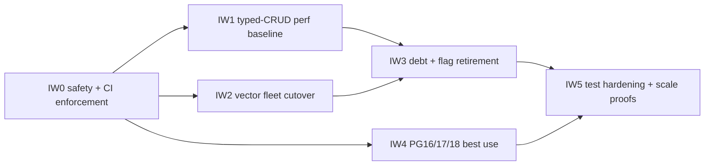

# 19 — Improvement Plan: Closing the Six Criteria

> **Status:** WIRED + VERIFIED (2026-07-30 wire-closure pass). Input: [18-full-completeness-assessment.md](18-full-completeness-assessment.md) (gap register `GAP-091-01..34`). Waves **IW0–IW5** landed; acceptance binaries are gated by `.github/workflows/spec091-data-layer.yml` and `make spec091-gates` (local green). Typed vector serving is the **default** (`EDGEQUAKE_VECTOR_BACKEND` unset → `typed_embeddings`; explicit `legacy_tables` for rollback). Residual honesty: KV facade remains behind a shrinking census allowlist (IW3 phased); SPEC-120 tests explicitly descoped in [`specs/92-task-system/README.md`](../92-task-system/README.md); fleet drop (migration **131**) is human-gated behind `--confirm-drop`; true kill-9 / 1M scale remain soak residuals.
> **Locked scope decisions (user, 2026-07-30):** (1) **full vector fleet cutover** — entity/relationship/report vectors move to typed tables and all `eq_*_vectors` + vector runtime DDL is retired (LD-03 becomes fully true); (2) **SPEC-120 restoration in scope** — wire the orphaned modules and green or explicitly descope the 8 quarantined contracts.
> **Builds on:** [16](16-post-cutover-assessment.md) (wave audit) · [17](17-boot-migration-gating.md) (explicit schema ownership) · [07](07-migration-engine.md) (engine patterns reused by IW2) · [11](11-e2e-test-matrix.md) (exists-vs-planned)
> **Laws:** LAW-D1..D8, LD-03/05/06/07/08/09/10/14/15 — extended by **LAW-I1..I6** (§2) and locked as **LD-16, LD-17**.

---

## 1. WHY — a migration that stops halfway keeps the cost of both worlds

**Five WHYs.** (1) Why is the data layer not done despite Waves A–D + W3/W4? Because cutovers stopped at the point of *safety* (typed SSOT exists) rather than *closure* (legacy deleted, legacy unreadable). (2) Why does that matter? Every live dual path is two truths, two costs, and one permanent rollback surface — the facade outliving the store is the canonical half-migration failure mode. (3) Why did tests not catch the drift? Because the strongest suites are manual-only: unwired tests are documents, not gates — CI, not intent, is what makes a property durable. (4) Why do isolation and debt co-occur in the gap register? Both are "second-mile" work: the first mile proves the new path works; the second mile proves the old path is gone and the edges are fail-closed. (5) Why fix this as one program instead of ad-hoc? Because the gaps share root causes (no closure definition, no enforcement, flags without expiry) — treating them per-symptom re-creates the tribal-knowledge problem LD-14 retired.

**Causal chain to break:**

```ascii
 cutover stops at "typed exists" (no closure definition)
   → legacy stays readable/writable behind flags
     → callers never migrate; facade and shims become load-bearing
       → tests of the new path stay manual; regressions invisible
         → "done" is claimed on vibes → silent drift until production teaches otherwise
```

**The program's reply:** make closure falsifiable per criterion (LAW-I1), enforce it in CI (LAW-I5), and retire flags by construction (LAW-I3).

---

## 2. First principles → laws LAW-I1..I6

Derived from the four axioms of [02-first-principles.md](02-first-principles.md) (one truth, one identity, one owner, scale off the request path), specialized for *closing* a migration rather than executing one:

| Law | Statement | Derivation |
| --- | --- | --- |
| **LAW-I1** | **Closure is falsifiable, never vibes.** Every criterion ships with a closure definition whose proof is a command whose output is boolean (doc 18 §10). A criterion is open until its proof runs green in CI. | LAW-D4 (counts as projections — truth is queried, not asserted) |
| **LAW-I2** | **Measurement before optimization.** No index, HNSW parameter, or version-specific feature is adopted without a recorded benchmark against the pre-change baseline (LD-10 pattern, generalized). | LAW-D8 + LD-06's lesson (three unmeasured `ef_construction` values) |
| **LAW-I3** | **Flags are scaffolding with an expiry, not architecture.** Every dual-run/rollback flag lands with a scheduled retirement wave; when its soak completes, the flag is removed and the advisor refuses stale values (LD-14 pattern). | LD-07 (its original intent, made enforceable) |
| **LAW-I4** | **Isolation fails closed at every layer.** Absent or malformed scope never widens visibility; it narrows to an explicit default or denies. Any deliberate cross-workspace sharing is documented, tested, and listed in one registry. | LAW-D1 (integrity over availability) + GAP-091-08/10/11 evidence |
| **LAW-I5** | **CI is the only proof that counts.** A test that does not run on the PRs that can break it is documentation. Every acceptance gate in this plan names the workflow that runs it. | GAP-091-26/27 evidence |
| **LAW-I6** | **Version features are adopted via capability probe, never version assumption.** PG16/17/18-differential SQL is gated on runtime-detected capabilities (`capabilities.rs` SSOT), so every profile boots and degrades gracefully. | Existing `capabilities.rs` design, generalized |

---

## 3. DRY / SOLID mapping

| Principle | Application in this program |
| --- | --- |
| **DRY — one mechanism per concern** | IW2 **generalizes** the W3 chunk backfill machinery (leased job + coverage verify + posture) into one embedding-family backfill used for entity/rel/report — no third copy of the pattern. IW1 reuses `perf_harness`/`data_layer_harness` against production typed tables instead of a new benchmark stack. IW0's spec091 CI job reuses the `postgres-age-tests` image + provisioning pattern. |
| **SRP — single responsibility per module** | Typed ports own persistence per family (chunks, embeddings, shells, dedup, cache); `kv.rs` facade is deleted, not extended (IW3). Isolation decisions live in one module per layer (`isolation_context`, `task_scope`, query scope builder) — IW0 fixes them *there*, not per handler. |
| **OCP/DIP — ports, not facades** | Caller migration (IW3) targets domain ports (LD-05); new consumers never see a KV-shaped API. Vector fleet cutover adds family columns to the existing `EmbeddingIndex` port rather than new ad-hoc stores. |
| **LSP/ISP — conformance** | The W3 port-conformance suite (`e2e_spec091_chunk_embeddings`) is extended to the fleet so every embedding backend satisfies the same contract. |
| **SSOT** | `capabilities.rs` remains the single version-capability source (LAW-I6); `extension-pins.sh` the single version pin source (a drift test guards docs, GAP-091-34). |

---

## 4. Waves



Ordering rationale: IW0 first (it closes live defects *and* builds the enforcement harness every later wave reports into). IW1 before IW3 (you cannot delete the facade's dual-write until its replacement is measured). IW2 before IW3 (flags retire only after the fleet cutover soak). IW4 parallel after IW0 (orthogonal). IW5 last (hardness tests pin a stable surface).

### IW0 — Safety + CI enforcement

- **Entry gate:** doc 18 approved; GHCR AGE image available; no other wave in flight.
- **Mechanism:**
  1. **CI (GAP-091-26/27):** new `spec091-data-layer` job modeled on `postgres-age-tests` (GHCR AGE image, scratch DB provisioning) running: `e2e_spec091_wave_d`, `e2e_spec091_console`, `e2e_spec091_job_control`, `e2e_spec091_chunk_embeddings`, `e2e_spec091_vector_backfill`, `e2e_spec091_recall_parity`, `e2e_spec091_vector_backend_dual`, `e2e_spec091_vector_retire`, `contract_spec091_boot_gate`, `cli_migrate_console`. Trigger: PRs touching `edgequake/crates/edgequake-{storage,api,tasks,pipeline}/`, `migrations/`, plus nightly. Re-enable `postgres-integration.yml::postgres-tests` (`if: false` at line 49 — its blocker, the missing AGE extension, no longer exists) and un-ignore `e2e_postgres_rls` (11 tests), wiring the suite to the role it tests *or* recording the superuser-acceptance decision (GAP-091-12).
  2. **Isolation defects (LAW-I4):** fail-closed malformed `X-Workspace-ID` (GAP-091-08 — deny, never `return true`); unconditional tenant+workspace check on task read/cancel with explicit default-workspace semantics for headerless requests (GAP-091-10); headerless vector queries scoped to the explicit default workspace instead of unscoped (GAP-091-11, flag-guarded rollout per EC-I2); `compensation_quarantine` writer sets `workspace_id` + drain filter (GAP-091-13); `llm_cache` cross-workspace sharing documented in `docs/` + pinned by a test (GAP-091-14).
  3. **Correctness hazards:** typed routing for `get_by_ids` (GAP-091-04 — fixes download 404); unknown KV key family becomes a loud error, never a silent no-op (GAP-091-07).
- **Exit gate:** both D-severity gaps closed with contract tests; spec091 CI job green on a real PR; RLS suite green or acceptance decision recorded; `e2e_tenant_isolation` extended to the malformed-header case on Postgres.
- **Rollback:** all app-layer changes reversible (fail-closed changes behind `EDGEQUAKE_STRICT_SCOPE_HEADERS` during soak); CI purely additive.

### IW1 — Typed-CRUD perf baseline

- **Entry gate:** IW0 exit (perf gates need a CI home); baseline corpus generator agreed (reuse `data_layer_harness` shapes against production tables).
- **Mechanism:**
  1. **Executable Wave-0 scorecard (GAP-091-22):** implement the spec'd budgets as binaries — `e2e_spec091_ingestion_p95_budget` (ingest tx p95 < 2s), `e2e_spec091_retrieval_slo_protection` (filtered ANN p95 < 150ms + recall gate, pool acquisition p95 < 10ms), typed-CRUD p95 gates for `chunks`/`documents`/`llm_cache`/`ingestion_dedup` with `assert_plan_uses_index` on their hot paths.
  2. **N+1 fix (GAP-091-16):** rewrite `dual_write_shell_upserts` as one `unnest` batch (LAW-D7), preserving FK-guarded column population; EXPLAIN + p95 gate.
  3. **Index gaps (GAP-091-24):** migration adding `(workspace_id, created_at DESC)` composite (CONCURRENTLY, EC-I3); bound `shell_staging_keys` (LIMIT + keyset); fix the OR-predicate workspace delete (IW4's PG18 virtual generated column is the principled fix; interim: two-statement UNION form).
  4. **LD-06 convergence (GAP-091-25):** run the recorded recall/size benchmark across 32/64/128 on a ≥100k-vector corpus; collapse to one value in migration + config + init.sql; close LD-06 with the benchmark artifact.
  5. **`chunk_embeddings` ANN (GAP-091-23):** measurement-gated (LAW-I2/LD-10): ladder exact-vs-HNSW at 10k/100k/1M; adopt model-scoped partial HNSW only past the reproduced threshold.
- **Exit gate:** scorecard green in CI; LD-06 closed with artifact; shell batch p95 within budget; index gates asserting plans.
- **Rollback:** indexes droppable CONCURRENTLY; code changes reversible; HNSW adoption is flag-free but migration-reversible.

### IW2 — Vector fleet cutover (entity/relationship/report)

- **Entry gate:** IW0 exit; W3/W4 chunk machinery green (exists); parity corpus defined.
- **Mechanism:**
  1. **Typed schema via migrations** (LD-03): extend the `chunk_embeddings` pattern to embedding families — model registry reuse + typed family tables (or one typed table with a family discriminator; decided by benchmark, LAW-I2); schema generation ledger row (F-091-16).
  2. **Dual-run:** dual-write on extraction/relationship/report writes; dual-read behind a family flag with logged fallback counter (mirrors `typed_read.rs`, DRY).
  3. **Engine backfill + verify:** generalize `w3-chunk-embedding-backfill` into one leased embedding-family backfill (DRY) with per-family coverage verify (EC-I4 quarantine on dimension mismatch).
  4. **Flip + retire:** recall-parity gate fleet-wide → default typed reads (GAP-091-02) → guarded migration **127** (coverage guard → delete covered rows → drop remaining `eq_*_vectors`, orphaned `eq_*_vectors_stats*` + `eq_hot_ann_workspaces`, GAP-091-06) behind `--confirm-drop` (LD-07 pattern, EC-I5) → delete all vector runtime DDL: `create_table` fleet, `ensure_dimension` DROP/recreate, per-workspace table creation (GAP-091-03). Console VECTOR posture extends to fleet (LD-14).
- **Exit gate:** C1 closure proof green (doc 18 §10: zero `eq_%_vectors`/`eq_%_kv`, zero runtime storage DDL, typed-only reads, loud unknown-family error).
- **Rollback:** pre-127 reversible via flag; post-127 restore-from-backup only (backup-gated contract, as 125/126).

### IW3 — Debt + flag retirement

- **Entry gate:** IW1 + IW2 exits and one full soak on typed serving (LD-07).
- **Mechanism:**
  1. **Caller migration (GAP-091-01):** move the ~40 `KVStorage` call-site files to typed ports (compile-time census test proves zero trait imports outside ports; EC-I6); then **delete** the facade + 42P01 shims.
  2. **Flag retirement (GAP-091-19, LAW-I3):** remove family flags, `EDGEQUAKE_CHUNK_TEXT_AUTHORITY`, `EDGEQUAKE_VECTOR_BACKEND`; advisor refuses stale values with a schema-derived message (LD-14); remove ornamental `EDGEQUAKE_KV_FAMILY_STAGING_HASH` (GAP-091-21a).
  3. **Dead code (GAP-091-17):** delete `PostgresKeywordCache` (or wire it deliberately — decision recorded), `eq_hot_ann_workspaces` remnants, kv-kind stats triggers.
  4. **Drain applier (GAP-091-18):** production compensation applier (retry/retract per entry kind) or an explicit redesign of quarantine; no more `on`→noop coercion.
  5. **Fence decision (GAP-091-21b):** with IW1 measurements in hand, flip serving-fence default or record the acceptance with numbers (LD-09).
  6. **SPEC-120 restoration (GAP-091-20):** wire `operations.rs`, `fenced_write.rs`, `cancel_notify.rs`, `document_stage_mirror.rs`, `operation_presentation.rs` into crate roots + routes; expand `TaskStatus` per the contracts; move the 8 `tests-wip-spec120-capacity` files back and green them — or record an explicit per-test descope in `specs/92-task-system/README.md` (EC-I8: one state-machine module stays law, LD-12).
  7. **JSONB payloads (GAP-091-05):** documented as accepted envelope-typing (decision record), not silently left.
- **Exit gate:** facade gone (grep + census test); flags removed; drain applier live; SPEC-120 suite in CI; C3 closure proof green.
- **Rollback:** code-level, reversible; no irreversible DB step in this wave (LD-07 budget reserved).

### IW4 — PG16 / PG17 / PG18 best use

- **Entry gate:** IW0 CI (matrix needs gating infra).
- **Mechanism:**
  1. **Visibility:** capability matrix surfaced in `/health` + `migrate console` (LAW-I6 SSOT read of `capabilities.rs`).
  2. **CI matrix (GAP-091-33):** PR smoke on pg16 + pg18 (fast suites), full `[pg16, pg17, pg18]` matrix remains nightly; pin-drift test asserting docs/Makefile match `extension-pins.sh` (GAP-091-34; fix the 0.8.3 mentions).
  3. **PG17 (GAP-091-31):** measure planner improvements against the IW1 scorecard on the same corpus; adopt only where benchmarked (LAW-I2) — even a recorded "no differential value, keep unified SQL" closes the gap honestly.
  4. **PG18 (GAP-091-32):** async-I/O tuning guide (`io_method`) with measured ANN impact; skip-scan-aware index review of composite btrees; `RETURNING OLD/NEW` for the outbox pattern (LAW-D3); virtual generated column for `metadata->>'workspace_id'` (the principled fix for GAP-091-24's OR predicate; capability-gated per EC-I7). All adopted via `capabilities.rs` probes, never version string checks.
  5. **Version ledger hygiene:** resolve or date every "pending" row in `docs/data-layer/version-matrix.md`.
- **Exit gate:** matrix green incl. PR smoke; `/health` exposes capabilities; each adopted feature cites a benchmark artifact; C6 closure proof green.
- **Rollback:** config/docs-level; capability probes degrade gracefully by design.

### IW5 — Test hardening + scale proofs

- **Entry gate:** IW3 exit (surface stable); some items (fuzz, chaos) may start earlier in parallel.
- **Mechanism:**
  1. **Property tests (GAP-091-28):** proptest suites for KV key grammar, chunk writer batching, Cypher query builder, migration cursor/keyset logic, dedup hash keys.
  2. **Chaos binaries (GAP-091-29):** `chaos_spec091_crash_mid_batch` (kill -9 mid-backfill → resume with zero duplication), `chaos_spec091_lease_expiry_fencing` (stale writer fenced), failed-migration rollback test (mid-train apply failure → documented recovery), concurrent-ingest-during-backfill (EC-03), migration lease exclusivity storm (EC-02: N instances ⇒ 1 runner).
  3. **Scale proofs (GAP-091-30):** 10k-document typed-relational soak in nightly; 1M-chunk workspace delete zero-residue (M-4.2); promote every "planned" row of [11](11-e2e-test-matrix.md) into a named binary or record its descope.
  4. **Isolation hard proofs (GAP-091-15):** Postgres-backed cross-tenant AGE leakage test incl. `LegacyNullAsWildcard`; cross-workspace ANN test over typed embeddings.
- **Exit gate:** C5 closure proof green (doc 18 §10); nightly suite runs the chaos + scale rungs.
- **Rollback:** additive only.

---

## 5. Edge cases (EC-I*)

| ID | Edge case | Handling |
| --- | --- | --- |
| EC-I1 | CI flakes on GHCR image pull | Pin image by digest; retry-once wrapper; cache layers |
| EC-I2 | Prod clients depend on headerless/unscoped behavior | Fail-closed scoping ships behind `EDGEQUAKE_STRICT_SCOPE_HEADERS` for one release + runbook + CHANGELOG; default flips next release |
| EC-I3 | Composite index build on a large `documents` table | `CREATE INDEX CONCURRENTLY`; off-peak guidance in runbook |
| EC-I4 | Fleet backfill finds vectors whose dims match no registry model | Quarantine + report; never silent skip; verify counts treat them as uncovered (blocks 127) |
| EC-I5 | Migration 127 guard aborts on uncovered rows | Engine resume → verify → retry (mirrors 125/126 operator loop; abort leaves DB pre-drop) |
| EC-I6 | A KV caller has no typed-port equivalent during IW3 | Extend the port (LD-05); never re-add a KV route "temporarily" |
| EC-I7 | PG18-only SQL on pg16/pg17 profiles | Capability probe gates (LAW-I6); profiles without the capability take the unified path |
| EC-I8 | SPEC-120 restoration conflicts with SPEC-091 queue SSOT | One state-machine module remains law (LD-12); conflicts resolve in favor of that module |

## 6. Risks (R-I*)

| ID | Risk | Mitigation |
| --- | --- | --- |
| R-I1 | CI runtime cost explodes (matrix × suites) | PR smoke subset + nightly full; digest-pinned images; suite budgets |
| R-I2 | Fail-closed scoping breaks legacy clients | EC-I2 flag + CHANGELOG + runbook; soak window |
| R-I3 | Fleet cutover recall regression | Parity gate blocks the default flip (mirrors W3); exact-reorder policy available |
| R-I4 | Facade deletion uncovers a hidden KV dependency | Compile-time census test + staged deletion across one release boundary |
| R-I5 | PG18 features degrade pg16/pg17 profiles | Capability probes + matrix CI (LAW-I6) |
| R-I6 | Scope creep into SPEC-120 / 92-task-system | Time-box restoration; per-test descope recorded; LD-12 conflict rule (EC-I8) |

---

## 7. Test matrix additions (planned — registered in [11](11-e2e-test-matrix.md))

| Test (planned binary) | Wave | Proves | GAP |
| --- | --- | --- | --- |
| `contract_spec091_strict_scope_headers` | IW0 | Malformed/absent scope headers fail closed (docs/chunks/tasks/vector/graph) | GAP-091-08/10/11 |
| `contract_spec091_get_by_ids_typed` | IW0 | Unordered batch read typed-routed; download 404 regression dead | GAP-091-04 |
| `contract_spec091_unknown_family_loud` | IW0 | Unknown KV family errors loudly | GAP-091-07 |
| `e2e_spec091_ingestion_p95_budget` | IW1 | Ingest tx p95 < 2s on typed writer | GAP-091-22 |
| `e2e_spec091_retrieval_slo_protection` | IW1 | Filtered ANN p95 < 150ms + recall gate; pool acquisition < 10ms | GAP-091-22 |
| `contract_spec091_shell_batch_write` | IW1 | Shell dual-write is one round trip (EXPLAIN + p95) | GAP-091-16 |
| `e2e_spec091_hnsw_policy_converged` | IW1 | One benchmarked ef_construction (LD-06 closed) | GAP-091-25 |
| `e2e_spec091_fleet_recall_parity` | IW2 | Entity/rel/report typed recall ≥ legacy baseline | GAP-091-02/03 |
| `contract_spec091_zero_runtime_ddl` | IW2 | Boot performs zero storage DDL; `eq_%_vectors` count = 0 | C1 closure |
| `contract_spec091_no_kv_facade` | IW3 | Compile-time census: zero KVStorage imports outside ports | GAP-091-01 |
| `e2e_spec091_pg_matrix_smoke` | IW4 | Typed CRUD green on pg16 + pg18 PR smoke | GAP-091-33 |
| `contract_spec091_capability_health` | IW4 | `/health` capability matrix matches `capabilities.rs` probe | GAP-091-32 |
| `proptest_spec091_key_grammar` / `_chunk_writer` / `_cypher` | IW5 | Property invariants | GAP-091-28 |
| `chaos_spec091_crash_mid_batch` / `_lease_expiry_fencing` | IW5 | kill -9 resume zero-dup; stale writer fenced | GAP-091-29 |
| `e2e_spec091_workspace_delete_zero_residue_1m` | IW5 | M-4.2 scale proof | GAP-091-30 |
| `e2e_spec091_cross_tenant_graph_leak` / `_ann_leak` | IW5 | AGE + ANN cross-tenant denial on Postgres | GAP-091-15 |

## 8. Acceptance — criterion closure (mirrors doc 18 §10)

| Criterion | Closed by | Proof (runs in CI) |
| --- | --- | --- |
| C1 | IW2 | `contract_spec091_zero_runtime_ddl` + `eq_%` relation count = 0 |
| C2 | IW0 + IW5 | `contract_spec091_strict_scope_headers` + `e2e_spec091_cross_tenant_{graph,ann}_leak` |
| C3 | IW3 | `contract_spec091_no_kv_facade` + dead-code grep gate + drain applier e2e + SPEC-120 suite green |
| C4 | IW1 | Scorecard binaries green + LD-06 benchmark artifact + EXPLAIN plan gates |
| C5 | IW0 + IW5 | spec091 CI job + RLS re-enabled + proptest/chaos/scale rungs in nightly |
| C6 | IW4 | `e2e_spec091_pg_matrix_smoke` + `contract_spec091_capability_health` + pin-drift test |

**Program DoD:** all six proofs green in CI on the same commit. LD-16: the six-criterion closure table above *is* the spec-complete DoD, superseding the "W3–W5 exit gates" phrasing in [16 §8](16-post-cutover-assessment.md). LD-17: the vector cutover completes the **fleet** (entity/relationship/report), not chunks only.

---

## Related

- Input audit: [18-full-completeness-assessment.md](18-full-completeness-assessment.md) (gap register GAP-091-01..34)
- Wave audit: [16-post-cutover-assessment.md](16-post-cutover-assessment.md) · Engine patterns: [07-migration-engine.md](07-migration-engine.md) · Console: [15-migration-console-cli.md](15-migration-console-cli.md)
- SPEC-120 context: [specs/92-task-system/README.md](../92-task-system/README.md) · Version ledger: [docs/data-layer/version-matrix.md](../../docs/data-layer/version-matrix.md)
