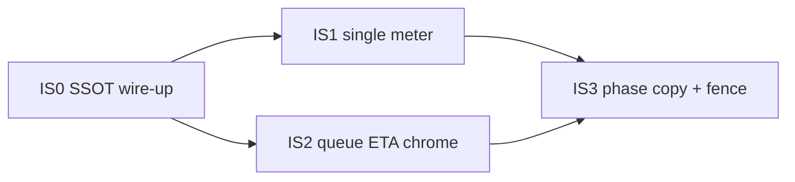

# 20 — Ingestion Surface Assessment: Active View · Document View · Pipeline

> **Status:** ASSESSMENT + **IS0–IS1 IMPLEMENTED** (2026-07-31). Code is law: `progress_counts` module wired; writers sync counts; facade/list/FE prefer structured SSOT; ActiveRuns single primary meter; per-type converting skip (pdf only).
> **Scope:** How the **ingestion pipeline** is presented in the **Active View** (ActiveRuns panel) and **Document View** (documents table), and how those surfaces relate to SPEC-091 data-layer laws (SSOT, projections, queue admission).
> **Inherits:** [SPEC-048](../048-improve-ux/) · [SPEC-086 lenses](../086-improve-ingestion-ux/lenses/) · [12–14 queue admission](12-queue-admission-first-principles.md) · [LD-11..13](README.md#locked-decisions) · NN/G progress / progressive-disclosure guidance (July 2026 citations below).
> **Output:** finding register `F-IS-01..18` · improvement waves **IS0–IS3** · laws **LAW-IS1..IS4** (IS0–IS1 landed).

---

## 0. Code-is-law re-assessment (2026-07-31)

| Claim (doc intent) | Code truth before IS0 | Closure |
| --- | --- | --- |
| `progress_counts` is list/ActiveRuns SSOT | Module existed **untracked / unwired** (`services/progress_counts.rs`); `mod.rs` omitted it; `progress_facade` only regex-parsed `stage_message` | **Wired** — `pub mod progress_counts` + `resolve_progress_counts` in facade |
| Writers persist structured counts | `pipeline_progress_callback` / status updates wrote message only | **Writers sync** via `sync_progress_counts_from_message` |
| List DTO carries counts | `DocumentSummary` had no field; FE had zero `progress_counts` references | **`DocumentSummary.progress_counts`** + FE `resolveProgressCounts` |
| One meter per card (LAW-IS2) | Stage bar + nested `PdfUploadProgress` + overall | Nested meter **gated off** when counts present; overall collapsed when stage N/M exists |
| Per document type | `shouldSkipConverting` pdf-only already in timeline | **Pinned by tests** for pdf / markdown / text / image |
| Active vs Document DRY (LAW-IS3) | Row always showed `spec048-row-stage` | Row subtitle **suppressed** when doc ∈ ActiveRuns |

**Residual (IS2–IS3):** queue_position/ETA chrome (F-IS-07); phase strip / jargon (F-IS-13); serving-fence badge (F-IS-14); live cost chip (F-IS-09).

---

## 1. Verdict (one paragraph)

The Documents page already had a strong **intent**: one `IngestionRunView` projection feeds ActiveRuns cards and row headlines (SPEC-048/086). Code-as-law showed the SSOT module was orphaned and every reader re-parsed messages — that is now closed for IS0–IS1. Remaining work is queue/ETA visibility and phase copy (IS2–IS3), not another progress product.

---

## 2. Evidence snapshot (live UI)

Observed on Documents with **Working · 2**, ActiveRuns open, Documents (10):

| Surface | What the user sees | Immediate tension |
| --- | --- | --- |
| Toolbar | `Working · 2` pill + Refresh / Clear All | Count duplicates ActiveRuns section header |
| Active View card A | Title-less / generic **Extracting Entities** · message “Extracting entities and relationships…” · **Overall 0%** | No filename; overall stuck at 0 while another run is converting |
| Active View card B | `01-databricks-ticket.pdf` · 11-step stepper · headline “Converting PDF · 4/9” · **This stage 44%** · nested **Page 4/9** bar · **Overall (est.) 2%** · message repeats page 4/9 | Three determinate bars + stepper + message = five progress signals |
| Document View | Rows: Completed (green) vs Extracting (purple) + stage subtitle; Entities; Cost; Created; Updated | Live stage repeated under badge while ActiveRuns already owns the narrative |
| Pipeline vocabulary | Uploading → … → **Gleaning** → **Merging Graph** → … | Internal LightRAG terms exposed without gloss |

```ascii
 Documents page (feedback zone + table)
 ┌─────────────────────────────────────────────────────────────┐
 │ Working · 2                                                 │
 │ ┌─ Active runs (2) ───────────────────────────────────────┐ │
 │ │ [Card A] Extracting Entities     Overall ████░░░░  0%   │ │
 │ │ [Card B] 01-databricks-ticket.pdf                       │ │
 │ │   ●Uploading ●Converting ○… ○Completed                  │ │
 │ │   This stage ████████░░ 44%   Page 4/9 ██░░░░ 0%?       │ │
 │ │   Overall (est.) █░░░░░░░░ 2%                           │ │
 │ └─────────────────────────────────────────────────────────┘ │
 │ Documents (10)                                              │
 │  title | status(+stage line) | entities | cost | …          │
 └─────────────────────────────────────────────────────────────┘
        ▲                              ▲
        │                              │
   IngestionRunView              same RunView + badge
   (list poll / WS)              (duplicate narrative)
```

---

## 3. Method — lenses

Each lens grades the three surfaces (pipeline semantics, Active View, Document View). Grades: **Strong** / **Partial** / **Weak**. Findings are falsifiable against code paths cited below.

| # | Lens | Primary question | External anchor |
| --- | --- | --- | --- |
| L1 | Visibility of system status | Does every long wait answer *what / where / how long / what can I do*? | [NN/G Progress Indicators](https://www.nngroup.com/articles/progress-indicators/); [Visibility of System Status](https://www.nngroup.com/articles/visibility-system-status/) |
| L2 | Progressive disclosure | Is stage detail staged so novices see one primary signal? | [NN/G Progressive Disclosure](https://www.nngroup.com/articles/progressive-disclosure/) — aim ≤2 disclosure levels |
| L3 | Data-layer SSOT (LAW-D4/D6) | Is UI progress a projection of one typed authority? | SPEC-091 axioms; `progress_counts.rs` |
| L4 | Queue & admission (LD-11..13) | Are queued vs working + ETA honest projections? | [13-queue-admission-target-spec.md](13-queue-admission-target-spec.md) |
| L5 | Cost & commitment boundary | Is spend risk visible at the commitment boundary? | [Multi-step progress visibility](https://ai-rng.com/multi-step-workflows-and-progress-visibility/) |
| L6 | Surface DRY (Active vs Document) | One narrative owner per concern? | SPEC-048 DEF-08; SPEC-086 UX lens |
| L7 | Pipeline semantics | Are stages real, measurable, user-named? | [LogRocket async/pipeline UI](https://blog.logrocket.com/ux-design/ui-patterns-for-async-workflows-background-jobs-and-data-pipelines/) (2026-02) |
| L8 | Dual-source / O(n) | Do nested PDF progress and list metadata disagree under load? | SPEC-086 O(n) lens; nested `PdfUploadProgress` |

---

## 4. Lens findings

### L1 — Visibility of system status · **Partial**

**Strong:** ActiveRuns exists; Cancel is present; stage message is specific (“Converting PDF to Markdown: page 4/9”); weighted overall estimate is labeled “(est.)” in code (`ingestion-run-card.tsx`).

**Weak:**
- Card A shows **Overall 0%** with no counts, no ETA, no queue_position — NN/G: for waits ≥10s, percent-done *or* step+ETA is required; a bar frozen at 0% reads as stuck.
- Nested PDF bar can show **0%** while “This stage” shows **44%** for the same page fraction (screenshot) — two percent-done indicators disagree → trust erosion (NN/G: hanging / inconsistent bars negate progress benefits).
- No visible **time remaining** on either card (PDF hook *has* `etaSeconds` but nested compact path does not surface it).

**Finding:** `F-IS-01` Dual percent-done conflict on converting PDF.  
**Finding:** `F-IS-02` Zeroed overall without ETA/queue context reads as hung.

### L2 — Progressive disclosure · **Weak**

NN/G: keep primary display focused; defer advanced detail. LogRocket: one counter *within* the pipeline + active-step highlight — not parallel bars.

Current converting card discloses **all at once**:
1. Full 11-chip stepper (always)
2. Headline counts
3. This-stage bar
4. Nested page bar (`PdfUploadProgress` nested)
5. Overall bar
6. Message line (repeats counts)

That is ≥3 disclosure levels of *the same quantity* (pages). Progressive disclosure would keep: **stepper + one primary meter + message**; put page/ETA/throughput behind “Details” or only when the primary meter lacks N/M.

**Finding:** `F-IS-03` Triple progress bars on converting violate progressive disclosure.  
**Finding:** `F-IS-04` 11 always-visible chips exceed the 3–7 step tracker heuristic; group into phases (Admit → Prepare → Extract → Materialize).

### L3 — Data-layer SSOT · **Weak (critical for SPEC-091)**

Backend already defines structured counts as the quantitative SSOT:

```1:6:edgequake/crates/edgequake-api/src/services/progress_counts.rs
//! Structured ingestion progress counts (SPEC-048 + SPEC-120 list SSOT).
//!
//! WHY: Active Runs / document list read Postgres `documents.metadata`. Free-text
//! `stage_message` alone forces brittle regex on the FE. Durable
//! `progress_counts: { unit, current, total }` is the quantitative SSOT; messages
//! remain human copy.
```

Frontend **does not read `progress_counts` at all** (repo grep: zero matches under `edgequake_webui/`). Counts are recovered by regex on `stage_message`:

```123:144:edgequake_webui/src/lib/pipeline/ingestion-run-view.ts
export function parseCountsFromMessage(
  message: string,
): IngestionRunCounts | undefined {
  // ...
  const m = message.match(/(\d+)\s*\/\s*(\d+)/);
  // ...
}
```

Meanwhile ActiveRuns nests a **second progress product** (`usePdfProgress` / track poll) under the card for converting PDFs (`active-runs-panel.tsx` → `PdfUploadProgress`). That second product owns its own `overallPercent`, which is what paints the nested bar — explaining 44% vs 0% drift.

**Finding:** `F-IS-05` FE ignores `progress_counts` SSOT (LAW-D4 violation at the presentation boundary).  
**Finding:** `F-IS-06` Nested PDF progress is a second authority for the same stage (anti-DRY; dual-source).

### L4 — Queue & admission · **Partial**

LD-12 requires explicit queued state + `queue_position` + clamped EWMA ETA — never silent hang. Task machine projects queued-vs-working from position/lease ([13](13-queue-admission-target-spec.md)).

Live Active View still shows a card that looks like **working extract at 0%** with no queue chrome. Document rows use status badges (“Extracting”) without queue position. Admission phases exist in the stepper (`AdmissionPhaseRow`) but are easy to miss when a second card monopolizes attention.

**Finding:** `F-IS-07` Queue position / ETA not first-class on ActiveRuns or row.  
**Finding:** `F-IS-08` “Working · N” counts active+queued without distinguishing fairness wait (LD-13 narrative gap).

### L5 — Cost & commitment boundary · **Partial**

Cost appears in the **table** (`CostCell`) but not on ActiveRuns cards while spend is accruing (extract/embed). Commitment boundary (upload accepted → provider budget consumed) is invisible until the row updates. Cancel exists (good stop control) but no “spend so far / budget lane” chip.

**Finding:** `F-IS-09` Live cost not projected onto Active View during provider-heavy stages.  
**Finding:** `F-IS-10` No link from ActiveRuns to capacity/provider saturation copy when overall stays near 0%.

### L6 — Surface DRY (Active vs Document) · **Partial**

SPEC-048 intended one RunView for banner/row/pill/stepper. Implementation:

| Concern | Owner today | Drift risk |
| --- | --- | --- |
| Live stage narrative | ActiveRuns **and** row subtitle (`formatRunHeadline`) | Duplicate; row truncates |
| Busy count | `Working · N` pill **and** ActiveRuns “2” | Duplicate |
| Terminal completed | Table only (ActiveRuns correctly drops completed) | OK |
| Failed orphan shells | ActiveRuns “Needs attention” | Strong (SPEC-086) |
| Cancel | Card + row actions menu | Acceptable redundancy |

While a run is live, the table’s status column competes with ActiveRuns for the same attention budget (screenshot: extracting MD under ActiveRuns extract card).

**Finding:** `F-IS-11` Row live stage line should demote to badge-only while the same `documentId` has an ActiveRuns card.  
**Finding:** `F-IS-12` Collapse Working pill into ActiveRuns header (one count).

### L7 — Pipeline semantics · **Partial**

Stages map to real server `UnifiedStage` order (`SERVER_STAGE_ORDER`) — good (“steps are real,” AI-RNG). Labels leak implementation:

| Wire stage | User label | Problem |
| --- | --- | --- |
| `gleaning` | Gleaning | Jargon; not a user decision point |
| `merging` | Merging Graph | “Graph” is architecture, not outcome |
| `summarizing` | Summarizing | Ambiguous (entity summary vs doc summary) |
| `storing` | Storing | Overlaps “Completed”; serving-fence invisible |

Heuristic from AI-RNG: expose **decision-point steps**; hide internal substeps unless inspect. SPEC-091 LD-09 (serving fence) is never named in UI — “Completed” does not mean “query-visible.”

**Finding:** `F-IS-13` Rename/group stages for humans; keep wire ids in inspect/API.  
**Finding:** `F-IS-14` Terminal success should distinguish *pipeline finished* vs *serving-visible* when fence is on.

### L8 — Dual-source / O(n) · **Weak**

Per converting PDF, the browser may: poll documents list, open WS, **and** poll/SSE PDF track progress for nested detail. Under multi-doc Working · N this multiplies fan-in (SPEC-086 O(n) concern). Nested compact UI also drops ETA/throughput that the full PDF card had — worst of both worlds (extra source, less useful signal).

**Finding:** `F-IS-15` Prefer list/WS `progress_counts` + message; nest PDF track only if list lacks page totals.  
**Finding:** `F-IS-16` Cap concurrent nested PDF progress subscriptions (or derive pages from document metadata only).

---

## 5. Surface grades (summary)

| Surface | L1 | L2 | L3 | L4 | L5 | L6 | L7 | L8 | Net |
| --- | --- | --- | --- | --- | --- | --- | --- | --- | --- |
| Pipeline semantics | — | Partial | — | — | — | — | Partial | — | Needs phase grouping + glossary |
| Active View | Partial | Weak | Weak | Partial | Partial | Partial | Partial | Weak | Highest ROI |
| Document View | Partial | Strong* | Weak | Partial | Strong (cost col) | Partial | Partial | Partial | Demote live duplicate |

\*Table density is fine when ActiveRuns owns live narrative; today it over-discloses stage text.

---

## 6. Finding register

| ID | Severity | Surface | Statement | Evidence |
| --- | --- | --- | --- | --- |
| F-IS-01 | High | Active | Nested page % and stage % disagree | Screenshot; `PdfUploadProgress` nested uses `overallPercent` |
| F-IS-02 | High | Active | Overall 0% without ETA/queue reads hung | Card A; NN/G ≥10s rule |
| F-IS-03 | High | Active | Triple progress bars on convert | `ingestion-run-card.tsx` + nested detail |
| F-IS-04 | Med | Pipeline | 11 chips always visible | `ServerStageStepper` + `PROCESSING_STAGES` |
| F-IS-05 | **Critical** | SSOT | FE never reads `progress_counts` | `progress_counts.rs` vs zero FE grep |
| F-IS-06 | High | SSOT | Nested PDF progress second authority | `active-runs-panel.tsx` |
| F-IS-07 | High | Queue | No queue_position/ETA on ActiveRuns/row | LD-12; live UI |
| F-IS-08 | Med | Queue | Working pill conflates queued+working | `document-header.tsx` |
| F-IS-09 | Med | Cost | Live cost absent from ActiveRuns | Table-only `CostCell` |
| F-IS-10 | Med | Capacity | No saturation copy when stuck near 0% | LD-11/13 |
| F-IS-11 | Med | DRY | Row restates ActiveRuns stage | `document-table-row.tsx` LIVE_STAGE_MESSAGE |
| F-IS-12 | Low | DRY | Duplicate Working count chrome | Header + panel |
| F-IS-13 | Med | Copy | Gleaning / Merging Graph jargon | `STAGE_LABELS` |
| F-IS-14 | Med | Fence | Completed ≠ serving-visible | LD-09 |
| F-IS-15 | High | O(n) | Nested track poll redundant with list SSOT | `usePdfProgress` under ActiveRuns |
| F-IS-16 | Med | O(n) | Unbounded nested subscriptions | Multi-doc Working |
| F-IS-17 | Med | Identity | Active card without filename (extract) | Screenshot card A |
| F-IS-18 | Low | A11y | Five progress signals without single `aria-valuenow` owner | Feedback zone live region exists but meters compete |

---

## 7. First principles → LAW-IS1..IS4

Specialize LAW-D4 (projections) and SPEC-048/086 UX contracts for the Documents ingestion chrome:

| Law | Statement | Derives from |
| --- | --- | --- |
| **LAW-IS1** | **One quantitative progress authority per run.** UI counts/fractions come from `progress_counts` (+ stage weights for overall). Message text is copy only — never parsed for N/M. | LAW-D4, F-IS-05 |
| **LAW-IS2** | **One primary meter per card.** At most: stepper (or phase strip) + **one** determinate/indeterminate meter + one message. Nested detail may add text, not a second bar. | NN/G progressive disclosure; F-IS-03 |
| **LAW-IS3** | **Active View owns live narrative; Document View owns inventory.** While `documentId` ∈ ActiveRuns, the row shows status badge only (no stage subtitle). Working count has one chrome owner. | SPEC-048 DEF-08; F-IS-11/12 |
| **LAW-IS4** | **Queued is never silent.** If `queue_position > 0` or admission phase is queued/cleaning, chrome must say Queued/Cleaning with position and/or ETA — never a frozen 0% overall labeled as an active extract stage. | LD-12; F-IS-02/07 |

---

## 8. Target composition (Active View)

```ascii
 Active run card (target)
 ┌──────────────────────────────────────────────────────────┐
 │ 01-databricks-ticket.pdf          Converting · 4/9 pages │
 │ [Prepare ●]  Extract ○  Materialize ○     Cancel         │
 │ ████████████░░░░░░  44%   ~2 min left (est.)             │
 │ Converting PDF to Markdown — page 4 of 9                 │
 │ Cost so far $0.00 · Provider ollama                      │  ← optional chip
 └──────────────────────────────────────────────────────────┘
        ▲
        └── progress_counts + stage_message + queue_position/ETA
            from documents list / operations projection (one poll/WS)
```

Phase strip mapping (wire stages collapse for default chrome; full wire list in “Details” / Pipeline page):

| Phase | Wire stages |
| --- | --- |
| Admit | cleaning, queued, uploading |
| Prepare | converting, preprocessing, chunking |
| Extract | extracting, gleaning, merging, summarizing |
| Materialize | embedding, storing, completed |

Document View target while live: badge `Converting` (or `Queued`) only; entities/cost update as projections; click row → scroll/highlight ActiveRuns card.

---

## 9. Improvement waves IS0–IS3



### IS0 — Wire `progress_counts` (closes F-IS-05, starts F-IS-06/15) — **DONE**

- **Landed:** `services/progress_counts.rs` in `mod.rs`; writers call `sync_progress_counts_from_message`; `progress_facade::resolve_progress_counts`; `DocumentSummary.progress_counts` on list/track; FE `resolveProgressCounts`.
- **Tests:** `progress_counts::*`, `progress_facade::progress_counts_structured_beats_message_regex`, FE `ingestion-run-view` LAW-IS1 cases, e2e `spec091-ingestion-surface.spec.ts`.

### IS1 — Single primary meter (closes F-IS-01/03/06/15/16) — **DONE**

- **Landed:** `shouldNestPdfPageMeter` / `shouldShowOverallMeter`; ActiveRuns nests PDF track only when counts absent; overall collapsed (`data-collapsed`) when stage N/M present; row stage demoted when doc ∈ ActiveRuns (LAW-IS3); per-type converting skip pinned for pdf/md/text/image.
- **Tests:** unit nest gates + e2e four source types.

### IS2 — Queue / ETA chrome (closes F-IS-02/07/08/10) — **DONE**

- **Landed:** `list_run_enrich::enrich_page_queue_estimates` on documents list/track page; `DocumentSummary.{queue_position,eta_seconds,eta_basis}`; FE `formatQueueChrome` / RunView fields; header `Working · W · Queued · Q`; capacity copy when provider-bound @ ~0%.
- **Tests:** `list_run_enrich::*`, FE LAW-IS4 queue chrome, e2e IS-AC-04.

### IS3 — Phase copy, cost chip, serving fence (closes F-IS-04/09/13/14/11/12) — **DONE**

- **Landed:** default `PhaseStrip` (Admit/Prepare/Extract/Materialize) via `ServerStageStepper variant=phases`; human labels for gleaning/merging; cost chip; `query_ready` enrichment when `EDGEQUAKE_SERVING_FENCE=on` + health `serving_fence_enabled`; table `ServingFenceBadge`.
- **Tests:** phase map unit (IS-AC-06); e2e Working+Queued + fence badges.

---

## 10. DRY / SOLID mapping

| Principle | Application |
| --- | --- |
| DRY | One RunView; one counts parser (structured); one meter component; PDF track not a second product under ActiveRuns |
| SRP | ActiveRuns = live narrative; table = inventory + terminal history; Pipeline page = inspect/timeline |
| DIP | UI depends on `IngestionRunView`, not KV shapes or PDF-progress hook internals |
| SSOT | `progress_counts` + `current_stage` + task lease/position; weighted overall is a pure function of those (`stage-timeline.ts`) |

---

## 11. Relationship to SPEC-091 closure

| SPEC-091 concern | How this doc helps |
| --- | --- |
| LAW-D4 projections | Forces UI to stop inventing progress from message regex |
| LD-12 queued+ETA | Makes admission visible on the surface operators already watch |
| LD-09 serving fence | Names the Completed vs queryable gap in Document View |
| C3 debt | Nested PDF progress under ActiveRuns is presentation debt parallel to KV facade — retire after structured counts soak |
| Queue waves QW* | IS2 is the UX acceptance surface for admission resolver output |

This assessment does **not** reopen SPEC-086 happy-path contracts (cancel, format skip converting, Needs attention). It tightens the **data-layer ↔ Documents chrome** contract after Waves A–D / IW*.

---

## 12. Acceptance checklist (falsifiable)

| ID | Gate | Status |
| --- | --- | --- |
| IS-AC-01 | `progress_counts` preferred in `buildIngestionRunView`; unit test with message lacking `N/M` still gets counts | **Met** |
| IS-AC-02 | Converting ActiveRuns card: ≤1 determinate Progress bar in default chrome | **Met** (e2e) |
| IS-AC-03 | No nested PDF Progress when page counts present | **Met** (e2e) |
| IS-AC-04 | Queued run shows Queued + position or ETA; never Extracting@0% as sole status | **Met** (unit + e2e) |
| IS-AC-05 | Document row with live ActiveRuns card: no `spec048-row-stage` subtitle | **Met** (e2e) |
| IS-AC-06 | Phase strip maps all `PROCESSING_STAGES`; wire ids preserved in data attributes | **Met** (unit + e2e) |
| IS-AC-07 | Screenshot regression: Working count appears once | **Met** (header Working·Queued chrome + e2e) |
| IS-AC-08 | markdown / text / image omit converting chip; pdf keeps it | **Met** (unit + e2e) |

---

## 13. References

**Internal**
- `edgequake_webui/src/lib/pipeline/ingestion-run-view.ts` — RunView SSOT intent
- `edgequake_webui/src/lib/pipeline/stage-timeline.ts` — weighted overall
- `edgequake_webui/src/components/documents/ingestion-run-card.tsx` — dual meters
- `edgequake_webui/src/components/documents/active-runs-panel.tsx` — nested PDF
- `edgequake_webui/src/components/documents/document-table-row.tsx` — row stage line
- `edgequake/crates/edgequake-api/src/services/progress_counts.rs` — unused-by-FE SSOT
- [SPEC-086 lenses](../086-improve-ingestion-ux/lenses/README.md)
- [13-queue-admission-target-spec.md](13-queue-admission-target-spec.md)

**External (fetched 2026-07-31)**
- Nielsen Norman Group — [Progress Indicators](https://www.nngroup.com/articles/progress-indicators/), [Progressive Disclosure](https://www.nngroup.com/articles/progressive-disclosure/), [Visibility of System Status](https://www.nngroup.com/articles/visibility-system-status/), [Long Waits](https://www.nngroup.com/articles/designing-for-waits-and-interruptions/)
- LogRocket — [UI patterns for async workflows / pipelines](https://blog.logrocket.com/ux-design/ui-patterns-for-async-workflows-background-jobs-and-data-pipelines/) (2026-02-13)
- AI-RNG — [Multi Step Workflows And Progress Visibility](https://ai-rng.com/multi-step-workflows-and-progress-visibility/)

---

## 14. Open questions (do not block IS0)

1. Should overall estimate stay visible by default for extract-heavy stages (weights dominate) once stage N/M is gone?
2. Is Pipeline monitor the sole “inspect” surface for 11-wire chips, or an in-card Details disclosure?
3. When serving fence is off, is F-IS-14 N/A or still show “Indexed”?
