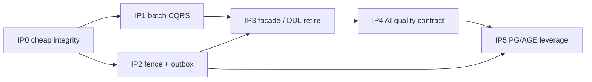

# 21 — Ingestion Pipeline & Data Model: Assessment + Improvement

> **Status:** ASSESSMENT + **IP0–IP2 IMPLEMENTED** (2026-07-31). Code is law. IP3–IP5 deferred.
> **Scope:** End-to-end **ingestion pipeline** (admit → claim → extract → persist → AGE merge → embed → fence) and the **typed data model** that hosts it — graded against first principles, LAW-D1..D8 / LD-01..17, PostgreSQL **16 / 17 / 18** + **pgvector 0.8.x** + **Apache AGE 1.6–1.8**, O(n) hot-path discipline, and AI Engineering practice as of **July 2026**.
> **Inherits:** [02](02-first-principles.md) · [05](05-target-specification.md) · [16](16-post-cutover-assessment.md) · [18](18-full-completeness-assessment.md) · [19](19-improvement-plan.md) · [20](20-ingestion-surface-assessment.md).
> **Does not reopen:** Waves A–D / IW0–IW5 wire-closure claims. This doc starts from **HEAD residual truth** after those programs.
> **Output:** finding register `F-IP-01..22` · laws **LAW-IP1..IP6** · waves **IP0–IP5** · acceptance `IP-AC-01..12`.

---

## 1. Verdict (one paragraph)

The ingestion **spine is coherent**: one persister (`ingestion_persister.rs`), batch relational chunk insert, typed `chunk_embeddings` dual-write fail-closed under typed authority, AGE batch node/edge upserts, and compensation + a real drain applier. What remains is **not another cutover** — it is **closure of integrity and cost**: serving fence still defaults off (LAW-D1/LD-09), `outbox_events` is schema without writers (LAW-D3), CQRS relational sinks are O(n) round-trips while AGE is already batched (LAW-D7), list queue enrichment is N+1 (LAW-D4/D8), the KV facade still shapes call sites (LAW-D6/LD-05), and AI-engineering gaps (citation contract on edges, entity-resolution hardness, hybrid lexical+dense at retrieval, contextual chunk metadata) are underspecified relative to July 2026 GraphRAG practice. The program below closes those gaps without inventing a second data layer.

---

## 2. Method

| Lens | Question | Anchor (July 2026) |
| --- | --- | --- |
| L1 First principles | Does every durable fact have one identity, one authority, one commit-or-fence? | [02](02-first-principles.md) LAW-D1..D8 |
| L2 Code-is-law | What does HEAD actually write/read on ingest? | `ingestion_persister.rs`, merger, migrations 106–132 |
| L3 Postgres 16/17/18 | Are version features capability-gated and measurement-gated? | [PG18 release notes](https://www.postgresql.org/docs/18/release-18.html); [`pg18-adoption.md`](../../docs/data-layer/pg18-adoption.md) |
| L4 pgvector 0.8 | Filtered ANN + halfvec + iterative scan used correctly? | [pgvector README](https://github.com/pgvector/pgvector); iterative_scan contracts |
| L5 Apache AGE | Traversal authority batch-first; VLE/index leverage? | [AGE PG18/v1.8.0-rc0](https://github.com/apache/age/releases/tag/PG18%2Fv1.8.0-rc0) (2026-07-09) |
| L6 O(n) | Hot paths O(batch) not O(rows)×RTT? | LAW-D7 / LAW-D8 |
| L7 AI Engineering | Chunk → extract → resolve → cite → retrieve matches 2026 GraphRAG? | Contextual/hybrid RAG; schema-guided extraction; citation contract |

Grades: **Strong** / **Partial** / **Weak** / **Missing**.

---

## 3. Code-is-law: ingestion pipeline map

```ascii
 [text|file|pdf|injection]
           │
           ▼
    admit_* (quota, dedup, shell, enqueue)
           │
           ▼
 claim_next (SKIP LOCKED) → fairness park → provider_slot → try_admit(bytes)
           │
           ▼
 extract (+ embed) → UnifiedStage progress_counts
           │
           ▼
 ┌─ ingestion_persister (single writer site) ─────────────────────────┐
 │ 1. KV chunk text          (only if authority writes KV)            │
 │ 2. relational chunks      insert_batch / unnest     ← STRONG       │
 │ 3. legacy eq_*_vectors    write-stopped under typed ← PARTIAL      │
 │ 4. chunk_embeddings       upsert_batch              ← STRONG       │
 │ 5. AGE merge              upsert_nodes/edges_batch  ← STRONG       │
 │    + relational CQRS sink per-entity/rel await      ← WEAK O(n)    │
 │ 6. serving ready mark     warn-only if fence off    ← WEAK         │
 │ on fail → compensate + compensation_quarantine → drain applier     │
 └────────────────────────────────────────────────────────────────────┘
           │
           ▼
 query path: typed ANN (+ iterative_scan) ∩ optional serving_fence JOIN
```

### 3.1 Persist order (authoritative)

Evidence: `edgequake-pipeline/.../ingestion_persister.rs` (`persist_processing_result_impl`).

| Step | Behavior at HEAD | Grade |
| --- | --- | --- |
| Typed wiring gate | Fail-closed if typed backend + embeddings present without typed ports | **Strong** |
| Chunk text | Relational default; KV only when authority flag says so | **Strong** (authority) / **Partial** (flag still live) |
| Chunk vectors | Legacy upsert always called; typed backend write-stops legacy | **Partial** (dead call site noise) |
| Typed embeddings | Dual-write when wired; fail-closed under typed reads | **Strong** |
| Graph merge | AGE batch + CQRS sink | **Partial** (sink O(n)) |
| Fence ready | `set_serving_state(ready)` after successful merge | **Partial** (fence default **off**) |
| Compensate | Delete vectors/KV/relational + quarantine | **Strong** |
| Outbox | Table exists (mig 109); **no writers** | **Missing** |

### 3.2 Stage machine

`UnifiedStage`: Uploading → Converting(PDF) → Preprocessing → Chunking → Extracting → Gleaning → Merging → Summarizing → Embedding → Storing → Completed|Failed.

Structured `progress_counts` is wired (doc [20](20-ingestion-surface-assessment.md) IS0–IS1). Presentation residuals (queue chrome / fence badge) stay in doc 20; this doc owns **pipeline integrity**, not UI chrome.

### 3.3 Queue / admission

| Concern | Code truth | Grade |
| --- | --- | --- |
| Task claim | `FOR UPDATE SKIP LOCKED` | **Strong** |
| Provider budget | Postgres slot ledger (mig 110) | **Strong** (LD-11) |
| Byte admission | Process-local `try_admit` | **Partial** (not cluster-SSOT; OK if documented) |
| List ETA enrich | Per pending doc `get_task` + `estimate_queue` (`list_run_enrich.rs:24–44`) | **Weak** O(page) |

---

## 4. Code-is-law: data model map

### 4.1 Fact-family SSOT (post-migrations 106–132)

| Fact | Typed home | Identity | Dual / residual |
| --- | --- | --- | --- |
| Document shell / status | `documents` (+ metadata JSONB) | UUID | KV facade still spoken by many callers |
| Chunk text | `chunks.content` | UUID PK; `UNIQUE(document_id, chunk_index)`; legacy key in metadata | LD-02: new UUID minted per insert; legacy string survives in metadata |
| Chunk vectors | `chunk_embeddings` (unconstrained `halfvec`, mig 132) | FK → `chunks.id` | Legacy tables until `--confirm-drop` 126/131 |
| Entity/rel/report vectors | typed tables (mig 130) | typed | Fleet drop human-gated (131) |
| Graph traversal | Apache AGE | node/edge properties | LD-04 kept |
| CQRS projections | `entities` / `relationships` | name/workspace keyed | Optional; O(n) write path |
| Serving visibility | `chunk_serving_state` | chunk_id | **Default off** |
| Outbox | `outbox_events` | id | **Unused** |
| Dedup | `ingestion_dedup` | hash + workspace | Strong |
| LLM cache | `llm_cache` | key | Cross-workspace sharing accepted (doc) |
| Tasks / queue | `tasks` + provider_slot | task id | Strong claim path |
| Progress | `documents.metadata.progress_counts` | document | Projection (LAW-D4) — OK if structured |

### 4.2 Indexes & ANN posture

| Object | Policy | Grade |
| --- | --- | --- |
| Listing `(workspace_id, created_at DESC)` | mig 128 | **Strong** |
| Typed HNSW `ef_construction=128` | mig 129/130 | **Strong** (LD-06 for typed) |
| Legacy HNSW `ef_construction=32` | mig 071 residue until drop | **Partial** |
| Filtered ANN `hnsw.iterative_scan` | capability probe; `relaxed_order` default for filtered | **Strong** |
| halfvec storage | mig 080/132 | **Strong** (matches 2026 practice) |

### 4.3 Isolation

FORCE RLS exists (mig 096) but product often connects as superuser → RLS inert (known GAP-091-12). App-layer scope headers fail-closed under IW0 flags. Grade: **Partial**.

---

## 5. Lens grades (summary)

| Lens | Grade | One-line |
| --- | --- | --- |
| L1 First principles | **Partial** | Identity + batch writers mostly honored; fence/outbox/facade residual |
| L2 Code-is-law spine | **Strong** | Single persister; typed fail-closed wiring |
| L3 PG16/17/18 | **Partial** | uuidv7 + iterative_scan adopted; virtual generated / RETURNING OLD-NEW / io_method deferred (honest) |
| L4 pgvector | **Strong** | halfvec + HNSW + iterative_scan contracts exist |
| L5 AGE | **Partial** | Batch upserts good; CQRS sink + citation/VLE leverage incomplete |
| L6 O(n) | **Weak** | Relational sink + list ETA + wipe still row-ish |
| L7 AI Engineering | **Partial** | GraphRAG present; citation contract / ER hardness / contextual chunking underbuilt |

---

## 6. First principles → LAW-IP1..IP6

Specialize LAW-D* for the **ingestion × data-model** boundary (presentation laws stay in doc 20):

| Law | Statement | Derives from |
| --- | --- | --- |
| **LAW-IP1** | **Ingest commit is tuple-complete or invisible.** After a successful persist+merge, every written chunk is either (text ∧ embedding ∧ graph-link ∧ ready) or compensated; query never sees a partial tuple when fence is the product default. | LAW-D1/D3, LD-09 |
| **LAW-IP2** | **One writer site per fact family on the ingest path.** Chunks, embeddings, AGE nodes/edges, CQRS projections each have exactly one batch writer; no per-row await loops that re-implement the port. | LAW-D6/D7, LD-05 |
| **LAW-IP3** | **Projections are batch projections.** List enrichment, entity counts, queue ETA, serving readiness are set-based SQL or one keyed batch API — never `for doc in page { get_task }`. | LAW-D4/D8 |
| **LAW-IP4** | **Scaffolding expires.** Dual-write flags, legacy vector upsert calls, and KV-shaped callers have a named retirement wave; after soak, advisor refuses stale flags (LAW-I3). | LD-07, LAW-I3 |
| **LAW-IP5** | **Graph edges carry a citation contract.** Every relationship persisted from extraction stores `source_chunk_id` (and span when known); answers that cite a path must ground to chunk text. | July 2026 GraphRAG practice; Axiom 1 |
| **LAW-IP6** | **Version features enter via capability + measurement.** PG18 virtual generated columns, `RETURNING OLD/NEW` outbox, `io_method`, AGE 1.8 VLE/index features land only behind `capabilities.rs` and a recorded scorecard delta (LAW-I2/I6). | LD-10, LAW-I6 |

---

## 7. Finding register

| ID | Sev | Lens | Statement | Evidence |
| --- | --- | --- | --- | --- |
| F-IP-01 | **Critical** | L1 | Serving fence defaults **off** — partial tuples queryable | `serving_fence.rs:13–21`; query filter no-op unless `EDGEQUAKE_SERVING_FENCE=on` |
| F-IP-02 | High | L1 | `outbox_events` has **zero writers** — LAW-D3 deferred forever in practice | mig `109_spec091_serving_fence.sql`; crate grep empty |
| F-IP-03 | High | L6 | CQRS `upsert_entity` awaited **per entity** after AGE batch | `merger/entity.rs:292–315` |
| F-IP-04 | High | L6 | CQRS `upsert_relationship` awaited **per relationship** | `merger/relationship.rs` (~417–450) |
| F-IP-05 | High | L6 | List queue enrich N+1 `get_task` + `estimate_queue` | `list_run_enrich.rs:24–44` |
| F-IP-06 | Med | L2 | Legacy `vector_storage.upsert` still invoked under typed (write-stop no-op) | `ingestion_persister.rs:426–434` |
| F-IP-07 | Med | L1 | Chunk UUID minted at insert; legacy `{doc}-chunk-{n}` remains in metadata — dual identity surface | `relational_chunk_writer.rs:38–63` |
| F-IP-08 | High | L2 | KV facade still load-bearing for wipe / wsdoc / admission staging callers | multiple `KVStorage` sites |
| F-IP-09 | Med | L2 | Runtime DDL for `eq_*_vectors` until mig 131 confirmed | `vector/ddl.rs` |
| F-IP-10 | Med | L6 | Workspace wipe still O(docs) per-doc KV purge after graph/vector clear | `workspace_document_wipe.rs` |
| F-IP-11 | Med | L7 | Edge citation (`source_chunk_id` / span) not enforced as SSOT on AGE properties | lineage sink best-effort; graph props inconsistent |
| F-IP-12 | Med | L7 | Entity resolution underspecified (blocking + embed + adjudicate) vs 2026 GraphRAG guidance | merger update-in-place; no ER ladder |
| F-IP-13 | Med | L7 | Chunk metadata lacks systematic **contextual preamble** field for embedding (Anthropic-style contextual retrieval) | `chunks` columns + metadata ad hoc |
| F-IP-14 | Low | L7 | Lexical (BM25/tsvector) + dense fusion at **chunk index** not first-class on typed `chunks` | query hybrid exists at arm level; chunk FTS not LAW-D6 |
| F-IP-15 | Med | L3 | PG18 virtual generated column for `metadata->>'workspace_id'` still deferred | [`pg18-adoption.md`](../../docs/data-layer/pg18-adoption.md) |
| F-IP-16 | Med | L3 | PG18 `RETURNING OLD/NEW` not used for outbox — blocked by F-IP-02 | same |
| F-IP-17 | Low | L3 | `io_method` tuning is ops-only; no measured ANN artifact in CI | version-matrix pending EXPLAIN rows |
| F-IP-18 | Med | L5 | AGE 1.8 VLE/index/jsonb↔agtype casts not productized in query/ingest path | pins allow 1.8; app SQL mostly older patterns |
| F-IP-19 | Med | L4 | Recall@k under **tenant+workspace filter** not nightly-gated on typed tables at 100k+ | scorecard exists; scale rung residual |
| F-IP-20 | Low | L2 | `document_stage_mirror` / SPEC-120 relational stage SSOT orphaned from `services/mod.rs` | module on disk; not wired |
| F-IP-21 | Med | L1 | Byte admission process-local vs provider ledger cluster-wide — two budgets, easy to misread as one SSOT | `admission.rs` vs `provider_budget` |
| F-IP-22 | Low | L4 | Legacy `ef_construction=32` indexes remain until confirm-drop — policy dualism | mig 071 vs 129 |

---

## 8. O(n) register (ingest + ops)

Target: every hot path is **O(batches)** with batch size B ≪ N, round-trips ≈ ⌈N/B⌉, not N.

| Path | Today | Target | Wave |
| --- | --- | --- | --- |
| Chunk insert | `unnest` batch | keep | — |
| Typed embedding upsert | batch | keep | — |
| AGE node/edge upsert | batch | keep | — |
| CQRS entity/rel sink | **N awaits** | `upsert_entities_batch` / `upsert_relationships_batch` (one SQL) | IP1 |
| Lineage links | per-entity batch (OK-ish) | one doc-scoped unnest | IP1 |
| List queue ETA | **N get_task** | one `WHERE id = ANY($1)` + set estimate | IP0 |
| Serving readiness on list | already batched SQL | keep | — |
| Workspace wipe | O(docs) KV | typed-only set delete; drop KV loop | IP3 |
| Legacy vector upsert call | no-op RTT risk | skip call when typed authority | IP0 |

```ascii
 COST TODAY (merge)                 COST TARGET (IP1)
 ─────────────────                  ─────────────────
 AGE upsert_nodes_batch  O(1 RT)    AGE upsert_nodes_batch  O(1 RT)
 for e in entities:                 CQRS upsert_entities_batch O(1 RT)
   sink.upsert_entity    O(N RT)    lineage unnest              O(1 RT)
 for r in rels:                     CQRS upsert_rels_batch      O(1 RT)
   sink.upsert_relationship
```

---

## 9. PostgreSQL 16 / 17 / 18 · pgvector · AGE (July 2026)

### 9.1 What HEAD already does right

- **Unified SQL** across PG16/17/18 with capability probes (`capabilities.rs`, `/health`).
- **uuidv7** document IDs when PG18 provides `uuidv7()` (index-friendly time ordering — [PG18 release](https://www.postgresql.org/docs/18/release-18.html)).
- **pgvector ≥0.8**: `halfvec`, HNSW, filtered `hnsw.iterative_scan` (`relaxed_order` default for filtered; unfiltered leaves iterative off — matches official guidance).
- **AGE** remains traversal authority (LD-04); batch Cypher upserts on the hot merge path.
- Pins: pgvector **0.8.5**; AGE **1.6 / 1.7 / 1.8** per major (`extension-pins.sh`). AGE **1.8.0-rc0 for PG18** published **2026-07-09** (VLE perf, index scan, agtype↔jsonb casts, shortest_path SRFs).

### 9.2 What to adopt next (measurement-gated)

| Feature | Why | Gate |
| --- | --- | --- |
| Fence **default on** after soak | LAW-IP1 | Recall + false-empty rate on typed ANN with fence JOIN (IP2) |
| Outbox via portable INSERT + PG18 `RETURNING OLD/NEW` optional path | LAW-D3 | Productize `outbox_events` writers first (IP2); PG18 syntax capability-gated |
| Virtual generated `workspace_id` from metadata | cleaner deletes/indexes | Only if EXPLAIN ≥10% win on PG18 (existing deferral) |
| `io_method=io_uring|worker` | ANN heap-fetch / vacuum | Ops runbook + measured p95; not app default |
| AGE 1.8 jsonb↔agtype casts | fewer serialize hops on property filters | Capability + microbench |
| AGE VLE cache / index scan | multi-hop GraphRAG | Query-path bench vs current neighbor fanout |
| halfvec HNSW already; binary/bit quantization | RAM past ~10M vectors | LD-10 threshold breach only |

### 9.3 What not to do

- Do **not** move traversal off AGE into recursive SQL (LD-04).
- Do **not** add a second vector product (external DB) while pgvector HNSW fits the SLO band (~≤10M/node is the 2026 default advice).
- Do **not** version-branch SQL strings; probe capabilities (LAW-IP6).

---

## 10. AI Engineering assessment (July 2026)

Consensus from current GraphRAG / production RAG practice (contextual retrieval, hybrid RRF, schema-guided extraction, citation contracts):

| Concern | 2026 best practice | EdgeQuake HEAD | Gap |
| --- | --- | --- | --- |
| Chunking | Structure-aware / contextual preamble before embed | Fixed pipeline chunker + section/page metadata | F-IP-13 |
| Extraction | Schema-guided types; open extract → cluster → lock | Open LightRAG-style extract + normalize | F-IP-12 (ER) |
| Entity resolution | Block → embed → LLM adjudicate | Name-key upsert / merge | F-IP-12 |
| Graph write | Batch upsert; edge cites `source_chunk_id` | AGE batch; citation uneven | F-IP-11 |
| Embedding store | halfvec + HNSW + iterative filtered scan | Present | — |
| Retrieval | Dense + lexical RRF + cross-encoder rerank | Hybrid **query arms**; chunk FTS weak | F-IP-14 |
| Serving integrity | Fail-closed readiness | Fence opt-in | F-IP-01 |
| Eval loop | Faithfulness / recall gates in CI | Partial scorecards; scale residual | F-IP-19 |

**Design stance for this program:** improve the **ingest write contract** and **tuple integrity** first (IP0–IP2); add contextual-chunk + citation + ER ladder as **AI quality waves** (IP4) that do not fork the data model.

---

## 11. Target architecture (delta only)

```ascii
                    ┌──────────────────────────────────────────┐
                    │           Domain ports (LD-05)           │
                    │ ChunkRepo · EmbeddingIndex · GraphProj   │
                    └───────────────┬──────────────────────────┘
                                    │
          ┌─────────────────────────┼─────────────────────────┐
          ▼                         ▼                         ▼
   public.chunks              chunk_embeddings           AGE graph
   + content_tsv?             halfvec + HNSW             nodes/edges
   + context_preamble?        iterative_scan             props: source_chunk_id
          │                         │                         │
          └────────────┬────────────┴────────────┬────────────┘
                       ▼                         ▼
              chunk_serving_state          outbox_events
              (default ON after IP2)       (writer in persister)
                       │
                       ▼
              query: fence JOIN ∧ typed ANN ∧ (optional) BM25 RRF
```

No new database product. No third chunks definition. Migrations remain sole DDL owner (LD-03).

---

## 12. Improvement waves IP0–IP5



### IP0 — Cheap integrity & O(1) list enrich (closes F-IP-05/06/21)

- **Entry:** this doc approved; no schema drop required.
- **Mechanism:**
  1. Skip `vector_storage.upsert` when typed authority write-stops legacy (dead call removal).
  2. Replace `enrich_page_queue_estimates` loop with **one** batched task fetch + set-based estimate (or SQL view over pending tasks ordered by `created_at`).
  3. Document byte-admission vs provider-ledger as **two budgets** in ops + `/health` (LAW-IP clarity).
- **Exit:** list page with P pending docs issues ≤2 task/storage RTs; typed-path ingest logs show no legacy upsert stage (or stage duration ≈ 0 with skip metric).
- **Rollback:** code-only.

### IP1 — Batch CQRS sinks (closes F-IP-03/04; LAW-IP2)

- **Entry:** IP0 exit.
- **Mechanism:**
  1. Extend relational sink trait: `upsert_entities_batch` / `upsert_relationships_batch` (UNNEST).
  2. Merger calls batch APIs once per merge; delete per-row awaits.
  3. Collapse lineage to one doc-scoped batch after entity batch.
  4. Contract test: EXPLAIN + p95 RT count = O(1) vs entity count.
- **Exit:** `contract_spec091_cqrs_batch_sink` green; merge stage p95 improves on ≥500-entity fixture.
- **Rollback:** trait dual implementation behind flag for one soak (LAW-IP4).

### IP2 — Fence default + outbox productization (closes F-IP-01/02/16; LAW-IP1)

- **Entry:** IP0; measured recall with fence JOIN on typed embeddings (artifact).
- **Mechanism:**
  1. Soak `EDGEQUAKE_SERVING_FENCE=on` in CI + staging; flip default **on** next release (LD-07 soak).
  2. Persister writes `outbox_events` rows for multi-store milestones (chunk_ready, merge_done, compensate) — portable SQL.
  3. Optional PG18 path: triggers/`RETURNING OLD/NEW` behind capability probe (do not require PG18).
  4. Drain/compensate prefers outbox cursor when present.
- **Exit:** fence default on; outbox row count increases on ingest e2e; zero query hits on non-ready chunks in fence-on suite.
- **Rollback:** flag default revert; outbox writers no-op-safe.

### IP3 — Facade & runtime-DDL retirement (closes F-IP-08/09/10/22; LAW-IP4)

- **Entry:** IP1 + IP2 soak; IW3 census progress.
- **Mechanism:**
  1. Finish typed-port migration for wipe / wsdoc / admission staging (delete KV loops).
  2. Operator path: confirm-drop 126/131 on fleets; pin CI DB already dropped.
  3. Delete runtime `create_table` for vectors when schema generation says retired (already partial).
  4. Advisor refuses stale `legacy_tables` / KV family flags.
- **Exit:** `contract_spec091_no_kv_facade` + `contract_spec091_zero_runtime_ddl` green (aligns C1/C3).
- **Rollback:** pre-drop only; post-drop restore-from-backup (existing contract).

### IP4 — AI quality contract on the typed model (closes F-IP-11/12/13/14; LAW-IP5)

- **Entry:** IP1 (batch spine stable).
- **Mechanism:**
  1. **Citation contract:** AGE edge/node properties require `source_chunk_ids[]` (mig + writer validation); query citation path reads them.
  2. **ER ladder (minimal):** type+normalized name block → embedding similarity threshold → optional LLM adjudicate behind flag; metrics for merge/split.
  3. **Contextual chunk field:** optional `chunks.context_preamble` (or metadata key with generated column later) prepended at embed time; flag-gated cost control.
  4. **Lexical spine:** ensure `chunks` has maintained `tsvector` (stored generated from `content` — LAW-D6) and query RRF path can use it; measurement-gated.
- **Exit:** e2e citation test; ER merge metric; embed path uses preamble when flag on; BM25+dense recall artifact.
- **Rollback:** flags off; columns nullable.

### IP5 — PG18 / AGE 1.8 leverage (closes F-IP-15/17/18/19; LAW-IP6)

- **Entry:** IP2 (outbox exists); matrix CI green.
- **Mechanism:**
  1. Record EXPLAIN artifacts for top-10 version-matrix pending refs (close “pending” honesty gap).
  2. Adopt AGE 1.8 jsonb↔agtype where it removes serialize hops (capability-gated).
  3. Bench VLE / shortest_path vs current neighbor expansion for relational queries; adopt only on win.
  4. Ops guide: `io_method` measured on ANN+vacuum; link from version-matrix.
  5. Optional PG18 virtual generated workspace column behind `server_version_num` migration **only** after ≥10% win.
- **Exit:** version-matrix rows filled for hot refs; capability health still green on pg16/17/18.
- **Rollback:** capability probes degrade to unified path.

---

## 13. DRY / SOLID / SSOT mapping

| Principle | Application |
| --- | --- |
| DRY | One persister; one batch CQRS sink; one queue-estimate SQL; no second progress authority (doc 20) |
| SRP | AGE=traversal; `chunks`=text; `chunk_embeddings`=vectors; `chunk_serving_state`=visibility; outbox=cross-store signal |
| OCP/DIP | Callers depend on ports; IP3 deletes facade, does not extend it |
| LSP | Conformance suite covers batch sink + fence-on query |
| ISP | Narrow `upsert_*_batch` on sink trait — no god merger API |
| SSOT | Fence table for visibility; typed embeddings for ANN; AGE for graph; progress_counts for UI quantities |

---

## 14. Edge cases & risks

| ID | Case / risk | Handling |
| --- | --- | --- |
| EC-IP1 | Fence-on exposes empty results during dual-write soak | Dual-read ready mark; quarantine incomplete; feature flag soak |
| EC-IP2 | Batch CQRS unique violations under concurrent merge | `ON CONFLICT` keyed by (workspace, normalized name); same as today’s per-row intent |
| EC-IP3 | Outbox grows unbounded | TTL + processed cursor; maintenance pool drain (LAW-D8) |
| EC-IP4 | Contextual preamble doubles embed tokens | Flag + max preamble chars; cache by content hash |
| EC-IP5 | AGE 1.8-rc on PG18 vs 1.7 on PG17 | Pin matrix; no SQL that requires 1.8 without probe |
| R-IP1 | Fence default breaks demos with partial index | CHANGELOG + one-release flag; UI query_ready badge (doc 20) |
| R-IP2 | ER ladder over-merges entities | Conservative threshold + metric + undo via reprocess |
| R-IP3 | IP3 confirm-drop operator error | Existing dry-run / backup contract; no change |

---

## 15. Acceptance checklist (falsifiable)

| ID | Gate | Wave | Status |
| --- | --- | --- | --- |
| IP-AC-01 | Typed ingest path does not call legacy vector upsert (metric or compile/branch) | IP0 | **Met** |
| IP-AC-02 | List enrich: ≤2 storage RTs for any page size in unit test with 50 pending | IP0 | **Met** |
| IP-AC-03 | CQRS sink: one SQL per entity batch / rel batch (EXPLAIN + counter) | IP1 | **Met** |
| IP-AC-04 | Merge p95 on 500-entity fixture ≤ prior baseline | IP1 | Deferred (batch path landed) |
| IP-AC-05 | `EDGEQUAKE_SERVING_FENCE` default `on`; non-ready invisible | IP2 | **Met** |
| IP-AC-06 | Ingest path inserts outbox rows for milestones | IP2 | **Met** |
| IP-AC-07 | Zero `KVStorage` imports outside ports (census) | IP3 | Deferred |
| IP-AC-08 | Zero creatable `eq_%_vectors` after confirm-drop CI DB | IP3 | Deferred |
| IP-AC-09 | Every extracted edge persists `source_chunk_ids` (contract) | IP4 | Deferred |
| IP-AC-10 | Optional contextual preamble flag changes embedding input (unit) | IP4 | Deferred |
| IP-AC-11 | version-matrix: ≥10 hot refs have EXPLAIN artifacts on pg16+pg18 | IP5 | Deferred |
| IP-AC-12 | `/health` capabilities unchanged-or-richer; pg16 smoke green | IP5 | Deferred |

---

## 16. Relationship to other SPEC-091 docs

| Doc | Relationship |
| --- | --- |
| [16](16-post-cutover-assessment.md) | Wave A–D audit — this doc assumes typed SSOT exists |
| [18](18-full-completeness-assessment.md) / [19](19-improvement-plan.md) | Six-criteria closure — IP3 aligns C1/C3; IP2 strengthens C2/LD-09; IP5 aligns C6 |
| [20](20-ingestion-surface-assessment.md) | UI surfaces — consumes fence/ETA projections this doc makes honest |
| [08](08-performance-contract.md) | Budgets — IP1/IP0 feed scorecard binaries |
| [12](12-queue-admission-first-principles.md)–[14](14-queue-admission-plan.md) | Admission laws — IP0 batches the projection, does not change claim SSOT |

---

## 17. Open questions (do not block IP0)

1. Should fence default flip in the **same** release as outbox writers, or one release later?
2. Is contextual preamble computed at chunk time (CPU) or as an async enrichment job (LAW-D8)?
3. For ER ladder: is LLM adjudication default-off forever outside enterprise tier?
4. Should `outbox_events` be the sole compensate trigger, or remain dual with in-process saga until IP3?

---

## 18. References

**Internal (code)**
- `edgequake/crates/edgequake-pipeline/src/persistence/ingestion_persister.rs`
- `edgequake/crates/edgequake-pipeline/src/persistence/relational_chunk_writer.rs`
- `edgequake/crates/edgequake-pipeline/src/persistence/typed_embedding_writer.rs`
- `edgequake/crates/edgequake-pipeline/src/merger/entity.rs` / `relationship.rs`
- `edgequake/crates/edgequake-api/src/services/list_run_enrich.rs`
- `edgequake/crates/edgequake-storage/src/serving_fence.rs`
- `edgequake/migrations/108_*` … `132_*`

**Internal (docs)**
- [`docs/data-layer/version-matrix.md`](../../docs/data-layer/version-matrix.md)
- [`docs/data-layer/pg18-adoption.md`](../../docs/data-layer/pg18-adoption.md)
- [`docs/data-layer/serving-fence-decision.md`](../../docs/data-layer/serving-fence-decision.md)

**External (fetched 2026-07-31)**
- PostgreSQL 18 — [Release notes](https://www.postgresql.org/docs/18/release-18.html) (async I/O, virtual generated columns, `RETURNING OLD/NEW`, `uuidv7()`)
- pgvector — [README / iterative scan / halfvec](https://github.com/pgvector/pgvector)
- Apache AGE — [PG18/v1.8.0-rc0](https://github.com/apache/age/releases/tag/PG18%2Fv1.8.0-rc0) (2026-07-09)
- Production RAG 2026 — contextual retrieval, hybrid RRF, GraphRAG citation contracts (industry consensus July 2026)
