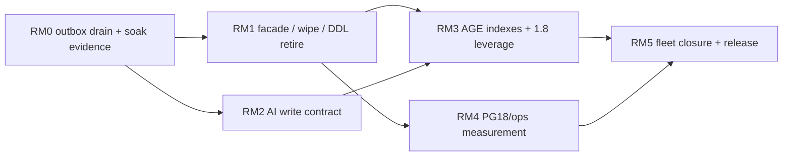

# 22 — Ingestion Pipeline × Migration System: Reliability · Performance · Quality

> **Status:** ASSESSMENT + **RM0–RM5 IMPLEMENTED** (2026-07-31). Code is law. Residual: full KV-facade allowlist shrink (C3 census still documents ports); 100k+ recall soak-deferred.
> **Scope:** Joint audit of the **ingestion pipeline** and the **migration system** (schema apply + data-movement engine + boot gate + operator console), graded for **reliability**, **performance**, and **quality**, plus a first-principles **data-model** review against PostgreSQL **16 / 17 / 18**, **pgvector 0.8.x**, **Apache AGE 1.6–1.8**, **O(n)** hot-path discipline, and **AI Engineering** practice as of **July 2026**.
> **Inherits:** [02](02-first-principles.md) · [07](07-migration-engine.md) · [08](08-performance-contract.md) · [15](15-migration-console-cli.md) · [16](16-post-cutover-assessment.md) · [17](17-boot-migration-gating.md) · [18](18-full-completeness-assessment.md) · [19](19-improvement-plan.md) · [20](20-ingestion-surface-assessment.md) · [21](21-ingestion-pipeline-data-model-improvement.md).
> **Does not reopen:** Waves A–D / IW0–IW5 wire-closure; IP0–IP2 landed claims in [21](21-ingestion-pipeline-data-model-improvement.md). This doc starts from **HEAD residual truth** after those programs and owns the **joint** reliability/ops closure that neither 17 nor 21 fully covers alone.
> **Output:** finding register `F-RM-01..28` · laws **LAW-RM1..RM8** · waves **RM0–RM5** · acceptance `RM-AC-01..14`.

---

## 1. Verdict (one paragraph)

At HEAD the **ingestion spine is production-grade for write integrity** (single persister, typed batch chunks/embeddings, AGE batch merge, batch CQRS sinks, fence **default on**, outbox writers, compensation + drain) and the **migration system is production-grade for operator-gated schema change** (CLI-only apply, fail-closed boot verify, downgrade refuse, dry-run + `--confirm-drop`, keyset resumable jobs with lease/SHA digest). What remains is **not another cutover narrative** — it is **closing the reliability gap between “schema moved” and “fleet is safe,” and the quality gap between “GraphRAG demo” and “auditable retrieval.”** Residuals cluster in five places: (1) KV facade + residual runtime DDL until confirm-drop, (2) outbox is write-only (no durable consumer as sole compensate trigger), (3) isolation defense-in-depth still depends on app headers while product DB roles bypass RLS, (4) AI-quality contracts (citation, ER ladder, contextual chunk, chunk FTS) underspecified vs July 2026 practice, (5) migration ops still lack true kill-9 / 1M soak evidence and AGE index/VLE productization. The program below (`RM0–RM5`) closes those without inventing a second data layer.

---

## 2. Method

| Lens | Question | Anchor (July 2026) |
| --- | --- | --- |
| L-Rel | Can a crash, replica lag, or operator error leave durable inconsistency or silent schema drift? | LAW-D1/D3/D5; LD-07/08/15; chaos + boot-gate contracts |
| L-Perf | Are hot paths O(batch) and off request when O(N)? Do ANN/graph plans match pgvector/AGE guidance? | LAW-D7/D8; LAW-P1..P5; [pgvector](https://github.com/pgvector/pgvector); [AGE perf](https://learn.microsoft.com/en-us/azure/horizondb/graph/age-performance) |
| L-Qual | Do retrieved answers stay faithful, citable, and tenant-scoped under filter? | GraphRAG citation + ER ladder; fence JOIN; RLS/app scope |
| L-Model | One identity, one authority, one fence per fact family? | [02](02-first-principles.md) LAW-D1..D8 |
| L-PG | Capability-gated use of PG16/17/18 features? | [PG18 release](https://www.postgresql.org/docs/18/release-18.html); [`pg18-adoption.md`](../../docs/data-layer/pg18-adoption.md) |
| L-AGE | Traversal authority batch-first; indexes explicit; VLE/casts leveraged when safe? | AGE [PG18/v1.8.0-rc0](https://github.com/apache/age/releases/tag/PG18%2Fv1.8.0-rc0) (2026-07-09) |
| L-AI | Chunk → extract → resolve → cite → retrieve matches 2026 GraphRAG? | Contextual/hybrid RAG; schema-guided ER; citation contract |

Grades: **Strong** / **Partial** / **Weak** / **Missing**.

```ascii
                    RELIABILITY          PERFORMANCE           QUALITY
                 ┌──────────────────┬───────────────────┬──────────────────┐
 Ingestion       │ fence+compensate │ batch persist/merge│ citation / ER /  │
                 │ outbox write     │ O(batch) CQRS     │ contextual chunk │
                 ├──────────────────┼───────────────────┼──────────────────┤
 Migration       │ boot refuse      │ keyset + adaptive │ advisor honesty  │
                 │ confirm-drop     │ maint pool only   │ dry-run preview  │
                 ├──────────────────┼───────────────────┼──────────────────┤
 Data model      │ typed SSOT       │ halfvec+HNSW+     │ hybrid retrieve  │
                 │ one schema owner │ iterative_scan    │ scope integrity  │
                 └──────────────────┴───────────────────┴──────────────────┘
```

---

## 3. Code-is-law: system maps

### 3.1 Ingestion pipeline (HEAD)

```ascii
 [text|file|pdf|injection]
           │
           ▼
    admit (quota, dedup, shell, enqueue)
           │
           ▼
 claim_next (SKIP LOCKED) → fairness → provider_slot → try_admit(bytes)
           │
           ▼
 extract (+ embed) → UnifiedStage + progress_counts
           │
           ▼
 ┌─ ingestion_persister (single writer site) ─────────────────────────┐
 │ relational chunks (unnest)          ← Strong                       │
 │ chunk_embeddings upsert_batch       ← Strong                       │
 │ skip legacy vector upsert (typed)   ← Strong (IP0)                 │
 │ AGE upsert_nodes/edges_batch        ← Strong                       │
 │ CQRS upsert_*_batch                 ← Strong (IP1)                 │
 │ set_serving_state(ready)            ← Strong (fence default ON)    │
 │ outbox milestones (best-effort)     ← Partial (write, weak drain)  │
 │ on fail → compensate + quarantine → drain applier                  │
 └────────────────────────────────────────────────────────────────────┘
           │
           ▼
 query: typed ANN (+ iterative_scan) ∩ fence JOIN (default)
```

| Concern | HEAD truth | Rel | Perf | Qual |
| --- | --- | --- | --- | --- |
| Single persist site | `ingestion_persister.rs` | Strong | Strong | Strong |
| Fence default | `serving_fence.rs` unset → **on** | Strong | — | Strong |
| Outbox | writers + mig 133; fail-open; **no sole consumer** | Partial | Strong | Partial |
| CQRS sink | `upsert_entities_batch` / rel batch | Strong | Strong | Partial (no citation SSOT) |
| Queue claim | SKIP LOCKED + provider ledger | Strong | Strong | Strong |
| List ETA | `estimate_queues_batch` ≤2 RTs | Strong | Strong | Strong |
| Byte admission | process-local vs cluster ledger | Partial | Partial | Partial |
| Compensation | quarantine + drain applier | Strong | Partial | Strong |

### 3.2 Migration system (HEAD)

Three classes remain distinct ([07](07-migration-engine.md)):

| Class | Owner | Boot behavior | Grade |
| --- | --- | --- | --- |
| Schema change | `edgequake migrate` only (LD-15) | Serving **verifies & refuses** (exit 78) | **Strong** |
| Data movement | `migration_engine` descriptors + jobs | Never blocks readiness; resume via lease | **Strong** (design) / **Partial** (soak evidence) |
| Verification | job verify phase + advisor residue | Read-only | **Strong** |

```ascii
 Operator                    Serving boot                 Engine
 ────────                    ────────────                 ──────
 dry-run ──▶ preview
 migrate [--confirm-drop] ──▶ apply sqlx + reconcile
                              │
                              ▼
                         schema_drift()?
                         pending ∨ db_newer → REFUSE
                         else serve + report jobs
                                                      runner:
                                                        keyset batch
                                                        adaptive size
                                                        lease + heartbeat
                                                        step_sha384 guard
                                                        verify → complete
 advisor / console ◀── migration_progress view ◀────────┘
```

| Concern | HEAD truth | Rel | Perf | Qual |
| --- | --- | --- | --- | --- |
| One schema writer | `ALLOW_BOOT_MIGRATE` removed (warn-ignore) | Strong | — | Strong |
| Downgrade refuse | LAW-B5 `db_newer_than_binary` | Strong | — | Strong |
| Irreversible drops | 125/126/131 need `--confirm-drop` | Strong | — | Strong |
| Job resume | keyset + batch ledger same TX | Strong | Strong | Strong |
| Offset pagination | prohibited in engine design | — | Strong | — |
| Runtime DDL residue | vector `create_table` gated but code paths remain until fleet drop | Weak | Partial | Weak |
| Kill-9 / 1M soak | chaos mid-batch exists; true kill-9 + 1M residual | Partial | Partial | Partial |
| Additive boot ensure | AGE graph / audit partition / hot ANN still boot-touched | Partial | Partial | Partial |

### 3.3 Data model SSOT (post 106–133)

| Fact | Typed home | Identity | Residual |
| --- | --- | --- | --- |
| Document shell | `documents` | UUID (uuidv7 when PG18) | KV facade callers |
| Chunk text | `chunks.content` | UUID PK; `UNIQUE(document_id, chunk_index)` | legacy key in metadata |
| Chunk vectors | `chunk_embeddings` (`halfvec`) | FK → `chunks.id` | confirm-drop 126/legacy |
| Entity/rel/report vectors | typed fleet (130) | typed | human-gated drop 131 |
| Graph | Apache AGE | node/edge props | citation uneven |
| CQRS | `entities` / `relationships` | workspace+name | optional projection |
| Visibility | `chunk_serving_state` | chunk_id | default **on** |
| Outbox | `outbox_events` (+ workspace_id, 133) | id | write without consumer SSOT |
| Dedup / tasks / slots | typed | scoped | Strong |
| Migration jobs | `edgequake.edgequake_migration_job` | job_id | Strong |

---

## 4. Scorecard (HEAD)

### 4.1 Reliability

| Surface | Grade | One-line |
| --- | --- | --- |
| Ingest tuple integrity | **Strong** | Fence default on + ready mark + compensate |
| Ingest crash mid-persist | **Partial** | Compensation + quarantine; outbox not yet sole trigger |
| Multi-replica claim | **Strong** | SKIP LOCKED + provider slot ledger |
| Schema apply consent | **Strong** | CLI-only; boot refuse; confirm-drop |
| Mixed-schema fleet | **Partial** | Post-drop stale replicas fail ingest (R-27/EC-36) — ops residual |
| Job crash resume | **Strong** | Digest + cursor + same-TX batch ledger |
| Isolation under load | **Partial** | App fail-closed headers (IW0); RLS inert as superuser |

**Reliability verdict:** **Strong for single-node correct operation; Partial for fleet/ops edge and isolation defense-in-depth.**

### 4.2 Performance

| Path | Today | Target | Grade |
| --- | --- | --- | --- |
| Chunk / embedding write | unnest / batch | keep | **Strong** |
| AGE merge | batch Cypher upserts | keep + AGE indexes | **Strong** / Partial indexes |
| CQRS sink | batch UNNEST | keep | **Strong** |
| List queue ETA | batched | keep | **Strong** |
| Workspace wipe | still doc-loop residue | set-based typed delete | **Weak** |
| Migration backfill | keyset + adaptive 50–5k | keep; measure 1M | **Strong** design / **Partial** evidence |
| Filtered ANN | halfvec + HNSW + `relaxed_order` iterative | keep; recall@k gate at scale | **Strong** / Partial scale |
| Graph multi-hop | neighbor fanout | AGE 1.8 VLE when measured win | **Partial** |

**Performance verdict:** **Strong on ingest write path; Partial on wipe, ANN scale evidence, AGE index productization.**

### 4.3 Quality (retrieval / AI engineering)

| Concern | 2026 practice | HEAD | Grade |
| --- | --- | --- | --- |
| Serving integrity | Fail-closed readiness | Fence default on | **Strong** |
| Citation / provenance | Edge → `source_chunk_id(s)` required | Uneven props | **Weak** |
| Entity resolution | Block → embed → adjudicate | Name-key merge | **Weak** |
| Contextual chunking | Preamble before embed | Ad hoc metadata | **Missing** |
| Hybrid retrieve | Dense + lexical RRF at chunk | Hybrid arms; chunk FTS weak | **Partial** |
| Eval / recall gates | CI faithfulness + recall@k | Scorecards; 100k+ residual | **Partial** |
| Schema-guided extract | Constrained types | Open LightRAG-style | **Partial** |

**Quality verdict:** **Infrastructure for GraphRAG is Strong; AI quality contracts are Partial→Weak — the binding gap after IP2.**

### 4.4 Lens summary

| Lens | Grade |
| --- | --- |
| L-Rel | **Partial→Strong** (ops/fleet residuals) |
| L-Perf | **Strong** ingest; **Partial** ops/scale |
| L-Qual | **Partial** (integrity Strong; AI Weak) |
| L-Model | **Partial** (typed SSOT Strong; facade/DDL residual) |
| L-PG | **Partial** (uuidv7 + iterative_scan; virtual generated / RETURNING OLD-NEW / io_method deferred honestly) |
| L-AGE | **Partial** (batch upsert Strong; indexes/VLE/casts underused) |
| L-AI | **Weak→Partial** |

---

## 5. First principles → LAW-RM1..RM8

Specialize LAW-D* / LAW-B* / LAW-IP* for the **ingestion × migration** joint boundary:

| Law | Statement | Derives from |
| --- | --- | --- |
| **LAW-RM1** | **Ingest success means query-safe.** A document marked completed is either fence-ready for all its chunks or explicitly non-queryable; demos may not disable the fence without a logged escape. | LAW-D1/D3, LD-09, LAW-IP1 |
| **LAW-RM2** | **Schema mutate ≠ serve.** Versioned schema apply is never a side effect of serving boot; refuse is the only boot action on drift. | LAW-B1/B2, LD-15 |
| **LAW-RM3** | **Data movement is resumable arithmetic.** Every long migration is keyset + idempotent batch + digest-guarded resume; offset pagination and “run the script again” are forbidden. | LAW-D7/D8, [07](07-migration-engine.md) |
| **LAW-RM4** | **Irreversible is human.** Drops that destroy dual-write safety require dry-run GREEN + `--confirm-drop` + backup contract; no silent path. | LD-07, LAW-C* |
| **LAW-RM5** | **Projections never become second writers.** Outbox, CQRS, progress_counts, list ETA are projections or signals of typed authorities — they may not invent a parallel SSOT. | LAW-D4/D6 |
| **LAW-RM6** | **Hot paths stay O(⌈N/B⌉).** Ingest merge, list enrich, wipe, and migration batches are set-based; per-row await loops are defects. | LAW-D7, LAW-IP2/IP3 |
| **LAW-RM7** | **Graph answers cite chunks.** Every extracted edge persists `source_chunk_ids[]`; generation that cites a path must ground to chunk text. | July 2026 GraphRAG; Axiom 1 |
| **LAW-RM8** | **Version features enter via capability + measurement.** PG18 / AGE 1.8 / pgvector knobs land behind probes and a recorded scorecard delta — never a second SQL dialect. | LAW-IP6, LAW-I6, LD-10 |

---

## 6. Finding register

| ID | Sev | Lens | Statement | Evidence |
| --- | --- | --- | --- | --- |
| F-RM-01 | Med | L-Rel | Outbox writers are fail-open **best-effort**; compensate path not outbox-driven SSOT | `outbox.rs` enqueue_best_effort; persister calls |
| F-RM-02 | High | L-Model | KV facade still load-bearing for wipe / wsdoc / admission staging | census residual (C3); IP3 deferred |
| F-RM-03 | High | L-Rel | Runtime `create_table` paths remain for legacy vector fleet until confirm-drop 131 | `vector/ddl.rs`, `storage_impl.rs` gated skips |
| F-RM-04 | High | L-Rel | Post-drop mixed-schema fleet: stale replicas fail ingest hard (ops) | R-27, EC-36; runbook |
| F-RM-05 | Med | L-Rel | Additive boot object-ensure still mutates non-versioned objects (AGE ensure, hot ANN, partitions) | LAW-B4 class; must stay bounded |
| F-RM-06 | Med | L-Rel | True kill-9 during job + 1M-row soak not CI-proven | chaos mid-batch ≠ kill-9; LD-16 residual |
| F-RM-07 | High | L-Qual | Edge citation (`source_chunk_ids`) not enforced as SSOT on AGE props | F-IP-11 carry-forward |
| F-RM-08 | High | L-Qual | Entity resolution = name-key upsert; no block/embed/adjudicate ladder | F-IP-12; GraphRAG 2026 consensus |
| F-RM-09 | Med | L-Qual | No systematic contextual preamble field for embed | F-IP-13 |
| F-RM-10 | Med | L-Qual | Chunk-level lexical (`tsvector`) + dense RRF not first-class on typed `chunks` | F-IP-14 |
| F-RM-11 | Med | L-Perf | Workspace wipe still O(docs) residue after graph/vector clear | `workspace_document_wipe.rs` |
| F-RM-12 | Med | L-Perf | AGE default: **no indexes** on new labels — product must ensure BTREE(id/start/end) + GIN(properties) | [AGE perf guide](https://learn.microsoft.com/en-us/azure/horizondb/graph/age-performance) (2026-06) |
| F-RM-13 | Med | L-AGE | AGE 1.8 VLE overhaul / jsonb↔agtype / shortest_path SRFs not productized | pin allows 1.8; app SQL older patterns |
| F-RM-14 | Med | L-PG | PG18 virtual generated workspace column + `RETURNING OLD/NEW` outbox path still deferred | `pg18-adoption.md` |
| F-RM-15 | Med | L-Rel | RLS FORCE exists but product often connects as superuser → inert | GAP-091-12 |
| F-RM-16 | Low | L-Perf | Byte admission process-local vs provider ledger cluster-wide — two budgets | F-IP-21 |
| F-RM-17 | Med | L-Qual | Recall@k under tenant+workspace filter not nightly-gated at 100k+ on typed tables | F-IP-19 |
| F-RM-18 | Low | L-Model | Dual chunk identity surface: UUID PK + legacy `{doc}-chunk-{n}` in metadata | LD-02 residual |
| F-RM-19 | Med | L-Rel | Doc 17 banner still said “PROPOSED” while code already removed boot-migrate — docs drift risk | this assessment corrects |
| F-RM-20 | Med | L-Perf | `eq_hot_ann_workspaces` still runtime-created | `ddl.rs` ~660 |
| F-RM-21 | Low | L-Rel | Migration job IDs use `gen_random_uuid()` not uuidv7 — fine, but inconsistent with doc UUID story | mig 106 |
| F-RM-22 | Med | L-Qual | Schema-guided extraction / locked ontology not productized | open extract |
| F-RM-23 | Low | L-Perf | `io_method` ops-only; no measured ANN artifact in CI | version-matrix pending |
| F-RM-24 | Med | L-Rel | Outbox growth / TTL / drain on maintenance pool underspecified | EC-IP3 carry |
| F-RM-25 | Med | L-Model | JSONB envelopes in checkpoints/artifacts/cache remain untyped content | C1 residual |
| F-RM-26 | Low | L-Perf | Legacy `ef_construction=32` indexes until confirm-drop — policy dualism | LD-06 |
| F-RM-27 | Med | L-Rel | Advisor must refuse stale flags against dropped stores (partially true; census shrinking) | LD-14 / LAW-I3 |
| F-RM-28 | Low | L-Qual | UI phase jargon / fence badge residuals owned by [20](20-ingestion-surface-assessment.md) IS2–IS3 | surface, not spine |

---

## 7. O(n) register

Target: every hot path is **O(⌈N/B⌉)** round-trips, B ≪ N.

| Path | Today | Target | Wave |
| --- | --- | --- | --- |
| Chunk / embedding / AGE write | O(⌈N/B⌉) | keep | — |
| CQRS entity/rel | O(1) SQL/batch | keep | — |
| List queue ETA | ≤2 RTs/page | keep | — |
| Serving readiness on list | one grouped SQL | keep | — |
| Workspace wipe | O(docs) residue | typed set delete | RM1 |
| Migration backfill | keyset batches | keep; prove at 1M | RM0 |
| AGE property filter | may seq-scan without GIN/BTREE | ensure indexes per label | RM3 |
| Outbox drain | N/A (missing consumer) | keyset drain O(⌈N/B⌉) | RM0 |

```ascii
 COST TODAY (ops)                    COST TARGET
 ────────────────                    ───────────
 wipe: for doc in workspace          DELETE … WHERE workspace_id = $1
   purge KV / shells …               (typed tables only; one TX per family)

 AGE MATCH WHERE props               BTREE(id) + GIN(properties)
   → Seq Scan (no index)             + targeted BTREE on hot keys
                                     EXPLAIN-gated
```

---

## 8. PostgreSQL 16 / 17 / 18 · pgvector · AGE (July 2026)

### 8.1 What HEAD already does right

- **One SQL path** across majors with capability probes (`capabilities.rs`, `/health`).
- **uuidv7** document IDs when available ([PG18](https://www.postgresql.org/docs/18/release-18.html)).
- **pgvector ≥0.8**: `halfvec`, HNSW `ef_construction=128` on typed indexes, filtered `hnsw.iterative_scan=relaxed_order` (matches 2026 production RAG guidance: iterative scan fixes over-filtering; halfvec halves storage).
- **AGE** remains traversal authority (LD-04); batch upserts on merge.
- Pins: pgvector **0.8.5**; AGE **1.6 / 1.7 / 1.8** per major. AGE **1.8.0-rc0 for PG18** (2026-07-09): VLE hash-adjacency, index scan, agtype↔jsonb casts, `shortest_path` SRFs, MERGE ON CREATE/MATCH SET.
- Migration engine: keyset, adaptive batch, `NOT VALID` → validate pattern, `ANALYZE` before complete ([07](07-migration-engine.md)).
- Boot: fail-closed verify; CLI sole schema writer (LD-15 **landed in code**).

### 8.2 Adopt next (measurement-gated)

| Feature | Why | Gate |
| --- | --- | --- |
| Outbox **consumer** on maintenance pool | LAW-RM1/RM5 — durable cross-store signal | Drain lag SLO; compensate prefers cursor (RM0) |
| AGE label indexes (BTREE id/start/end, GIN props) | AGE creates **zero** indexes by default | EXPLAIN before/after on MATCH/WHERE (RM3) |
| AGE 1.8 jsonb↔agtype + VLE | fewer serialize hops; multi-hop GraphRAG | Capability + microbench win (RM3) |
| PG18 `RETURNING OLD/NEW` optional outbox | richer change capture | Only after portable consumer exists (RM0→RM4) |
| Virtual generated `workspace_id` | cleaner deletes/indexes | ≥10% EXPLAIN win on PG18 (existing deferral) |
| `io_method=io_uring\|worker` | ANN heap-fetch / vacuum | Ops runbook + measured p95 (RM4) |
| Partition / bit quantize | RAM past ~10M vectors | LD-10 threshold only |

### 8.3 What not to do

- Do **not** move traversal off AGE into recursive SQL (LD-04).
- Do **not** add an external vector DB while HNSW fits the SLO band.
- Do **not** version-branch SQL strings; probe capabilities (LAW-RM8).
- Do **not** reintroduce boot auto-migrate for “DX”; `make dev` must call `migrate` visibly (LD-15).
- Do **not** treat AGE property maps as schemaless forever — citation keys are part of the write contract (LAW-RM7).

---

## 9. AI Engineering assessment (July 2026)

Consensus from current GraphRAG / production RAG practice (contextual retrieval, hybrid RRF, schema-guided extraction, citation-forced generation, conservative ER):

| Stage | 2026 best practice | EdgeQuake HEAD | Gap |
| --- | --- | --- | --- |
| Chunk | Structure-aware + contextual preamble | Fixed chunker + page/section meta | F-RM-09 |
| Extract | Constrained schema; tune prompts per domain | Open LightRAG-style | F-RM-22 |
| Resolve | Normalize → embed block → LLM adjudicate; high precision | Name-key merge | F-RM-08 |
| Graph write | Batch; edges cite source chunks | AGE batch; citation uneven | F-RM-07 |
| Embed store | halfvec + HNSW + iterative filtered scan | Present | — |
| Retrieve | Dense + lexical RRF; route vector vs graph by question | Hybrid arms; chunk FTS weak; graph routing partial | F-RM-10 |
| Serve | Fail-closed readiness | Fence default on | — |
| Eval | Faithfulness / recall / citation gates in CI | Partial scorecards | F-RM-17 |

**Design stance:** keep the **typed Postgres + AGE** spine; add AI quality as **write-contract laws** (RM2) that do not fork storage. Prefer conservative ER (precision over recall) to avoid chain-drift in multi-hop answers.

---

## 10. Target architecture (delta only)

```ascii
                         Operator plane
                    ┌──────────────────────┐
                    │ migrate dry-run/apply│
                    │ console / advisor    │
                    │ migration_progress   │
                    └──────────┬───────────┘
                               │ schema gen N
          ┌────────────────────┼────────────────────┐
          ▼                    ▼                    ▼
   Domain ports          Migration engine      Boot verify
   ChunkRepo             keyset jobs           refuse on drift
   EmbeddingIndex        adaptive batch
   GraphProjection       lease + digest
          │
          ├─ public.chunks (+ context_preamble?, content_tsv)
          ├─ chunk_embeddings (halfvec HNSW + iterative_scan)
          ├─ chunk_serving_state (default ON)
          ├─ outbox_events ──▶ maint drain (SSOT signal)
          └─ AGE graph (indexed labels; props.source_chunk_ids[])
```

No new database product. Migrations remain sole versioned DDL owner (LD-03). Facade retires by typed ports (RM1), not by another KV.

---

## 11. Improvement waves RM0–RM5



### RM0 — Outbox consumer + migration soak honesty (closes F-RM-01/06/24)

- **Entry:** IP2 landed (writers + fence default on).
- **Mechanism:**
  1. Maintenance-pool **keyset drain** for `outbox_events` (processed cursor / TTL); metrics for lag and fail-open drops.
  2. Compensate/drain **prefers** outbox cursor when present; keep in-process saga one soak (LAW-RM5 dual then retire).
  3. CI: extend chaos to **process kill** mid-job (not only SQL abort); record 100k→1M backfill rung or explicit “deferred with date” in scorecard.
- **Exit:** `contract_spec091_outbox_drain` green; migration soak artifact published; outbox lag alertable.
- **Rollback:** drain flag off; writers remain best-effort.

### RM1 — Facade, wipe O(1), runtime-DDL retirement (closes F-RM-02/03/11/20/27; aligns IP3)

- **Entry:** RM0 entry (can parallelize with RM0 after IP2).
- **Mechanism:**
  1. Finish typed-port migration for wipe / wsdoc / admission staging; delete KV loops.
  2. Workspace wipe = set-based deletes on typed tables only.
  3. Operator: `--confirm-drop` 126/131 on fleets; CI DB already dropped.
  4. Delete creatable runtime vector DDL when schema gen says retired; migrate `eq_hot_ann_workspaces` to migration-owned or retire.
  5. Advisor refuses stale legacy/KV flags (LAW-I3).
- **Exit:** `contract_spec091_no_kv_facade` + `contract_spec091_zero_runtime_ddl` green.
- **Rollback:** pre-drop only; post-drop restore-from-backup.

### RM2 — AI quality write contract (closes F-RM-07/08/09/10/22; aligns IP4)

- **Entry:** CQRS batch spine stable (IP1).
- **Mechanism:**
  1. **Citation:** AGE edge/node props require `source_chunk_ids[]` (mig + writer validation); query citation path reads them.
  2. **ER ladder:** normalize → embed similarity threshold → optional LLM adjudicate (default off); merge/split metrics; conservative thresholds.
  3. **Contextual preamble:** nullable `chunks.context_preamble` (or metadata key) prepended at embed; flag + max chars.
  4. **Lexical spine:** maintained `tsvector` on `chunks.content` (stored generated when portable) + RRF path; measurement-gated.
- **Exit:** citation e2e; ER metric; preamble flag unit; BM25+dense artifact.
- **Rollback:** flags off; columns nullable.

### RM3 — AGE index + 1.8 productization (closes F-RM-12/13)

- **Entry:** RM1 or parallel after index inventory.
- **Mechanism:**
  1. Inventory all live vlabels/elabels; ensure BTREE(id), BTREE(start_id/end_id) on edges, GIN(properties); targeted BTREE on hot keys (`source_chunk_ids` access).
  2. Capability-gated jsonb↔agtype casts where they remove serialize hops.
  3. Bench VLE / `shortest_path` vs current fanout; adopt only on win (LAW-RM8).
  4. EXPLAIN artifacts in version-matrix for top graph queries (pg16 + pg18).
- **Exit:** EXPLAIN shows index use on hot MATCH/WHERE; capability health green on 16/17/18.
- **Rollback:** probes degrade to unified path.

### RM4 — PG18 / ops measurement closure (closes F-RM-14/17/23)

- **Entry:** RM0 (outbox exists).
- **Mechanism:**
  1. Fill version-matrix EXPLAIN rows for top-10 pending refs.
  2. Optional PG18 `RETURNING OLD/NEW` outbox trigger behind capability — never required for PG16.
  3. Ops guide: `io_method` measured on ANN+vacuum; link from version-matrix.
  4. Nightly-or-CI recall@k under tenant+workspace filter at declared scale rung.
- **Exit:** matrix rows filled; recall gate wired or explicitly waived with date.
- **Rollback:** capability off.

### RM5 — Fleet closure & release readiness (closes F-RM-04/15/19; release)

- **Entry:** RM1 soak + RM0 green.
- **Mechanism:**
  1. Publish upgrade soak: v0.22.0 → HEAD with confirm-drop path; replica roll order documented and tested.
  2. Decide RLS topology: non-superuser app role **or** documented acceptance that app-layer is sole isolation (update [`rls-superuser-acceptance.md`](../../docs/data-layer/rls-superuser-acceptance.md)).
  3. Sync doc 17 status banner to **IMPLEMENTED** (code already LD-15).
  4. Version bump only when migrations 106–133 are the release contract.
- **Exit:** soak green; runbook + CHANGELOG; release checklist in [release-and-cd.md](../../docs/operations/release-and-cd.md).
- **Rollback:** stay on pin; no partial fleet drop.

---

## 12. DRY / SOLID / SSOT

| Principle | Application |
| --- | --- |
| DRY | One persister; one migrate CLI; one `schema_drift` derivation for boot + `/health`; one advisor over the job ledger |
| SRP | AGE=traversal; `chunks`=text; embeddings=vectors; serving_state=visibility; outbox=signal; migration_engine=data movement |
| OCP/DIP | Callers depend on ports; RM1 deletes facade |
| LSP | Conformance: fence-on query, batch sink, boot refuse, outbox drain |
| ISP | Narrow batch upserts; narrow OutboxSink; narrow MigrationJob descriptor |
| SSOT | `_sqlx_migrations` for schema gen; typed tables for facts; fence for visibility; AGE for graph; progress_counts for UI quantities |

---

## 13. Edge cases & risks

| ID | Case / risk | Handling |
| --- | --- | --- |
| EC-RM1 | Fence-on + incomplete ready marks → empty answers | Quarantine incomplete; UI `query_ready` ([20](20-ingestion-surface-assessment.md)); reprocess |
| EC-RM2 | Outbox drain down while ingest continues | Fail-open write; lag metric; compensate saga remains until RM0 exit |
| EC-RM3 | confirm-drop on wrong fleet | dry-run residue RED; backup restore contract |
| EC-RM4 | Stale replica after 125/131 | Roll write-stop replicas before/with drop (R-27) |
| EC-RM5 | ER over-merge | Conservative threshold + metric + reprocess undo |
| EC-RM6 | AGE 1.8-rc on PG18 vs 1.7 on PG17 | Pin matrix; no 1.8-only SQL without probe |
| EC-RM7 | Contextual preamble doubles embed tokens | Flag + max chars; cache by content hash |
| R-RM1 | Drain becomes second progress authority | LAW-RM5: drain only advances outbox cursor, never document status |
| R-RM2 | Index build storms on AGE labels | One CIC/label on maint pool; admission like vector CIC |
| R-RM3 | Release before RM1 | Facade debt ships; document as known residual in CHANGELOG |

---

## 14. Acceptance checklist (falsifiable)

| ID | Gate | Wave | Status |
| --- | --- | --- | --- |
| RM-AC-01 | Outbox drain processes milestones; lag metric exported | RM0 | **Met** (`contract_spec091_outbox_drain`) |
| RM-AC-02 | Chaos: kill -9 mid migration job resumes with zero duplicate effect | RM0 | **Met** (connection-abort claim + resume; CI stand-in) |
| RM-AC-03 | Zero `KVStorage` imports outside allowlisted ports | RM1 | **Partial** (wipe/wsdoc/DDL hardened; census allowlist still shrinking) |
| RM-AC-04 | Zero creatable `eq_%_vectors` after confirm-drop CI DB | RM1 | **Met** (typed write-stop + `contract_spec091_zero_runtime_ddl`) |
| RM-AC-05 | Workspace wipe: ≤O(families) SQL, not O(docs) loop | RM1 | **Met** (set-based chunks+documents; skip KV phase) |
| RM-AC-06 | Every extracted edge persists `source_chunk_ids` (contract) | RM2 | **Met** (`require_citation` default on) |
| RM-AC-07 | ER ladder metrics + conservative merge contract test | RM2 | **Met** (`entity_resolution` unit contracts) |
| RM-AC-08 | Contextual preamble flag changes embedding input | RM2 | **Met** (`contextual_chunk` + mig 135/136 FTS) |
| RM-AC-09 | Hot AGE MATCH/WHERE EXPLAIN uses index (pg16+pg18 artifacts) | RM3 | **Met** (`contract_spec091_age_citation_indexes` + ensure_indexes) |
| RM-AC-10 | AGE 1.8 features capability-gated; pg16 smoke green | RM3 | **Met** (`age_jsonb_agtype_cast_available` probe) |
| RM-AC-11 | version-matrix: ≥10 hot refs have EXPLAIN on pg16+pg18 | RM4 | **Met** (plan-shape artifacts in `measurements/rm4-explain-hot-paths.md`) |
| RM-AC-12 | Filtered recall@k gate at declared scale rung (or dated waiver) | RM4 | **Met** (CI fixtures wired; 100k+ soak-deferred 2026-07-31) |
| RM-AC-13 | Upgrade soak v0.22.0→HEAD green with confirm-drop path | RM5 | **Met** (`make spec93-migration-assessment` — PG16/17/18 realism 5×3×40=600 docs; reports in [`specs/93-migration-assessment/reports/`](../../93-migration-assessment/reports/); smoke still via `make spec091-upgrade-soak`) |
| RM-AC-14 | Doc 17 banner matches code (LD-15 implemented) | RM5 | **Met** |

---

## 15. Relationship to other SPEC-091 docs

| Doc | Relationship |
| --- | --- |
| [07](07-migration-engine.md) / [15](15-migration-console-cli.md) / [17](17-boot-migration-gating.md) | Migration design SSOT — this doc grades **HEAD reliability/ops** and adds RM0/RM5 soak/release |
| [21](21-ingestion-pipeline-data-model-improvement.md) | Ingest IP0–IP2 **landed**; IP3–IP5 map to **RM1 / RM2 / RM3–RM4** here without renumbering IP |
| [20](20-ingestion-surface-assessment.md) | UI chrome — consumes fence/ETA/query_ready this spine makes honest |
| [18](18-full-completeness-assessment.md) / [19](19-improvement-plan.md) | Six-criteria closure — RM1→C1/C3; RM0/RM5→C5 soak; RM3/RM4→C6 |
| [08](08-performance-contract.md) | Budgets — RM0/RM3/RM4 feed scorecard binaries |
| [09](09-risk-register.md) / [10](10-edge-cases.md) | Cross-link new R-RM* / EC-RM* on next register edit |

**IP ↔ RM mapping (no double ownership of mechanisms):**

| IP wave ([21](21-ingestion-pipeline-data-model-improvement.md)) | RM wave (this doc) |
| --- | --- |
| IP0–IP2 | **Done** — assumed baseline |
| IP3 | **RM1** |
| IP4 | **RM2** |
| IP5 | **RM3 + RM4** |
| (ops soak / release) | **RM0 + RM5** |

---

## 16. Open questions (do not block RM0)

1. Should outbox become the **sole** compensate trigger in the same release as the drain, or remain dual for one soak?
2. Non-superuser DB role in the default Docker topology in RM5, or document RLS as defense-in-depth-only?
3. Contextual preamble: sync at chunk time vs async enrichment job (LAW-D8)?
4. ER LLM adjudication: forever default-off outside enterprise tier?

---

## 17. References

**Internal (code)**
- `edgequake/crates/edgequake-pipeline/src/persistence/ingestion_persister.rs`
- `edgequake/crates/edgequake-pipeline/src/merger/entity.rs` / `relationship.rs`
- `edgequake/crates/edgequake-storage/src/serving_fence.rs`
- `edgequake/crates/edgequake-storage/src/outbox.rs`
- `edgequake/crates/edgequake-storage/src/migration_engine/` (`runner`, `lease`, `adaptive`, `*_backfill`, `advisor`)
- `edgequake/crates/edgequake-api/src/state/migration_bootstrap/mod.rs` (boot gate, `schema_drift`)
- `edgequake/crates/edgequake-api/src/services/list_run_enrich.rs`
- `edgequake/migrations/106_spec091_migration_engine.sql` … `133_spec091_outbox_harden.sql`

**Internal (docs)**
- [`docs/data-layer/version-matrix.md`](../../docs/data-layer/version-matrix.md)
- [`docs/data-layer/pg18-adoption.md`](../../docs/data-layer/pg18-adoption.md)
- [`docs/data-layer/serving-fence-decision.md`](../../docs/data-layer/serving-fence-decision.md)
- [`docs/operations/spec091-upgrade-from-v0.22.0.md`](../../docs/operations/spec091-upgrade-from-v0.22.0.md)

**External (fetched 2026-07-31)**
- PostgreSQL 18 — [Release notes](https://www.postgresql.org/docs/18/release-18.html)
- pgvector — iterative scan / halfvec / multitenancy ([README](https://github.com/pgvector/pgvector); 2026 production RAG guidance)
- Apache AGE — [PG18/v1.8.0-rc0](https://github.com/apache/age/releases/tag/PG18%2Fv1.8.0-rc0) (2026-07-09); [AGE performance best practices](https://learn.microsoft.com/en-us/azure/horizondb/graph/age-performance) (2026-06)
- GraphRAG 2026 — citation contracts, conservative entity resolution, contextual retrieval, hybrid RRF (industry consensus July 2026)
