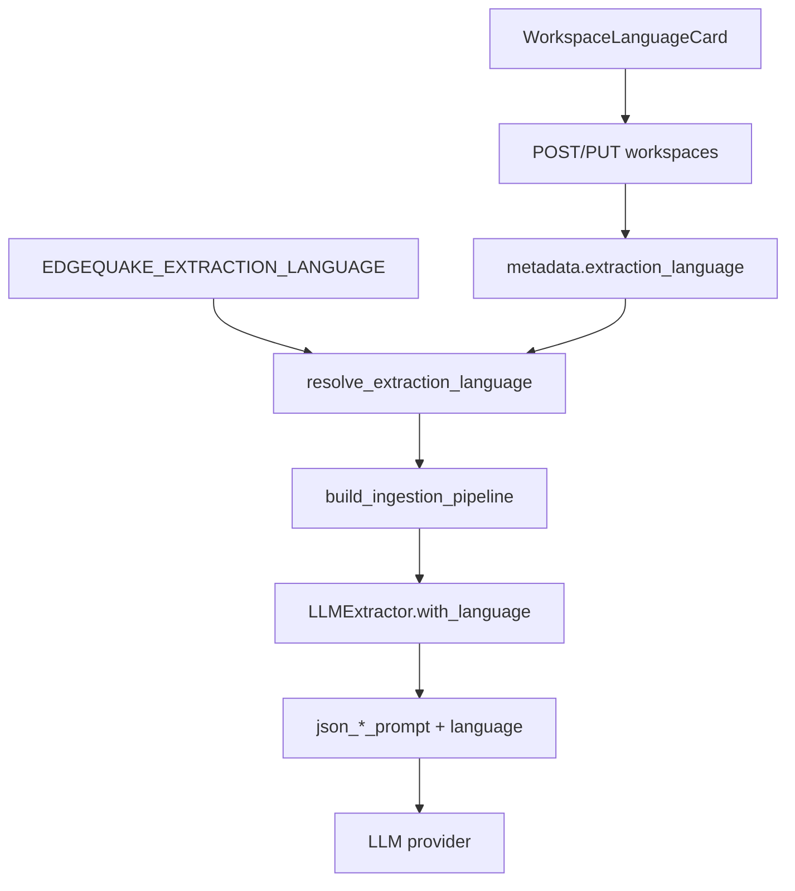

# SPEC-096 — Multi-Language Extraction (GH-352)

> **Product pin**: EdgeQuake v0.22.0+  
> **Status**: Waves 1–5 — language-aware entity type presets (LAW-L6)  

> **GitHub**: [#352](https://github.com/raphaelmansuy/edgequake/issues/352)  
> **Inherits**: [SPEC-017 DRY/SOLID](../017-dry-and-solid-audit/) · workspace `entity_types` (SPEC-085 / #216) · [SPEC-032](../032-*) workspace config · [SPEC-051](../051-reprocess/) reprocess  
> **Peers**: [LightRAG SUMMARY_LANGUAGE](https://github.com/HKUDS/LightRAG/) · [TrustGraph non-English](https://docs.trustgraph.ai/guides/non-english-languages/)

## Start here

1. [00-why.md](00-why.md) — Five WHYs + causal ASCII  
2. [00-first-principles.md](00-first-principles.md) — LAW-L1…L6 + SOLID/DRY  
3. [01-finding-register.md](01-finding-register.md) — F-352-*  
4. [02-cross-ref-matrix.md](02-cross-ref-matrix.md) — code ↔ law ↔ testid ↔ test  
5. [03-implementation-roadmap.md](03-implementation-roadmap.md) — Waves 0–5 + DoD  
6. [04-e2e-test-matrix.md](04-e2e-test-matrix.md) — gates  
7. [05-edge-cases.md](05-edge-cases.md) — EC register  
8. Issue study → [`issues/GH-352-extraction-language.md`](issues/GH-352-extraction-language.md)  
9. Lenses → [`lenses/`](lenses/README.md)

## Locked decisions

1. **Workspace-scoped** `extraction_language` (no document auto-detect in v1) — LAW-L1.  
2. **Allowlist** = existing `SUPPORTED_LANGUAGES` display names (LightRAG-compatible).  
3. **Resolve**: workspace metadata → `EDGEQUAKE_EXTRACTION_LANGUAGE` → `"English"` — LAW-L3.  
4. **Storage**: JSONB `workspaces.metadata` — **no migration** — Database lens.  
5. **Prompt SSOT**: language on `json_extraction_prompt` / `json_gleaning_prompt`; not inside `EntityExtractionSchema` — LAW-L2 / ISP.  
6. **JSON keys stay English**; natural-language values follow language — LAW-L4.  
7. **Few-shots**: omit English examples when language ≠ `English`.  
8. **Change semantics**: future ingestions / reprocess only — LAW-L5.  
9. **UI**: `WorkspaceExtractionLanguageCard` **above** Entity Types (language first; types follow — LAW-L6).  
10. **Entity-type presets follow language** via shared catalog (persisted UPPERCASE localized tokens); auto-remap only when selection matches a known preset — LAW-L6.

## Surfaces

| Surface | Role |
|---------|------|
| `edgequake-pipeline` prompts + extractors | Language instruction + builders |
| `build_ingestion_pipeline` | Wire language into production path |
| `edgequake-core` resolve + metadata helpers | Precedence + JSONB |
| `edgequake-api` workspace DTOs | Create/Update/Response + 400 validate |
| Env `EDGEQUAKE_EXTRACTION_LANGUAGE` | Fleet default |
| WebUI workspace page / create | Operator configuration |
| OpenAPI + docs | Discoverability |

## Data flow



## Verification (after implementation)

```bash
cargo test -p edgequake-pipeline --lib spec096
cargo test -p edgequake-api --test contract_spec096_extraction_language
cargo test -p edgequake-api --features postgres --test e2e_spec096_extraction_language
cd edgequake_webui && pnpm exec playwright test e2e/spec096-extraction-language.spec.ts
```

See [04-e2e-test-matrix.md](04-e2e-test-matrix.md) for full gate list.

## Lens index

| Lens | Primary question |
|------|------------------|
| [Product Owner](lenses/LENS-product-owner.md) | What is done for non-English KG? |
| [UX](lenses/LENS-ux.md) | Discoverable, honest future-only config |
| [UI](lenses/LENS-ui.md) | Card, select, testids |
| [Front End](lenses/LENS-frontend.md) | Types, client, pages |
| [Full Stack](lenses/LENS-fullstack.md) | FE→prompt wire |
| [Database](lenses/LENS-database.md) | JSONB, no migration |
