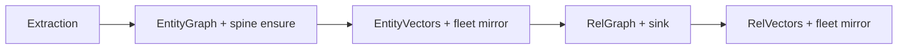

# SPEC-098 — Data Access Hardening (Fleet Spine + Edge Upsert Reliability)

> **Product pin**: EdgeQuake v0.22.0+  
> **Status**: Waves 0–8 — spine ensure + fail-closed fleet mirror + single-arbiter edge upsert  
> **Inherits**: [SPEC-091](../091-simplify-data-layer/) typed fleet · [SPEC-047](../047-rag-evaluation/) SOURCE_IDS KEEP · [SPEC-057](../057-pipeline-reliability/) persist saga · [SPEC-058](../058-source-ids-merge/) property merge · [SPEC-083](../083-improvements/) D-30 multigraph  
> **Peers**: migration 130 fleet FKs · migration 040 AGE→entities backfill · migration 139/140

## Start here

1. [00-why.md](00-why.md) — Five WHYs (fleet 0/N + edge cardinality) + causal ASCII  
2. [00-first-principles.md](00-first-principles.md) — LAW-098-1…8 + SOLID/DRY  
3. [01-finding-register.md](01-finding-register.md) — F-098-*  
4. [02-cross-ref-matrix.md](02-cross-ref-matrix.md) — code ↔ law ↔ test  
5. [03-implementation-roadmap.md](03-implementation-roadmap.md) — Waves 0–8 + DoD  
6. [04-e2e-test-matrix.md](04-e2e-test-matrix.md) — gates  
7. [05-edge-cases.md](05-edge-cases.md) — EC register  
8. Issues → [`issues/ISSUE-fleet-mirror-0-n.md`](issues/ISSUE-fleet-mirror-0-n.md) · [`issues/ISSUE-edge-upsert-cardinality.md`](issues/ISSUE-edge-upsert-cardinality.md)  
9. Database lens → [`lenses/LENS-database.md`](lenses/LENS-database.md)

## Locked decisions

1. **KEEP is AGE-only** — saturated SOURCE_IDS skips graph description mutation; relational spine is still ensured (LAW-098-2).  
2. **Spine before fleet** — typed `mirror_legacy_batch` requires resolvable `entities`/`relationships` FKs (LAW-098-1).  
3. **Relation type uppercase SSOT** — vector id, sink, and fleet lookup share one normalizer (LAW-098-3).  
4. **Fail closed on any miss** — typed path fails when `resolved < eligible`, with sample miss ids (LAW-098-4).  
5. **Invalid workspace_id is loud** — missing/non-UUID metadata fails typed mirror (not silent skip).  
6. **Migration 139** — entity spine marker + support reconcile; portable SQL for PG16/17/18 (LAW-098-5).  
7. **Single EDGE arbiter** — `(eq_source, eq_target, eq_rel_type)` only; legacy UNIQUEs dropped every boot (LAW-098-7).  
8. **Batch writers dedupe** — AGE, entity sink, relationship sink, vectors (LAW-098-8).  
9. **CI is proof** — contract + e2e gates (LAW-098-6).

## Surfaces

| Surface | Role |
|---------|------|
| `edgequake-pipeline` merger entity/rel | Spine ensure on saturated KEEP; relation type id |
| `edgequake-storage` fleet mirror | Resolve report + miss evidence |
| `edgequake-storage` graph edges/nodes | Native upsert + arbiter reconcile |
| `PostgresEntitySink` | Relational spine writer + batch dedupe |
| Migration 139/140 + `support/139|140/` | Historical spine + arbiter reconcile |
| `capabilities.rs` | PG major probe (no version-branched DDL) |

## Data flow (typed)



## Verification

```bash
cargo test -p edgequake-pipeline --lib spec098
cargo test -p edgequake-storage --lib spec098
cargo test -p edgequake-storage --features postgres --test contract_spec098_fleet_mirror_report
cargo test -p edgequake-storage --features postgres --test e2e_spec098_saturated_spine_ensure
cargo test -p edgequake-storage --features postgres --test e2e_spec098_relation_type_case
cargo test -p edgequake-storage --features postgres --test e2e_spec098_edge_upsert_cardinality
cargo test -p edgequake-storage --features postgres --test e2e_spec098_cypher_edge_multigraph
cargo test -p edgequake-storage --features postgres --test e2e_spec098_legacy_edge_unique_reconcile
cargo test -p edgequake-storage --features postgres --test e2e_spec098_edge_upsert_perf
./scripts/check_migration_checksums.sh
```

See [04-e2e-test-matrix.md](04-e2e-test-matrix.md).
