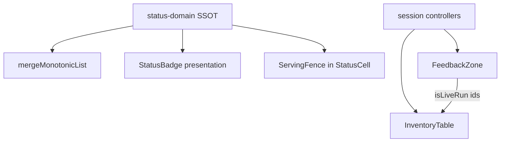

# SPEC-099 — Documents UX/UI Hardening

> **Product pin**: EdgeQuake v0.22.0+  
> **Status**: Waves 1–8 implemented — dropzone always-on; gates wired in CI  
> **Inherits**: [SPEC-029](../029-full-ux-ui-audit/) · [SPEC-030](../030-full-ux-ui-audit/) · [SPEC-048](../048-improve-ux/) · [SPEC-050](../050-pipeline-and-delete/) · [SPEC-086](../086-improve-ingestion-ux/) · [SPEC-091](../091-simplify-data-layer/) serving fence · [SPEC-098](../098-data-access-hardening/) delete honesty · [SPEC-051](../051-reprocess/) feedback zone  
> **Peers**: GH-317 batch delete · GH-319 pagination · GH-350 bulk upload WebUI

## Start here

1. [00-why.md](00-why.md) — Five WHYs (dual pills · triple narrative · status dual-SSOT · Clear All · scale honesty) + causal ASCII  
2. [00-first-principles.md](00-first-principles.md) — LAW-099-1…10 + SOLID/DRY  
3. [01-finding-register.md](01-finding-register.md) — F-099-*  
4. [02-cross-ref-matrix.md](02-cross-ref-matrix.md) — code ↔ law ↔ test  
5. [03-implementation-roadmap.md](03-implementation-roadmap.md) — Waves 0–8 + DoD  
6. [04-e2e-test-matrix.md](04-e2e-test-matrix.md) — non-regression + new gates  
7. [05-edge-cases.md](05-edge-cases.md) — EC register  
8. Issues → [`issues/`](issues/)  
9. Lenses → [`lenses/`](lenses/)  
10. Evidence screenshots → [`evidence/`](evidence/README.md)

## Scope (locked)

| In | Out |
|----|-----|
| `/documents` — dropzone, toolbar/filters, feedback zone (Active runs / upload / reprocess / delete), inventory table, status cells, batch selection, preview drawer, toast overlap, Clear All | Full WebUI redesign (Dashboard, Query, KG, Settings) — remain SPEC-029/030 history |

## Locked decisions

1. **Keep dual surfaces** — Feedback zone owns live narrative; table owns inventory (LAW-IS3 / SPEC-048). Do not remove Active runs.  
2. **Keep serving fence semantics** — `query_ready` remains real; only **presentation** changes (composite StatusCell, not two peer green pills).  
3. **One status domain import path** — `lib/documents/status-domain.ts` is SSOT; `status-badge.tsx` is presentation map only; `document-status.ts` calls domain.  
4. **Upload slot collapses** when feedback zone has live work — icon/button + drag-target (quiet → collapse).  
5. **Toast demotes** when feedback zone already shows the same upload session (one narrative SSOT).  
6. **Clear All** moves behind overflow / typed confirm (keep dialog; demote chrome).  
7. **CI is proof** — every F-099-* maps to a unit or Playwright gate.  
8. **No regression** of SPEC-098 delete honesty, SPEC-091 fence truth, SPEC-048 phase parity.

## Surfaces

| Surface | Role |
|---------|------|
| `document-manager.tsx` | Thin shell (target); today god-composer |
| `document-toolbar-section.tsx` | Search, filters, dropzone slot, batch bar |
| `document-dropzone.tsx` | Upload chrome; expand idle / collapse busy |
| Feedback zone (`active-runs-panel`, `upload-progress-list`, `progress-panel-row`, `admission-phase-row`) | Sole live-work narrative |
| `document-table-section.tsx` + `document-table-row.tsx` | Inventory |
| `enhanced-status-badge.tsx` + `status-badge.tsx` | StatusCell presentation |
| `lib/documents/status-domain.ts` | Status normalize / display / terminal / rank SSOT |
| `lib/documents/merge-monotonic-list.ts` + `deletion-session.ts` | List honesty (SPEC-098) |
| `hooks/use-file-upload.ts` | Upload queue + toast (demote when zone owns session) |

## Target composition

```ascii
DocumentsPageShell
├── DocumentsToolbar        search · filters · selection mode (replaces header)
├── DocumentsUploadSlot     expand idle | collapse when FeedbackZone.hasLiveWork
├── DocumentsFeedbackZone   sole live-work owner (≤35vh, denser cards)
│   ├── ActiveRunsPanel
│   ├── UploadSessionList   (toast suppressed when listed)
│   ├── ReprocessSessionList
│   └── DeleteSessionList
├── DocumentsInventoryTable inventory only; StatusCell = pipeline ⊕ fence
└── DocumentPreviewDrawer
```

## Data flow (status + narrative)



## Verification

```bash
# Non-regression (must stay green)
cd edgequake_webui
pnpm exec playwright test e2e/spec048-ingestion-progress.spec.ts
pnpm exec playwright test e2e/spec050-delete-feedback-zone.spec.ts
pnpm exec playwright test e2e/spec086-ingestion-ux.spec.ts
pnpm exec playwright test e2e/spec091-ingestion-surface.spec.ts
pnpm exec playwright test e2e/spec098-bulk-delete-honesty.spec.ts
pnpm exec playwright test e2e/spec350-bulk-upload-webui.spec.ts
bun test src/lib/documents/__tests__/status-domain.test.ts
bun test src/lib/documents/__tests__/merge-monotonic-list.test.ts
bun test src/lib/documents/__tests__/deletion-session.test.ts

# SPEC-099 gates (Waves 1–8)
pnpm exec playwright test e2e/spec099-
bun test src/lib/documents/__tests__/
```

See [04-e2e-test-matrix.md](04-e2e-test-matrix.md).
