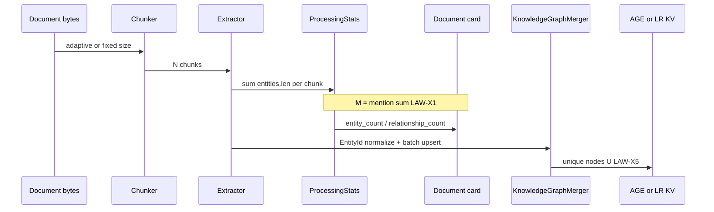

# 03 — Code Comparison (EdgeQuake ↔ LightRAG)

> Code is law. Paths relative to repo root unless noted. LightRAG = sibling `/Users/raphaelmansuy/Github/03-working/LightRAG`.

## End-to-end (where M vs U diverge)



## Stage table

| Stage | EdgeQuake | LightRAG | Parity note |
|-------|-----------|----------|-------------|
| Adaptive sizing | `edgequake-pipeline/src/adaptive_chunking.rs` — **default ON**; >100KB → **600** tok, overlap ~8.3% | No product adaptive shrink; `CHUNK_SIZE=1200` legacy default | **Product confound** (X-02) |
| Fixed / fair pin | `EDGEQUAKE_ADAPTIVE_CHUNKING=0` + `CHUNK_SIZE=1200` / `OVERLAP=100` | `CHUNK_SIZE` / `CHUNK_OVERLAP_SIZE` = 1200/100 | Acc fair (LAW-X3) |
| Strategy R | `chunker/recursive.rs` — separators `\n\n`,`\n`, CJK punct, space, `""` | `lightrag/chunker/recursive_character.py` | Intentional mirror |
| Token budget (R merge) | Word/CJK heuristic `recursive_token_len` (not tiktoken) | Tokenizer-backed length_function | Boundary drift possible |
| Pipeline token SSOT | `token_estimator.rs` tiktoken `cl100k_base` | tiktoken-class | Used outside R merge path |
| Extract caps | `prompts/extract_caps.rs` **40 / 100** | `constants.py` `DEFAULT_MAX_EXTRACTION_ENTITIES=40`, `DEFAULT_MAX_EXTRACTION_RECORDS=100` | SPEC-001/054 |
| Gleaning | `extractor/gleaning.rs` max 1; local often off unless opted in | `DEFAULT_MAX_GLEANING=1` | Match for fair arms |
| Mention stats M | `pipeline/helpers/stats.rs` L85–87 `entity_count += extraction.entities.len()` | No equivalent “sum mentions into doc card” as EQ UI SSOT | **X-01** |
| Persist M to doc | `edgequake-api/.../status_updates.rs` L588–591 / L730–731 | LR stores unique entities in graph/KV | UI reads EQ M |
| Merge U | `merger/entity.rs` `merge_entities_batch` via `EntityId::new` | `operate.py` `_merge_nodes_then_upsert` (~L2008), `merge_nodes_and_edges` (~L2922) | Name-keyed merge |
| Extract entry | `extractor/llm.rs` | `operate.py` `extract_entities` (~L3328) | Per-chunk LLM |

## Critical EQ snippets (count write)

**Pre-dedup sum (M):**

```85:87:edgequake/crates/edgequake-pipeline/src/pipeline/helpers/stats.rs
        stats.entity_count += extraction.entities.len();
        stats.relationship_count += extraction.relationships.len();
```

**Adaptive product default:**

```16:24:edgequake/crates/edgequake-pipeline/src/adaptive_chunking.rs
pub fn calculate_adaptive_chunk_size(document_size_bytes: usize) -> usize {
    if document_size_bytes > 100_000 {
        600
    } else if document_size_bytes > 50_000 {
        800
    } else {
        1200
    }
}
```

**Caps (LR parity):**

```11:15:edgequake/crates/edgequake-pipeline/src/prompts/extract_caps.rs
pub const DEFAULT_MAX_EXTRACTION_ENTITIES: usize = 40;
pub const DEFAULT_MAX_EXTRACTION_RECORDS: usize = 100;
```

## Critical LightRAG anchors

| Item | Location |
|------|----------|
| Caps 40/100, gleaning 1 | `lightrag/constants.py` |
| Chunk env 1200/100 | `lightrag/api/config.py` (`CHUNK_SIZE`, `CHUNK_OVERLAP_SIZE`) |
| Extract | `lightrag/operate.py` `extract_entities` |
| Merge | `lightrag/operate.py` `_merge_nodes_then_upsert` |
| Chunk strategies F/R/V/P | `lightrag/chunker/` + [FileProcessingPipeline.md](https://github.com/HKUDS/LightRAG/blob/main/docs/FileProcessingPipeline.md) |

## Library default trap

`ChunkerConfig::default()` uses **800/100** (embed-safety), while `PipelineConfig` / adaptive fixed path defaults **1200**. Acc and partner fair compares must pin env explicitly — never rely on `Default` alone.

## What code does **not** say

- Code does **not** write unique AGE node count into `documents.entity_count`.
- Soft AGE reconcile on list (SPEC-107 R2) is a fallback when count==0 — not the vanity M path.
- Plural forms (`ORGANIZATION` vs `ORGANIZATIONS`) stay distinct under exact `EntityId` unless fuzzy env is on.
