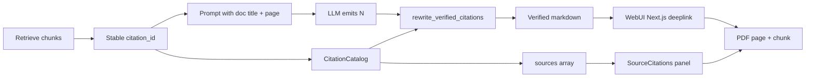

# 04 — Target Architecture

## Flow

```ascii
                    ingest KV / vector
                    page_start, page_end, document_id, title
                              │
                              ▼
                 QueryContext.ensure_stable_citation_ids()
                              │
              ┌───────────────┴───────────────┐
              ▼                               ▼
     Prompt headers                    CitationCatalog
     [N] doc="Q3.pdf" page=12          N → {doc_id, name, pages,
     (name is hint only)                 chunk_id, href}
              │                               │
              ▼                               │
         LLM answer: "... [1] [99] page 999" │
                              │               │
                              ▼               │
                    rewrite_verified_citations(answer, catalog)
                      [1] → [Q3.pdf, p.12](/documents/{id}?chunk=c&page=12)
                      [99] stripped
                      "page 999" left as prose (href cannot lie)
                              │
                              ▼
              QueryResponse.answer + sources[] (+ optional catalog)
              SSE Context then tokens; Done(verified_answer)
              Chat persist rewritten markdown
              MCP tool result same markdown
                              │
                              ▼
              WebUI: Next.js nav for /documents/ links
              Streaming chips from catalog until Done
```

## Module boundaries (SOLID)

| Module | Responsibility |
|--------|----------------|
| `citation_verify.rs` | Parse `[N]`, rewrite, strip unknown — no KV |
| `context_format.rs` | Emit `doc="{title}"` + `page=` headers |
| `grounding.rs` | Product citation policy text |
| `source_reference_builder` + resolve | Build sources; titles for catalog |
| API handlers | Call rewrite after generate; stamp `reference_id` |
| `document-url.ts` + Rust twin | Href schema DRY |



## Surface matrix

| Surface | When rewrite runs |
|---------|-------------------|
| `POST /api/v1/query` | After `generate_answer` (skip gold) |
| `/query/stream` v2/v3 | Prefer Done payload; or rewrite client-side with catalog for mid-stream |
| Chat completion / stream | Same; persist rewritten |
| MCP search/query tools | Same SSOT |
| Bypass | Skip (empty catalog) |

## Cross-refs

- Plan: [07-implementation-plan.md](07-implementation-plan.md)
- Laws: [01-first-principles.md](01-first-principles.md)
