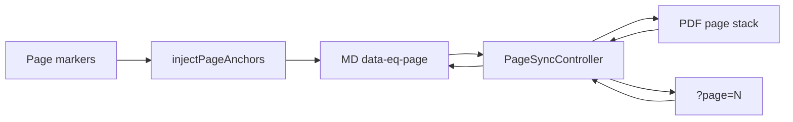

# 04 — Target Architecture

## Flow

```ascii
  Stored markdown with <!-- edgequake-page:N -->
           │
           ▼
  injectPageAnchors(md)  →  <div data-eq-page="N" id="eq-md-page-N">
           │
           ▼
  ┌────────────────────────────────────────────────────────────┐
  │              usePageSyncController                         │
  │   activePage · syncEnabled · driver · settleMs             │
  │   setPageFromPdf | setPageFromMd | setPageFromUrl          │
  └───────────────┬────────────────────────────┬───────────────┘
                  │                            │
                  ▼                            ▼
     PDF continuous stack              Markdown pane
     sheets[data-testid=pdf-page-sheet]  [data-eq-page]
     IntersectionObserver              IntersectionObserver
     scrollToPage(n)                   scrollIntoView(#eq-md-page-N)
                  │                            │
                  └──────────┬─────────────────┘
                             ▼
                    router ?page=N (debounced)
```

## Module boundaries (SOLID)

| Module | Responsibility | Does not |
|--------|----------------|----------|
| `page-markers.ts` | Parse / list / inject anchors | Touch React / URL |
| `usePageSyncController` | Active page + lock + sync flag | Render PDF/MD |
| `pdf-viewer.tsx` | Continuous stack, IO, keyboard, overlay | Own URL |
| `useMarkdownPageObserver` | Observe MD anchors → page | Write URL |
| `side-by-side-viewer.tsx` | Layout + sync toggle chrome | Page math |
| `documents/[id]/page.tsx` | Wire controller ↔ URL ↔ panes | Duplicate page logic |



## Surface matrix

| Surface | Wiring |
|---------|--------|
| `documents/[id]` side-by-side | Full controller + URL |
| `DocumentViewerDialog` | Same controller props |
| `PDFMarkdownSplitView` | Same (no half-wired path) |

## Cross-refs

- Plan: [07-implementation-plan.md](07-implementation-plan.md)
- Laws: [01-first-principles.md](01-first-principles.md)
