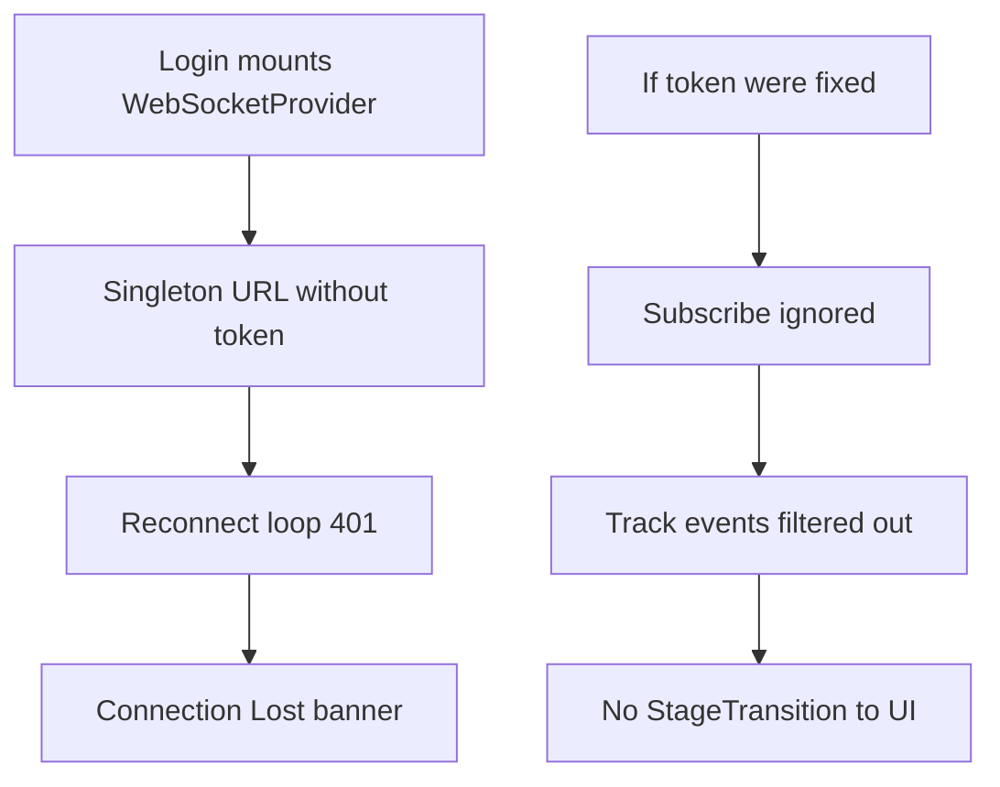

# 03 — Root Cause

## RC-1 — Stale / missing token in singleton URL (banner trigger)

**Evidence**

- `getWebSocketClient()` constructs `ProgressWebSocket({ url: getWebSocketUrl() })` once.
- `withAuthToken` reads `getTokens()` only at that moment.
- `WebSocketProvider` auto-connects on mount for the whole tree including `/login`.
- `useAuthStore.login` / `tryRefreshToken` call `setTokens` but never `disconnectWebSocket()` + reconnect.

**Effect:** Auth-enabled sessions reconnect with a permanently tokenless (or expired) URL until full page reload. Exhausted attempts → Connection Banner + infinite toast.

## RC-2 — Protocol mismatch: subscribe ignored + track fan-out suppressed

**Evidence**

- FE: `subscribe({ type: "subscribe", track_ids })`.
- BE global handler: only `"status"` text and `cancel` JSON.
- `event_visible_to_session`: for `StageTransition`, `ChunkProgress`, `PdfPageProgress`, deletion track events → **always `false`**.

**Effect:** Even a healthy authenticated socket delivers heartbeats/Connected but **zero** document progress. Polling masks incompleteness until RC-1 surfaces.

**Intent conflict:** SPEC-083 correctly forbade unscoped fan-out; the missing half was **authorized subscription**, not permanent drop.

## RC-3 — Wire DTO drift

**Evidence**

- Rust `PdfPageProgress`: `pdf_id`, `page_num`, …
- TS `PdfPageProgressEvent.data`: `document_id`, `current_page`, `progress`
- BE sends `ProgressSnapshot` / `GraphStorageProgress`; FE warns unknown / listens on wrong event name

**Effect:** Partial UI updates even when events arrive (e.g. per-track socket).

## RC-4 — Unauthenticated SSE

**Evidence**

- `createPdfProgressEventSource` → `new EventSource(...)` (no Authorization).
- Route under `/api/v1` behind auth middleware.

**Effect:** Auth mode → 401; hook falls back to polling only.

## RC-5 — Non-proving tests

**Evidence**

- `e2e_websocket.rs` treats 101 **or** 400 **or** 426 as pass.
- Playwright WS frame monitoring commented out; `shouldAutoConnectRealtime()` false under automation.

## Amplifiers (not primary)

| Amplifier | Path |
|-----------|------|
| `connect()` ignores CONNECTING | concurrent sockets |
| Manual Retry no attempt reset | immediate max-out |
| Uncapped exponential backoff | ~51 min to give up |
| Disconnect toast spam | UX noise |

## Causal chain (demo screenshot)

